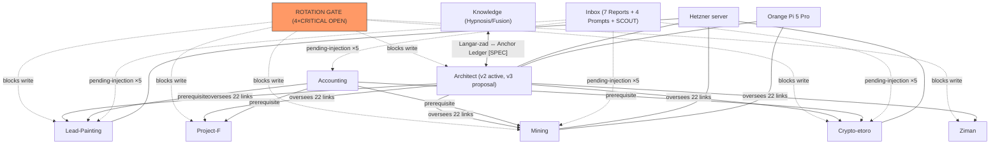

> [!warning] superseded — canonical: [[Report - Vault Relationship Map 2026-07-04 v3]] (verdict آری 2026-07-04).

# Report — نقشه روابط Vault (2026-07-04)

> اجرای [[04 - Architect System/architect/02-Research/Prompt - Vault Relationship Discovery 2026-07-04|پرامپت کشف روابط]] در MODE=**REPORT-ONLY** (هر ۴ ردیف CRITICAL در [[ROTATION_CHECKLIST]] هنوز OPEN — charter §Security Gate). هیچ نوت موجودی ویرایش نشد؛ فقط این گزارش + یک خط در HANDOFF.
> روش: پارس کامل wikilinkها با اسکریپت (یک‌بار pass روی همه نوت‌ها) + sweep های evidence با الگوهای موجودیت. هر یال evidence دارد.

## ۱. متریک‌های baseline

| متریک | مقدار |
|---|---|
| نوت md پارس‌شده (خارج از محدوده منفی) | ۲۸۶ |
| wikilink حل‌شده | ۵۹۵ |
| لینک مبهم (bare مثل `[[PROJECT]]` با ۹ فایل هم‌نام) | ۱۴ |
| هدف stale/حل‌نشده واقعی | ~۵ (جزئیات §۴) |
| نوت orphan (بدون هیچ لینک ورودی/خروجی) | **۱۴۸ از ۲۸۶ ≈ ۵۲٪** |
| orphan به تفکیک | Projects ۷۸ · Knowledge ۵۰ · Architect ۱۱ · سایر ۹ |
| هاب شماره ۱ (in-degree) | ROTATION_CHECKLIST (۲۴) — گیت، پرارجاع‌ترین نوت vault |
| جریان بین‌پوشه‌ای غالب | architect→Projects (۲۲) · Dashboard→Inbox (۱۷) · Projects→ROTATION (۱۳) |

هاب‌های بعدی: SERVER_ARCHITECTURE (AiFarm) ۲۲ · research-safety-governance ۱۹ · Crypto PROJECT ۱۸ · GAPS ۱۸ · DECISIONS ۱۷ · SCOUT-A ۱۶.

## ۲. راستی‌آزمایی ۱۳ یال Seed

| # | یال | نتیجه | Evidence | اطمینان |
|---|---|---|---|---|
| 1 | ROTATION → کل اکوسیستم (blocked-by) | ✅ تایید + هاب #1 | `ARCHITECT_CHARTER.md:24` «§Security Gate (قید مقدم بر همه)… autonomy همه ایجنت‌ها = read-only» | [FACT] · already-linked |
| 2 | D-25 → ≥۳ پروژه (budget-governed-by) | ✅ تایید، دامنه بزرگ‌تر: **۱۳ فایل** | `DECISIONS.md:36` «معماری بودجه v1… کل هزینه AI ماهانه ≈ ۲۰۰–۳۰۰ AUD» + Lead-نقاشی PROJECT، charter، GAPS، AGENT_REGISTRY، v3-proposal، OBSIDIAN-SYNC | [FACT] · نیمه‌لینک‌شده |
| 3 | Langar-zād ↔ Anchor Ledger (bridges-fiction↔reality) | ✅ پل صریح در خود نوت | `07 - Knowledge/…/knowledge_base.md:35` «در فیکشن، موجودِ لنگرزاد… هستهٔ انسانیِ میرا به‌عنوان root-of-trust غیرقابل‌جعل و append-only» | [FACT] وجود پل / [SPEC] محتوا · **wikilink به architect ندارد → پیشنهاد #6** |
| 4 | Adversarial Review → v3-proposal (evidences) | ✅ تایید | `SYSTEM-BLUEPRINT-v3-proposal.md:5` «status: proposal — منتظر verdict آری (v2 دست‌نخورده و active می‌ماند)» | [FACT] · awaiting-verdict |
| 5 | P2 ⟷ Track-BC (contradicts — برنامه ACC در X) | ✅ تناقض زنده | `P2-x-growth-engine.md:24-25` «هشدار اطلاعات جعلی… [EST] چند وب‌سایت سئویی از ACC program با ID» **vs** `research-track-BC-2026-07-04.md:93` «[FACT] محتوای adult فقط داخل چارچوب ACC مجاز — ثبت‌نام با ID» | [FACT] تناقض · §۵-C1 |
| 6 | Orange Pi (shares-resource) | ✅ تایید، ۴۱ فایل | Mining docs + SCOUT-A/B/C + architect research + گزارش‌ها | [FACT] |
| 7 | Cardew (same-entity + evidences) | ✅ تایید، ۸ فایل | `Report - هیپنوتیزم - Cardew…md:10` + چک‌لیست مجهول‌ها؛ PROJECT هیپنوتیزم ✅ لینک دارد | [FACT] · already-linked |
| 8 | Tax Map → Lead-نقاشی (constrained-by) | ✅ رابطه هست، **لینک نیست** | `Report - Accounting - Tax Map…md:25` (deductions: paint/brushes/sprayers…) + `HANDOFF.md:34` (سقف write-off → $1,000 از 1 Jul 2026) | [FACT] · new-discovery → پیشنهاد #4 |
| 9 | AiFarm-Lead1/2 (duplicates) | ⚠️ **منسوخ** — در پاکسازی حل شده | `ls 03 - Projects/Lead-نقاشی/` فقط `AiFarm-Lead` دارد؛ نسخه‌های 1/2 دیگر وجود ندارند | [FACT] · seed از حافظه چت بود، vault جلوتر است (§۵-C4) |
| 10 | DNCR → SEGMENT-DISCOVERY + bot (constrained-by) | ✅ تایید | `Outreach Compliance.md:21` «Do Not Call Register Act 2006 (Cth) [Verified: donotcall.gov.au]»؛ PROJECT ✅ به Outreach Compliance لینک دارد | [FACT] · already-linked |
| 11 | گزارش‌های Inbox → PROJECT.md (pending-injection) | ✅ تایید دقیق: **فقط ۲ از ۸** PROJECT.md به گزارشی اشاره دارند | Accounting ❌ Tax Map · Lead-نقاشی ❌ Sydney Lead Channels · Crypto ❌ Data Stack · Mining ❌ (فقط architect ✅ و هیپنوتیزم ✅) | [FACT] · پیشنهادهای #1–#3 |
| 12 | v1→v2→v3 (evolves-into) | ✅ تایید | v3 status=proposal (بالا)؛ v1 پرلینک‌ترین نوت خروجی (۷۲ لینک)، v2 دوم (۴۹) | [FACT] |
| 13 | Accounting (depends-on پروژه‌های درآمدی) | ✅ در قانون اساسی و ایندکس | `_Index - Projects.md:15` + `_PROJECT_INSTRUCTIONS` «پیش‌نیاز کارهای بزرگ» | [FACT] |

## ۳. کشف‌های جدید (خارج از seed ها) — ۱۵ مورد

| # | کشف | نوع یال | Evidence | اطمینان |
|---|---|---|---|---|
| N1 | **نام پارتنر Project-F در ۴ فایل خارج از پوشه خودش** — نقض قاعده aliasing خود charter | contradicts (قاعده⟷عمل) | مسیرها در §۶ security-flags؛ متن عمداً نقل نمی‌شود | [FACT] |
| N2 | **خطر ابهام لینک:** ۹ فایل با نام `PROJECT.md` + ۱۴ لینک bare (بدون مسیر) → Obsidian ممکن است به فایل اشتباه resolve کند | same-entity (ابهام) | اسکریپت: `ambiguous: project×7, _project_instructions×3, index×2, handoff×2` | [FACT] |
| N3 | **جزیره brushline:** زیرشاخه `AiFarm-Lead/Ai farm- sister Painting/brushline` (~۴۰+ نوت KB/OPS/governance) کاملاً orphan — غنی‌ترین جزیره vault | duplicates/island | orphans.txt: ۷۸ orphan در Projects که اکثرشان brushline | [FACT] |
| N4 | **۵۰ orphan در Knowledge:** همه READMEهای `فیوژن هیپنوتیزم/00_Knowledge_Base` + پوشه Marathon | island | orphans.txt §Knowledge | [FACT] |
| N5 | **۲ لینک stale به `Mining/Ai bots/ARCHITECTURE`** — پوشه `Ai bots` بعد از بازسازی Mining دیگر وجود ندارد (کد به `02 - Code` رفت)؛ اما `find_broken_links.py` صفر خطا گزارش می‌دهد → **نقطه کور validator** | contradicts (ابزار⟷واقعیت) | اسکریپت: unresolved `03 - Projects/Mining/Ai bots/ARCHITECTURE ×2`؛ `ls Mining/` پوشه ندارد | [FACT] · §۵-C2 |
| N6 | **Hetzner = منبع مشترک ۴+ پروژه** (۱۹ فایل): Crypto، Lead-نقاشی، Mining ARCHITECTURE_v2، Project-F/P9، architect blueprints | shares-resource | فهرست فایل‌ها در sweep | [FACT] |
| N7 | **«لنگر/langar» سه‌معنایی:** بات تلگرام (architect) ≠ Anchor Ledger (blueprint) ≠ لنگرزاد (fiction) — ۲۷ فایل architect + ۱۵ فایل Knowledge | same-entity (ابهام) | توزیع پوشه‌ای sweep | [FACT] |
| N8 | **HRV در ۴۷ فایل** از Knowledge تا Life OS تا DECISIONS (O-04: داده شخصی off-VPS) — پرپخش‌ترین مفهوم شخصی | same-entity + constrained-by | sweep hrv | [FACT] |
| N9 | **نود جدید pending-execution:** `Prompt - هیپنوتیزم - آدیت و بازسازی PROJECT + نقشه 2026-07-04` در Inbox (خروجی جلسه موازی امروز) — هنوز اجرا نشده؛ به quirk «دو فاصله» در نام پوشه هم اشاره دارد | pending-execution | خطوط ۱۰–۱۳ همان فایل | [FACT] |
| N10 | **Silabi-Bot در ۲۸ فایل** — پل بین آزمایشگاه Knowledge (فیوژن KB) و عملیات؛ فایل کد آن قبلاً پرچم نشت توکن خورده (فقط مسیر؛ §۶) | shares-resource | sweep silabi | [FACT] |
| N11 | **Spam Act در ۳۷ فایل** — قید حقوقی مشترک bot کاریابی + brushline KB + AiFarm | constrained-by | sweep spamact | [FACT] |
| N12 | **خوشه SCOUT در Inbox هنوز triage نشده** با این که in-degree بالا دارند (A=۱۶، B=۱۱، C=۱۰) — مقصدشان طبق HANDOFF «بعد از گیت» است | pending-injection | in-degree + HANDOFF §پیگیری‌ها | [FACT] |
| N13 | **الگوی proposal تکثیر شده:** علاوه بر v3-proposal، فایل `PROJECT.v2-proposal.md` در هیپنوتیزم — دو نود «منتظر verdict» هم‌الگو | evolves-into | وجود فایل + الگوی نام | [FACT] |
| N14 | **صفحه کنترل ریشه:** AUDIT-PHASE3، INGEST-INVENTORY، INGEST-EXCLUDED-SECRETS، ROTATION_CHECKLIST بیرون از هر پوشه‌ای زندگی می‌کنند — عملاً control-plane هستند اما در taxonomy پوشه‌ها جا ندارند | structural | فهرست ریشه | [EST] |
| N15 | **`مغز دوم` هنوز در ریشه است** (۴ نوت، ۲ orphan) — تصمیم حذف/ادغامش از جلسه ingest با آری مانده | pending-decision | فهرست ریشه + HANDOFF جلسات قبل | [FACT] |

## ۴. لینک‌های stale/حل‌نشده واقعی

`Mining/Ai bots/ARCHITECTURE` ×۲ (پوشه دیگر وجود ندارد — احتمالاً حالا در `Mining/02 - Code`) · `Atlas/Home MOC` ×۱ · `../../../01 - Dashboard/HANDOFF` ×۱ (لینک نسبی غیراستاندارد). بقیه حل‌نشده‌ها placeholder قالب‌ها هستند (`<نام>`، `X`، `...`) و سالم‌اند.

## ۵. تناقض‌ها + کوتاه‌ترین مسیر حل

| # | تناقض | مسیر حل |
|---|---|---|
| C1 | **برنامه ACC در X:** P2 آن را «اطلاعات جعلی سایت‌های سئویی» می‌داند [EST]، Track-BC آن را [FACT] قطعی گزارش می‌کند | یک چک دستی ۱۰ دقیقه‌ای صفحه رسمی X (help.x.com، بخش adult content). تا آن موقع برچسب Track-BC:93 باید به [EST] تنزل کند |
| C2 | **validator صفر لینک شکسته می‌گوید** اما ۲ لینک stale به `Ai bots/ARCHITECTURE` وجود دارد | بررسی `find_broken_links.py` — به احتمال زیاد لینک‌های path-qualified یا فایل‌های خاص را skip می‌کند؛ یک test case اضافه شود |
| C3 | **قاعده aliasing Project-F ⟷ عمل:** نام پارتنر در ۴ فایل خارج از پوشه (مسیرها §۶) | جایگزینی با «پارتنر» در همان ۴ فایل — ویرایش یک‌کلمه‌ای، بعد از verdict |
| C4 | **حافظه چت ⟷ vault:** seed 9 (AiFarm-Lead1/2) در چت‌ها بود اما vault قبلاً پاکسازی شده | درس روش‌شناسی: ادعاهای برآمده از چت باید همیشه علیه vault فعلی verify شوند (همین گزارش این کار را کرد) |

## ۶. Security & Privacy Flags (فقط مسیر — بدون محتوا)

- نام پارتنر Project-F خارج از پوشه پروژه: `01 - Dashboard/HANDOFF.md` · `03 - Projects/_Index - Projects.md` · `07 - Knowledge/هیپنوتیزم  و خودآگاهی/هیپنوتیزم و خودآگاهی.md` · `AUDIT-PHASE3.md`
- داده ژنومی شخصی به‌صورت orphan و خارج از ایندکس: `07 - Knowledge/هیپنوتیزم  و خودآگاهی/Marathon/امواج مغزی/ARMIN_DNA_REPORT.md` — مشمول روح O-04 (داده شخصی حساس)؛ پیشنهاد: حداقل به ایندکس Knowledge لینک شود تا گم نشود
- پرچم‌های نشت از پیش ثبت‌شده (فقط ارجاع): ردیف‌های OPEN در ROTATION_CHECKLIST + فایل‌های کد داخل `_code` (خوانده نشد — .agentignore)

## ۷. ۲۰ لینک پیشنهادی پرارزش (Proposed Wikilink Diff — اعمال نشده)

قالب: فایل هدف ← خطی که زیر `## Related` (یا انتهای فایل) اضافه شود. اعمال فقط بعد از باز شدن گیت + verdict آری.

```
 1. 03 - Projects/Accounting/PROJECT.md
    + - [[03 - Projects/Accounting/Report - Accounting - Tax Map FY2025-26|Tax Map FY2025-26]] — نقشه مالیاتی؛ سقف write-off از 1 Jul 2026 → $1,000
 2. 03 - Projects/Lead-نقاشی/PROJECT.md
    + - [[03 - Projects/Lead-نقاشی/Report - Lead-نقاشی - Sydney Lead Channels 2026|Sydney Lead Channels 2026]] — نقشه کانال‌های لید (LSA هنوز در AU نیست)
 3. 03 - Projects/Crypto - etoro/PROJECT.md
    + - [[03 - Projects/Crypto - etoro/Report - Crypto - etoro - Data Stack under AU30|Data Stack under AU30]] — استک free-API طبق D-25
 4. 03 - Projects/Lead-نقاشی/PROJECT.md
    + - [[03 - Projects/Accounting/Report - Accounting - Tax Map FY2025-26|Tax Map]] — خرید ابزار قبل از 1 Jul 2026 (سقف write-off)
 5. 03 - Projects/Mining/PROJECT.md
    + - [[03 - Projects/Mining/01 - Docs/Orange Pi Automation System - 20 Projects/ARCHITECTURE_v2_Hybrid_Final|ARCHITECTURE v2 Hybrid]] — سند معماری اصلی خودِ پروژه
 6. 07 - Knowledge/هیپنوتیزم  و خودآگاهی/knowledge_base.md
    + - [SPEC/پل داستان↔واقعیت] [[04 - Architect System/architect/03-Exports/LANGAR-MASTER-EXPORT|LANGAR Blueprint]] — لنگرزاد (فیکشن) ↔ Anchor Ledger (واقعی)
 7. 03 - Projects/اونلی فنز/research-track-BC-2026-07-04.md
    + - ⚠️ تناقض با [[03 - Projects/اونلی فنز/research-results/P2-x-growth-engine|P2]] درباره ACC — تا چک دستی، [EST]
 8. 03 - Projects/Mining/PROJECT.md
    + اصلاح ۲ لینک stale «Ai bots/ARCHITECTURE» به مسیر جدید در 02 - Code (بعد از تایید مسیر دقیق)
 9. 07 - Knowledge/_Index - Knowledge.md
    + - [[07 - Knowledge/هیپنوتیزم  و خودآگاهی/فیوژن هیپنوتیزم/00_Knowledge_Base/Architecture|فیوژن KB]] — ورودی جزیره ۵۰نوتی
10. 03 - Projects/Lead-نقاشی/AiFarm-Lead/SERVER_ARCHITECTURE.md
    + - [[03 - Projects/Lead-نقاشی/AiFarm-Lead/Ai farm- sister Painting/brushline/00_governance/BLUEPRINT|brushline BLUEPRINT]] — پل به جزیره brushline
11. 03 - Projects/اونلی فنز/PROJECT.md
    + - [[03 - Projects/اونلی فنز/research-results/00-executive-summary|خلاصه اجرایی ۱۰ گزارش لیدگیری]]
12. 07 - Knowledge/هیپنوتیزم  و خودآگاهی/PROJECT.md
    + - [[07 - Knowledge/هیپنوتیزم  و خودآگاهی/Prompt - هیپنوتیزم - آدیت و بازسازی PROJECT + نقشه 2026-07-04|پرامپت آدیت]] — pending-execution
13. 03 - Projects/Crypto - etoro/PROJECT.md
    + - [[04 - Architect System/architect/01-Project/DECISIONS|D-25]] — سقف AU$30 حاکم بر استک داده
14. 07 - Knowledge/هیپنوتیزم  و خودآگاهی/Report - هیپنوتیزم - HRV و خودهیپنوتیزم.md
    + - [[04 - Architect System/architect/01-Project/DECISIONS|O-04]] — داده HRV شخصی، off-VPS
15. 03 - Projects/Lead-نقاشی/کاریابی/06_پرامپت‌های_تحقیقاتی_گسترش_لیدگیری.md
    + - [[03 - Projects/Lead-نقاشی/Outreach Compliance|Outreach Compliance]] — قیدهای DNCR/Spam Act
16. 06 - Architecture Maps/ECOSYSTEM.md
    + - [[03 - Projects/Mining/01 - Docs/Orange Pi Automation System - 20 Projects/ARCHITECTURE_v2_Hybrid_Final|Hetzner hybrid]] — سرور مشترک ۴+ پروژه
17. 01 - Dashboard/Home.md
    + - [[AUDIT-PHASE3|AUDIT-PHASE3]] — گزارش وضعیت فازهای ۰–۳ (control-plane ریشه)
18. 04 - Architect System/architect/01-Project/GAPS.md
    + - [[04 - Architect System/architect/02-Research/Report - Architect - Open Questions 2026-07-04|Open Questions]] — سند بستن GAP 7 (KILLBENCH)
19. 07 - Knowledge/هیپنوتیزم  و خودآگاهی/PROJECT.md
    + - [[07 - Knowledge/هیپنوتیزم  و خودآگاهی/Marathon/امواج مغزی/ARMIN_DNA_REPORT|DNA Report]] — داده شخصی orphan (پرچم O-04)
20. 03 - Projects/_Index - Projects.md
    + - [[INGEST-INVENTORY|INGEST-INVENTORY]] — تصمیم‌های معلق ingest (از جمله «مغز دوم»)
```

## ۸. نقشه Mermaid — سطح ۱ (مقصد نهایی پیشنهادی: `06 - Architecture Maps` کنار SYSTEM_MAP)



زیرنقشه ۱ — وب تحقیق Project-F: `Prompt lead-gen (10×P)` → `research-results P1..P10` → `Track-BC` → تناقض C1 با P2 → verdict آری. زیرنقشه ۲ — compliance Lead-نقاشی: bot کاریابی ← DNCR (تماس business مجاز) + Spam Act (draft-only) + Tax Map (سقف ابزار). در صورت تایید، این دو هم به `06 - Architecture Maps` منتقل شوند.

## ۹. معیار پذیرش — خوداظهاری

- یال بدون evidence: **۰** (هر ردیف §۲ و §۳ مسیر/خط دارد) · secret در خروجی: **۰** (فقط مسیر)
- کشف جدید معنادار: **۱۵** (N1–N15) + ۴ یال pending-injection دقیق‌شده · تفکیک already-linked/new-discovery: در ستون‌ها
- هر یال fiction↔reality: برچسب [SPEC] + پرچم فایروال دارد (seed 3، پیشنهاد #6)
- محدودیت‌های این اجرا: فایل‌های >1.5MB اسکن نشدند (exportهای حجیم)؛ `_code` طبق .agentignore خوانده نشد؛ کشف یال‌های معنایی عمیق‌تر (بدون کلیدواژه مشترک) نیازمند embedding است که در این اجرا نبود

## Related

- [[04 - Architect System/architect/02-Research/Prompt - Vault Relationship Discovery 2026-07-04|پرامپت مولد این گزارش]]
- [[06 - Architecture Maps/SYSTEM_MAP|SYSTEM_MAP]] · [[06 - Architecture Maps/ECOSYSTEM|ECOSYSTEM]]
- [[01 - Dashboard/HANDOFF|HANDOFF]]
