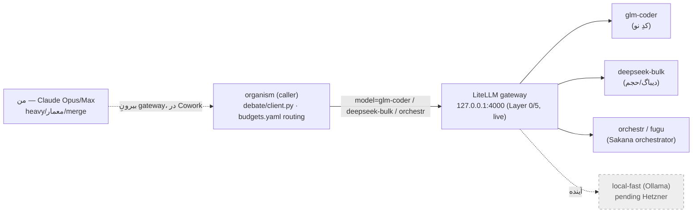

# HYBRID DESIGN v1 — ادغامِ داده‌ی جلسه با canonِ پروژه + بهینه‌سازیِ مسیردهی

> **این چیست:** داده‌ی نوِ این جلسه (gateway زنده، prompt-setِ GLM، واژگانِ ایجنتِ آنبورد) را با دیتای موجودِ پروژه (Base-Map v0، ORGANISM-SPEC، budgets.yaml routing) ادغام می‌کند و یک **طرحِ هایبریدِ بهینه** می‌دهد. کدی نوشته نشد؛ فقط طراحی + diffِ پیشنهادی. propose-only، owner-applied.

---

## §۰ یک‌خطی
یک gatewayِ فیزیکیِ واحد (LiteLLM، زنده) + یک لایهٔ منطقیِ انتخاب‌گر در organism = **حذفِ افزونگیِ دو-مسیردهی**. GLM = حمالِ کدِ اصلی از میانِ همین gateway؛ من = heavy/معمار، بیرونِ gateway.

## §۱ داده‌ی نوِ این جلسه → کجا می‌نشیند
| داده‌ی نو (این جلسه) | وضعیت | نگاشت در canon |
|---|---|---|
| gateway **زنده شد** (glm-coder·deepseek-bulk·orchestr·fugu) = اسکرین‌شاتِ آری | `[تثبیت‌شده]` | Base-Map §I: از «کاندید» → **گرهِ زندهٔ Layer 0/5** |
| `GLM-MAPPER-PROMPTSET.md` (۶ پرامپتِ نقشه‌کش) | ساخته‌شد این جلسه | ابزارِ **Agent-Mapper** ذیلِ roster §I₂ (تکاملِ نقشه در آینده) |
| واژگانِ ایجنتِ آنبورد (worker_proposal ۷فیلدی، guard_decision) | مقایسه‌شد | Base-Map §H (قبلاً نگاشت شد؛ DDL دور ریخته) |
| نتیجه‌گیریِ مقایسه (zip=تنها artifactِ منطبق؛ ترتیبِ P3 اول) | `[تثبیت‌شده]` | تأییدِ Base-Map §D + roadmap §۵ |

## §۲ بهینه‌سازیِ اصلی — یکی‌کردنِ دو مسیردهی (قلبِ هایبرید)
**مسئله:** الان دو چیزِ هم‌پوش «مسیرِ مدل» را مدیریت می‌کنند:
- **gateway (فیزیکی):** LiteLLM روی `127.0.0.1:4000`، ۴ routeِ زنده.
- **organism (منطقی):** `budgets.yaml → routing.orchestr.base_url` (فعلاً TBD) + `debate/client.py` + تیرهای `heavy/fast` در Base-Map §A/§C.

**طرحِ هایبریدِ بهینه (extend, don't rival):** gateway = **تنها درِ فیزیکی** (Layer 0)؛ organism = **caller** که فقط *گروه* را انتخاب می‌کند. نامِ routeهای زندهٔ gateway = واژگانِ رسمیِ tierهای organism. یک درِ ورودی، تیرینگِ منطقی بالای آن.

**درزِ باقی‌مانده که این طرح می‌بندد:** Base-Map §I می‌گفت «gateway هنوز با organism ادغام نشده». طرحِ بهینه: `budgets.yaml → routing.orchestr.base_url = http://127.0.0.1:4000` (به‌جای TBD/Fugu مستقیم) → organism همه‌چیز را از یک در می‌فرستد. `[فرضیه — verdict آری]`

## §۳ Roster → نگاشتِ tierِ زندهٔ gateway (بهینه‌شده)
| نقش | worker | routeِ gateway | مسیر |
|---|---|---|---|
| کدِ نو (حمالِ اصلی) | **GLM Max** (Coding Plan) | `glm-coder` | organism → gateway |
| دیباگ/review/حجم | DeepSeek V4-flash | `deepseek-bulk` | organism → gateway |
| orchestration | Sakana Fugu | `orchestr` / `fugu` | organism → gateway |
| heavy/معماری/merge/final-review | **من (Claude)** | — | بیرونِ gateway (Cowork) |
| نقشه‌کش/آرشیویست (recon، map-evolve) | GLM Max | `glm-coder` | `GLM-MAPPER-PROMPTSET` |
| fallbackِ $۰ | Qwen/GLM local | — | Ollama، pending Hetzner |

**تقسیمِ بهینه:** heavy فقط جایی که یک قدمِ غلط جوابِ نهایی را خراب می‌کند (من)؛ همه‌چیزِ lookup/کد/دیباگ/حجم = ارزان از gateway (GLM→DeepSeek fallback). = دقیقاً قراردادِ routingِ README ِ zip.

## §۴ اصلاحاتِ لازم روی canon (بخشی از ادغام)
1. **`GLM-MAPPER-PROMPTSET.md`:** مسیرِ خروجیِ من (`_proposal/`) اشتباه بود — کنوانسیونِ واقعیِ vault = **`00 - Inbox/build-proposals/`** (استیجینگِ propose-only) یا in-place `*-proposal.md`. → اصلاح شد.
2. **Base-Map §I:** وضعیتِ zip از «کاندید/INFRA_PROPOSAL معلق» → «زنده + در حالِ سیم‌کشیِ organism (این سند)».
3. **budgets.yaml `routing.orchestr.base_url`:** از TBD → `127.0.0.1:4000` (فقط با verdict تو — I4/I6، فایل فقط‌خواندنی).

## §۵ ناوردی‌ها — همه دست‌نخورده (چک شد)
I1..I10 + TINV-3/5/7 بی‌تغییر. gateway روی loopback · secret فقط env (I9) · cost cap $۸۰ fail-closed · هیچ money-effectorِ auto · propose-only. این هایبرید **صرفاً یک سیمِ داخلی** اضافه می‌کند (organism→gateway)، هیچ توانِ نو/خرج‌دار باز نمی‌کند → همه shadow تا budgets.yaml پر شود.

## §۶ قدمِ بعدیِ واحد (ضدِ گنبد)
ترتیبِ ratify-شده بی‌تغییر: **P3 (تلگرام) اول** — پیش‌نیازِ هر human-append و هر پا. حالا که حمالِ کد (GLM از gateway) و کانالِ merge (من) روشن‌اند، P3 اولین کارِ واقعیِ build است:
> **من پرامپتِ P3 را برای GLM آماده می‌کنم (طبق `P3-TELEGRAM.md`)، GLM روی دستگاهِ تو `approval_channel.py` را از stub به آداپترِ واقعیِ تلگرام می‌برد، من final-review می‌کنم.** توکنِ بات فقط env، paper-mode، suite سبز، commit دستِ تو.

## Gap / verify-debt
- `[EST]` آیا GLM Coding Plan از میانِ LiteLLM (OpenAI-compatible) کار می‌کند یا فقط داخلِ coding-agentها؟ اسکرین‌شاتِ تو نشان می‌دهد route ساخته شده ولی «In:$0/Out:$0» = هنوز call نخورده → با یک smoke-call تأیید کن (`GATEWAY-WIRING-PROPOSAL` گام ۵).
- `[EST]` `deepseek-bulk` = «نیازِ شارژ» (top-up) طبق §I Base-Map.
- `[فرضیه]` نگاشتِ `routing.orchestr.base_url → gateway` verdictِ توست، نه تصمیمِ من.

## Sources
[[OCTOPUS-BASE-MAP-v0]] §A/§I/§I₂ · [[GATEWAY-WIRING-PROPOSAL]] · [[GLM-MAPPER-PROMPTSET]] · [[P3-TELEGRAM]] · `_ops/budget/budgets.yaml` · `survival-gateway/` (litellm_config.yaml) · اسکرین‌شاتِ ۴-routeِ آری
