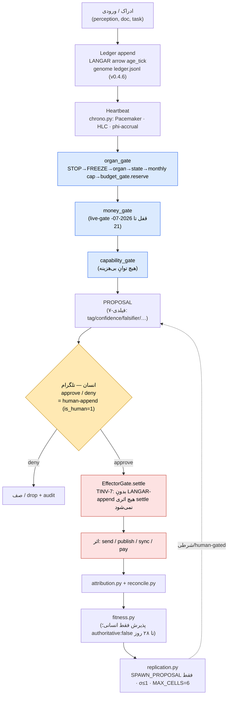
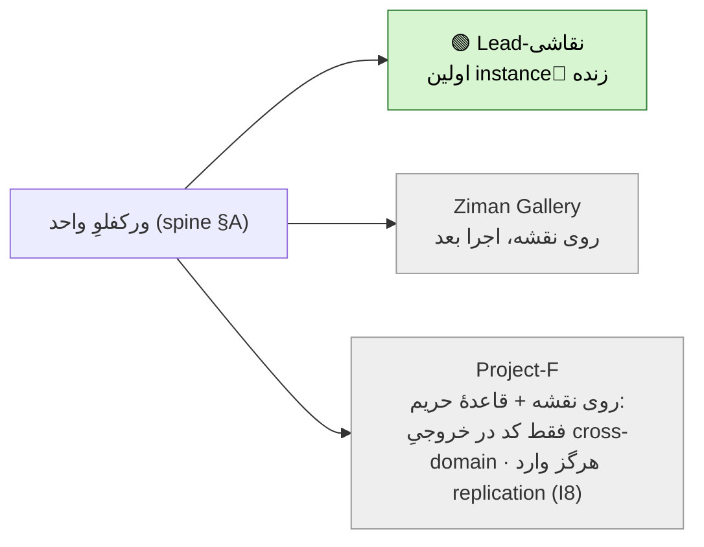
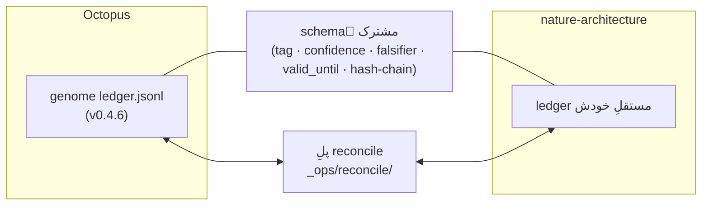
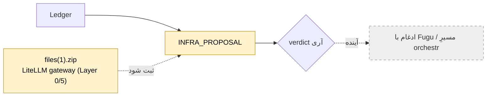
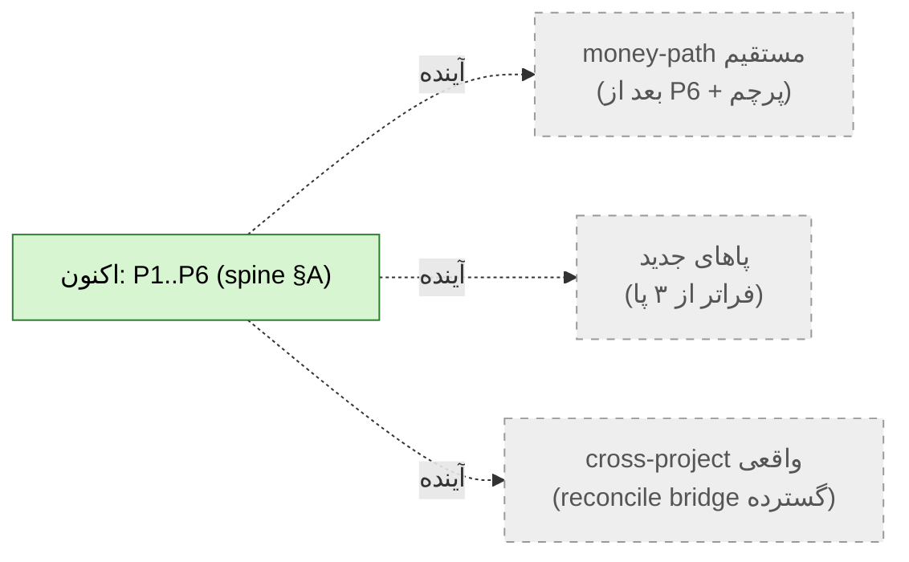

# OCTOPUS BASE-MAP — v0 (draft، روی میزِ آری برای verdict)

> **این چیست:** نقشهٔ پایهٔ واحدِ اختاپوس. طبقِ جواب‌های چیپِ ۱۰سؤالی، این سند **self-documenting** است — یک ایجنتِ سرد باید بتواند بدونِ آری از رویش build/توسعه کند. شاملِ (۱) دیاگرامِ end-to-end، (۲) جدولِ گیت‌ها، (۳) نگاشتِ هر فاز/پا به **فایلِ واقعیِ موجود**.
> **قانونِ حاکم:** گنبد نساز؛ این v0 است، یک قدم. هیچ فازِ نوی کد پیش از ratify شدنِ همین نقشه.
> **وضعیت (2026-07-08):** P1 (قلب) ✅ ساخته شد؛ اجرای authoritative + commit ِ Windows-side مانده. گیتِ P2 پس از آن.

---

## A. ستون‌فقراتِ ورکفلو (end-to-end spine)

**خواندنِ نقشه:** هر ورودی اول در Ledger می‌نشیند (منبعِ حقیقت)، بعد ضربانِ chrono آن را جلو می‌برد، از **سه گیتِ زنجیره‌ای** رد می‌شود، به یک PROPOSAL تبدیل می‌شود، **به انسان (تلگرام) می‌رسد**، و فقط پس از approve از EffectorGate به اثر می‌رسد؛ سپس attribution→fitness→(شرطی) replication.

---

## B. سه لایه و نگاشتِ ماژول (همه در `_ops/`، مرجع: ORGANISM-SPEC)

```mermaid
flowchart LR
  subgraph ANA["آناتومی — MycoLedger (حافظه)"]
    opslib["budget/opslib.py<br/>پلِ ledger, مسیرها, LockedJson, live_gate_open"]
    led["genome ledger.jsonl + ledger.py<br/>append-only, hash-chain"]
    st["_ops/state/*<br/>ماشین‌خوان: ORGANISM-STATE, chrono.db"]
  end
  subgraph PHY["فیزیولوژی — Heart (ضربان)"]
    org["organism.py<br/>وحدت‌بخش + سرور 127.0.0.1:8771"]
    chr["chrono.py<br/>Pacemaker/HLC/phi/EffectorGate"]
    bat["RUN-ORGANISM.bat<br/>لانچرِ ۳۰روزه + watchdog"]
  end
  subgraph MET["متابولیسم — Governor (انرژی)"]
    tel["telemetry.py"]
    og["organ_gate.py"]
    ge["governor_epoch.py"]
    fit["fitness.py"]
    rep["replication.py"]
    deb["debate/* (muse×architect)"]
  end
  subgraph GEN["ژنوم — Values/Gates/Doctor"]
    val["genome/values.yaml"]
    gat["genome/gates.yaml"]
    met["genome/metrics.yaml"]
  end
  ANA --> PHY --> MET
  GEN -. قیدها/اعداد .-> MET
  GEN -. RFC انسان-گیت‌دار .-> ANA
```

---

## C. جدولِ گیت‌ها (هر گیت: ورودی → منطق → فایل → verdict)

| گیت | جای روی spine | منطقِ یک‌خطی | فایل | خروجی/verdict |
|---|---|---|---|---|
| **organ_gate** | اولین گیت | STOP→FREEZE→organ→state→سقفِ ماهانهٔ ارگان→`budget_gate.reserve`؛ deny هر لایه = deny کل | `_ops/budget/organ_gate.py` | allow/deny + لاگ `organ-gate-log.jsonl` |
| **budget_gate** | داخلِ organ_gate | **تنها enforcer** (I2)؛ این لایه فقط MEASURE/propose | (مغز/genome) | reserve یا reject |
| **money_gate** | دوم | مسیرِ خرج‌دار؛ **live قفل تا 2026-07-21** (I5) + پرچمِ `ACTIVATION-*.flag` مالک | `_ops/budget/money_gate.py` | shadow/$0 تا گیتِ دوقفله |
| **capability_gate** | سوم | هیچ توانِ بی‌هزینه؛ scope-محدود | `_ops/budget/capability_gate.py` | allow با capability یا deny |
| **EffectorGate** | پس از human | TINV-7: بدونِ LANGAR-append قبلی هیچ اثرِ برگشت‌ناپذیر settle نمی‌شود؛ kill/FREEZE = force-close | `_ops/chrono.py` | settle یا block |
| **human-append** | قلبِ نقشه | approve/deny تلگرامی = `is_human=1` = تنها راهِ irreversible | `_ops/budget/approval_channel.py` + P3 | تیکِ انسانی |

---

## D. نگاشتِ فاز → گیت → فایلِ واقعی (buildable by cold agent)

| # | فاز | هدف | گیتِ ورودی/خروجی | فایل‌های کلیدی | وضعیت |
|---|---|---|---|---|---|
| P1 | **HEART** | بسترِ زمان/ضربان | خروجی: heartbeat+age_tick+effect-gate سبز | `_ops/chrono.py` · `organism.py` · `tests/test_chrono_*` | ✅ ساخته (commit مانده) |
| P3 | **TELEGRAM** | تنها کانالِ کنترل/تأیید | خروجی: approve/deny end-to-end (paper) | `_ops/budget/approval_channel.py` · `P3-TELEGRAM.md` | ⬅️ **بعدی** (پیش‌نیازِ همه) |
| P4 | **LEGS** | پروژه‌ها→پا (worker) | ورودی: تلگرام سبز؛ خروجی: Lead-نقاشی paper-$ CONFIRMED | `P4-LEGS.md` · `replication.py` (SPAWN_PROPOSAL) | صف |
| P2 | **DOCTOR** | تکاملِ ژنوم (RFC) | anchored RFC loop, human-gated | `P2-DOCTOR.md` · `debate/*` · `genome/genome_change_protocol.md` | صف (پس از P3) |
| P5 | **STAY-ALIVE** | ۲۴/۷ + یک ارگانیسمِ واحد | 24h green + one ledger/bus | `RUN-ORGANISM.bat` · watchdog · P5 | صف |
| P6 | **MONEY-LIVE** | پولِ واقعی — آخر | همهٔ گیت‌ها سبز + پرچمِ مالک | `money_gate.py` · `P6-MONEY-LIVE.md` | 🔒 قفل |

> **ترتیبِ اجرا (پس از ratify):** P3 → P4(Lead-نقاشی) → P2 → P5/paper 30-day → تصمیمِ P6. (منبع: 00-INDEX + roadmap §۵.)

---

## E. سه پا روی ورکفلو (اجرا با Lead-نقاشی)

هر پا یک instance از همان spine است. **اجرای واقعی فقط با Lead-نقاشی شروع می‌شود** (جواب ۷)؛ دو تای دیگر روی نقشه‌اند اما شادو.

---

## F. money-path (infra-only اکنون؛ گیتِ زنده کجا باز می‌شود)

- **الان:** اختاپوس فقط زیرساخت است — می‌سنجد/propose می‌کند؛ **هیچ دلارِ مستقیمِ auto** (روادمپ §۲.۱، I5).
- **قفلِ سخت:** هیچ مسیرِ خرج‌دار پیش از **2026-07-21** (در `opslib.live_gate_open`) و بدونِ پرچمِ `ACTIVATION-*.flag` که فقط مالک می‌سازد.
- **شرطِ بازشدنِ گیتِ زنده (جواب ۶ — روی نقشه علامت‌دار):**
  > **≥ ۱۰ پیشنهادِ غیرتریویالِ human-approved در هفتهٔ اولِ دیتا  ➕  صفر incidentِ جدی (safety breach / cost-cap hit).**
  اگر هر دو محقق شد → آری تصمیمِ P6 را می‌گیرد (نه سیستم).

---

## G. اتصالِ cross-project (§۲.۱۰ — دو ledger + schema مشترک + پلِ reconcile)

**تصمیمِ ratify-شده (جواب ۴):** هیچ ledgerِ فیزیکیِ واحد. هر پروژه ledgerِ مستقل با **schemaِ مشترک** دارد؛ یک **پلِ reconcile** آن‌ها را هم‌تراز می‌کند. → ابهامِ ثبت‌شدهٔ هندآفِ nature-architecture این‌جا بسته شد.

---

## H. جای ۴ specِ ایجنتِ آنبورد (جواب ۳=ب — واژگان حل شد، spec در repo می‌ماند)

اسکلتِ واژگانِ ایجنت را به ماژولِ واقعی نگاشت می‌کنیم؛ **DDLِ پیشنهادی‌اش را دور می‌ریزیم** (با ledger v0.4.6 superseded شد):

| واژهٔ ایجنتِ آنبورد | معادلِ واقعیِ اختاپوس | فایل |
|---|---|---|
| `ledger_events` (DDL skeleton) | genome ledger (hash-chain, `NOTE`+subtype) | `07…/genome-system/ledger/ledger.py` |
| `agent_task_packet` | worker/leg task (capability-scoped) | `P4-LEGS.md` + `capability_gate.py` |
| `worker_proposal` (۷-فیلدی) | PROPOSALِ هفت‌فیلدیِ debate | `debate/debate_loop.py` |
| `guard_decision` / guard layer | زنجیرهٔ organ/money/capability + EffectorGate | `_ops/budget/*_gate.py` + `chrono.py` |
| memory_vault_item | ژنوم values + reports (tag/confidence/falsifier) | `genome/values.yaml` |

specهای اصلی (`chronos-ledger`, `worker-runtime`, `memory-vault`, `guard-layer`) در repo نگه داشته می‌شوند، **نه به‌عنوان لایهٔ اجراییِ فعلی** — فقط مرجعِ واژگان.

---

## I. جای `files(1).zip` (Survival Stack gateway) — جواب ۵=ب

- **چیست:** یک آجرِ آمادهٔ Layer 0 (LiteLLM gateway) + Layer 5 (cost cap $80/30d + fail-closed + kill-switch + audit).
- **روی نقشه:** گرهِ لایهٔ ابزار/زیرساخت → ✅ **LIVE شد (2026-07-08):** gateway بالا آمد (`F:\backup\survival-gateway`, `docker compose`, پورت 4000) با ۴ routeِ سبز — `glm-coder` (GLM Coding Plan) · `deepseek-bulk` (نیازِ شارژ) · `orchestr`/`fugu` (Sakana، تست‌شده). تیرهای Claude/GPT/Gemini حذف شدند. **هنوز با organism (`budgets.yaml routing`) ادغام نشده** — قدمِ بعدیِ اتصال.
- **اقدامِ لازم:** به‌صورتِ یک PROPOSAL در Ledger ثبت شود (subtype پیشنهادی: `INFRA_PROPOSAL`)؛ سپس آری verdict بدهد که آیا جایگزین/جلوترِ مسیرِ orchestr فعلی (`debate/client.py` + `routing.orchestr.base_url` در budgets.yaml، فعلاً TBD/Fugu) شود.

---

## I₂. Worker Roster — حمال‌ها و نحوهٔ اتصال (verdict آری، جلسه ۳۳)

**تمرکز روی دو حمال؛ من = معمار/Planner/Final-Review.**

| worker | نقش | چه بخری | endpoint | کلید کجا |
|---|---|---|---|---|
| **GLM (Z.ai)** GLM-5.x/4.x | کارگرِ اصلیِ کدنویس | **GLM Coding Plan — Lite $۱۸/mo** (شروع؛ Pro/Max بعداً) | OpenAI-compatible | `.env` فقط |
| **DeepSeek V4 (Flash/Pro)** | دیباگ + review + حجمِ بالا | **اشتراک نه** — top-up ~$۱۰ + API key | OpenAI-compatible | `.env` فقط |
| Qwen/GLM local (Ollama) | fallbackِ $۰ | — (رایگان، local) | `http://ollama:11434` | — |
| Kimi K2.6 | on-demand: فایلِ بزرگ/swarm | per-token (گاه‌گاه) | — | `.env` |
| من (Opus/Max) | Planner + Final-Review + معمار | — | — | — |
| OpenRouter | لایهٔ routing (اختیاری، تک-کلید) | per-token + کارمزد | — | `.env` |

**تقسیمِ کار:** کدِ نو → GLM · دیباگ/تست/حجم → DeepSeek · پیچیده/بزرگ → Kimi (on-demand) · offline/بودجه‌تمام → Qwen local · معماری/merge → من.

**نحوهٔ حمالی (mechanism):** worker‌ها روی **دستگاهِ مالک** اجرا می‌شوند، نه در چتِ Cowork. دو مسیر:
1. **coding-agent (شروع):** GLM Coding Plan + DeepSeek key داخلِ Claude Code / Cline.
2. **gateway (Base-Map):** `files(1).zip` (LiteLLM) → هر دو کلید در `.env`، در `model_list` اضافه، route توسطِ organism. = همان گرهِ §I `INFRA_PROPOSAL`.

**قیدها:** کلید **فقط در `.env`** (I9؛ هرگز در چت/md/لاگ) · هر worker capability-scoped · **propose-only** → از `organ→money→capability→EffectorGate` → human-append (تلگرام) · تا `budgets.yaml` (`routing.*`) پر نشده، مسیرشان **shadow**.

**مسیر روی spine:** من = `heavy-reasoning`؛ GLM+DeepSeek = tierِ `fast/bulk` (§A/§C).

> `[EST] جولای ۲۰۲۶` قیمت‌ها/حدها (GLM Lite $۱۸ · DeepSeek V4 Flash ~$۰.۱۴/$۰.۲۸ per 1M) مقابلِ کنسولِ provider verify شوند — schema/قیمت جابه‌جا می‌شود.

---

## J. لیستِ صریحِ اکشن‌های auto مجازِ دکتر (جواب ۸)

دکتر (P2) این‌ها را **خودکار** انجام می‌دهد؛ **هرچیزِ دیگر = PROPOSAL + human-append**:

**✅ مجاز خودکار (non-critical، برگشت‌پذیر، $0):**
- تنظیمِ پارامترهای غیرحیاتی داخلِ سقفِ ژنوم (مثلِ threshold‌های telemetry، طولِ epoch در بازهٔ مجاز).
- به‌روزرسانیِ داکیومنت/توضیحات/reportها.
- بازکردنِ RFC (نه merge) و صف‌کردنِ survivorها.
- ری‌استارتِ پا از known-good در مسیرِ verify-fail (`doctor.restart_from_known_good`) با **سقفِ N تلاش → بعد FREEZE + صف انسان** (ضدِ حلقهٔ ترمیمِ بی‌پایان).

**⛔ فقط PROPOSAL + انسان:**
- هر تغییرِ `genome/values.yaml` یا `gates.yaml` (هستهٔ ارزش‌ها).
- هر spawn (I8: فقط SPAWN_PROPOSAL).
- هر مسیرِ money/effector.
- هر تغییرِ قاعدهٔ قفل‌شده.

---

## K. قلاب‌های آینده (خاکستری/placeholder — جواب ۱۰، ضدِ گنبد)

این‌ها فقط جای‌گرفته‌اند تا بعداً کسی از سقف شروع نکند؛ **هیچ‌کدام الان ساخته نمی‌شوند.**

---

## L. ناوردی‌های حاکم (مرجع سریع — نقض = توقف)

I1 append-only · I2 تک-enforcer (budget_gate) · I3 fail-closed (واگرایی>۲۰٪ = STOP-METABOLIC) · I4 اعداد از `budgets.yaml` · I5 گیتِ دوقفلهٔ زنده (پیش از 2026-07-21 قفل) · I6 budgets.yaml فقط‌خواندنی · I7 پذیرشِ فقط انسانی · I8 ضدسرطان (σ≤1، MAX_CELLS=6، Project-F مستثنا) · I9 secret فقط از env · I10 ضدتزریق · TINV-3 (age_tick) · TINV-5 (پا wall-clock نمی‌خواند) · TINV-7 (EffectorGate).

---

## Gap-report و Checkpoint

**بسته‌شده در این v0:** ورکفلوِ end-to-end · جدولِ گیت · نگاشتِ فاز/پا→فایل · §۲.۱۰ (دو ledger+پل) · جای zip · لیستِ auto دکتر · قلاب‌های خاکستری.

**بازِ نیازمندِ verdict آری (قبل از build):**
1. **subtypeِ رویدادِ `INFRA_PROPOSAL`** برای zip — نام/schema را آری تأیید کند (V2 در نردبانِ فعال‌سازی).
2. **base_url ِ Fugu** هنوز TBD — تا آن‌موقع مسیرِ orchestr شادو.
3. **عددِ دقیقِ «غیرتریویال»** در متریکِ §F (چه چیزی یک پیشنهاد را واجدِ شمارش می‌کند؟) — پیشنهاد: هر PROPOSALی که به EffectorGate رسیده باشد.
4. **commit ِ Windows-side ِ P1** هنوز انجام نشده — تا آن نرود، نقشه روی کدِ torn تکیه دارد.

**قدمِ بعدی پس از ratify:** ترتیبِ §D را از **P3 (تلگرام)** شروع کن — پیش‌نیازِ هر human-append و هر پا.

> `[تثبیت‌شده]` = مسیرها/گیت‌ها/فازها از ORGANISM-SPEC و 00-INDEX خوانده شد. `[فرضیه]` = نگاشتِ واژگانِ §H و subtypeِ §I پیشنهادِ من است و verdict می‌خواهد.
