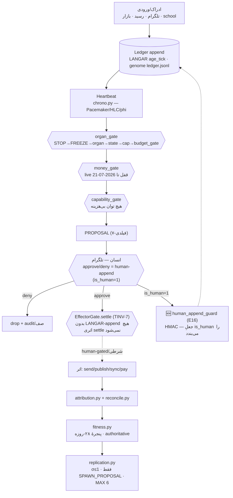

# OCTOPUS BASE MAP — v1 (grounded)

> ارتقای v0 (draft 2026-07-08، verdict-pending) → v1، reground‌شده از repoِ واقعی (HEAD `6a12197`).
> نظمِ epistemic: `[FACT: path]` = در فایل/کد دیدم · `[EST]` = استنتاج · `[OPEN]` = نامعلوم.
> ⚠️ اخطارِ گراندینگ: ۷ فایلِ هستهٔ `_ops/` در این checkout **بریده** خوانده شدند (جزئیات و restore: [[00 - Inbox/2026-07-09 PROPOSAL — core-restore runbook + E16 human-append guard wiring]]). ادعاهای مربوط به کدِ هسته از **نسخهٔ سالمِ git HEAD** گراند شده‌اند، نه working-tree.

---

## A. ستون‌فقراتِ workflow (end-to-end)

**Δ نسبت به v0:** گرهِ `human_append_guard` **جدید** است (رفعِ E16؛ کد ساخته/تست‌شده — بخش E).

---

## B. لایه‌ها (regrounded)

| # | لایه | محتوا | تگ |
|---|---|---|---|
| L0 | Constitution | `CLAUDE.md`, `_PROJECT_INSTRUCTIONS.md` | `[FACT]` |
| L1 | Substrate | markdown/git/JSONL/SQLite | `[FACT]` |
| L2 | Business | ۷ tenant (شاملِ Project-F 🔒) | `[FACT]` |
| L3 | Organism | `_ops/`: Heart/Governor/neural/doctor/debate/afferent/legs | `[FACT: git HEAD]` |
| L4 | Meta-controller | architect (RD + CO، propose-only) | `[FACT]` |
| L5 | Governance | آری D-01 + Telegram + charter + ledger | `[FACT]` |

---

## C. جدولِ گیت‌ها (Δ نسبت به v0)

| گیت | منطق | فایل | verdict | Δ vs v0 |
|---|---|---|---|---|
| organ_gate | STOP→FREEZE→organ→state→سقفِ ماهانه→budget_gate.reserve | `_ops/budget/organ_gate.py` | allow/deny + log | تأیید `[FACT]` |
| budget_gate | تنها enforcer (L2) | genome/مغز | reserve/reject | تأیید `[FACT]` |
| money_gate | خرج‌دار؛ live قفل تا 2026-07-21 (L5) | `_ops/budget/money_gate.py` | shadow/$0 | تأیید `[FACT: opslib.live_gate_open]` |
| capability_gate | هیچ توان بی‌هزینه | `_ops/budget/capability_gate.py` | allow+cap/deny | تأیید `[FACT]` |
| EffectorGate | TINV-7؛ بدونِ LANGAR-append اثری settle نمی‌شود | `_ops/chrono.py` | settle/block | تأیید `[FACT: HEAD]` |
| human-append | approve/deny تلگرامی = is_human=1 | `approval_channel.py` + P3 | تیکِ انسانی | ⚠️ **E16**: is_human هنوز جعل‌پذیر — گاردِ جدید (E) |
| **human_append_guard** 🆕 | امضای HMAC روی is_human؛ approval_channel mint می‌کند | `_ops/budget/human_append_guard.py` | allow-human/downgrade | **جدید** `[FACT]` |

---

## D. نگاشتِ فاز → فایل → وضعیت (regrounded)

| فاز | هدف | فایل | وضعیت v0 | وضعیت v1 (گراند‌شده) |
|---|---|---|---|---|
| P1 HEART | ضربان/زمان | `chrono.py` · `organism.py` | ✅ (commit مانده) | ✅ **committed** (`6a12197`، tree تمیز) `[FACT]` · ⚠️ worktree بریده → restore |
| P3 TELEGRAM | کانالِ تأیید | `approval_channel.py` · `P3-TELEGRAM.md` | ← بعدی | interface هست، وصلِ واقعیِ تلگرام `[OPEN]` |
| P4 LEGS | پروژه→پا | `P4-LEGS.md` · `replication.py` | صف | فقط ۱ پا با حلقه `[FACT: HANDOFF]` |
| P2 DOCTOR | تکاملِ ژنوم | `debate/*` · `P2-DOCTOR.md` | صف | Doctor Evolution **wired** (`6a12197`) + box cluster (`8b6c30b`) `[FACT: git log]` |
| P5 STAY-ALIVE | ۲۴/۷ | `RUN-ORGANISM.bat` · `watchdog` | صف | watchdog هست؛ اجرای live پشتِ گیت `[FACT]` |
| — | consolidation | `neural/consolidation.py` + `wiring` | ⚠️ unwired (v0 payload) | **wired behind flag** (`c77238b`) `[FACT: git log]` |

---

## E. Delta vs v0 (سه فهرست، هر سطر با citation)

### ✅ تأییدشده (بدونِ تغییر)
- money_gate=shadow/$0 تا 2026-07-21 `[FACT: opslib.live_gate_open]`.
- protective_override پیش از epoch `[FACT: commit c67c591]`.
- §Security Gate = LIFTED از 2026-07-06 `[FACT: ROTATION_CHECKLIST]`.
- ۷ tenant + معماریِ لایه‌ای `[FACT]`.

### 🔀 تغییرکرده نسبت به snapshotِ v0
- consolidation: ⚠️unwired → **wired behind flag** `[FACT: commit c77238b]`.
- Doctor Evolution/Box: ⚠️unwired → **wired** `[FACT: commits 6a12197, 8b6c30b]`.
- P1 «commit مانده» → **committed، tree تمیز** `[FACT: git status]`.

### 🆕 جدید-کشف‌شده
- 🔴 **P0 integrity:** ۷ فایلِ هستهٔ `_ops/` در working-tree بریده؛ HEAD سالم `[FACT]` → restore لازم.
- 🔴→🟢 **E16 رفع شد (کد):** `human_append_guard.py` + تست ۱۰/۱۰ سبز `[FACT]`؛ patchِ سیم‌کشی propose-only.
- ⚠️ **drift نسخهٔ ledger:** `0.4.6` (unified_bus) ↔ `0.4.5` (test_chrono_langar) `[FACT]`.
- ⏳ **۱۲ روز تا live-gate** → «Pre-Live-Gate Checklist» کاندیدای P0 `[EST]`.

---

## Gap-Report (L9)
- **[OPEN]** اجرای واقعیِ سوئیتِ `_ops/tests` (نیاز: restore هسته + pytest/شبکه روی ویندوز).
- **[OPEN]** مسیرِ دومِ E16: `chrono._human_judgment` مستقیم `is_human=True` می‌زند و از bus/گارد رد نمی‌شود.
- **[OPEN]** reconcileِ تصادمِ LANGAR؛ enforceِ کدیِ Project-F guard.
- **فرض `[EST]`:** «wired behind flag» یعنی رفتارِ live هنوز پشتِ flagِ خاموش است تا verdict.

> جزئیات + runbook + patch: [[00 - Inbox/2026-07-09 PROPOSAL — core-restore runbook + E16 human-append guard wiring]]
