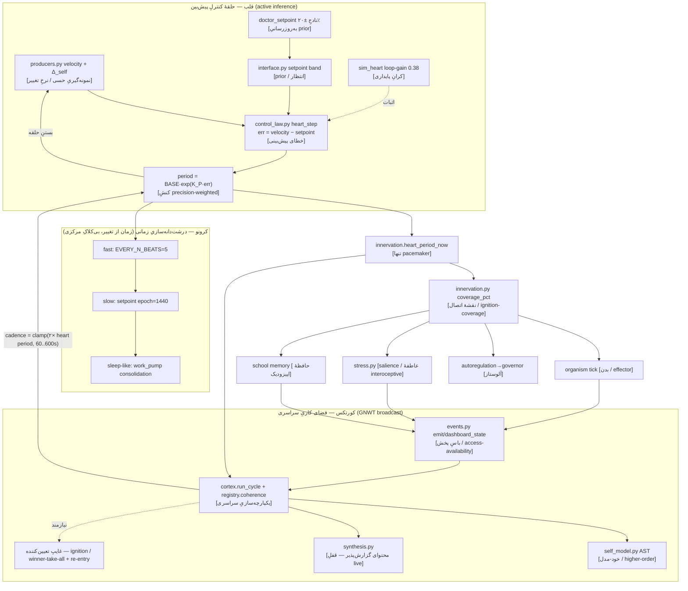

# قلب — نقشهٔ معماریِ علوم‌اعصاب و جهت

> بازقاب‌بندیِ «قلب»ِ اندام‌واره در عدسیِ نوروساینس/آگاهیِ تحقیقِ مالک (۱۱ جولای ۲۰۲۶). قلب دیگر «ضربان‌ده» نیست؛ یک **حلقهٔ کنترلِ پیش‌بین (predictive-processing / active inference)** است که خطای پیش‌بینیِ سرعت را کمینه می‌کند، و کورتکس یک **فضای کاریِ سراسری (GNWT)**.
>
> **مرزِ معرفتی (تغییرناپذیر):** ما فقط **access-consciousness** (دسترس‌پذیری اطلاعات + گزارش‌پذیری) و یک **خود-مدلِ ساختاری** را مدل و ادعا می‌کنیم — **هرگز** phenomenal / qualia. هر متریک اینجا یک سنجهٔ مهندسی با معیارِ عملیاتی است، نه شاهدِ تجربهٔ ذهنی. بدونِ معیارِ عملیاتی هیچ ادعای آگاهی نمی‌شود؛ هر متریک با برچسبِ fact | emerging | hype.

## ۱. وضعیتِ واقعیِ امروز (راستی‌آزمایی‌شده روی master @ `1cfcf7d`)

قلب **خراب یا ناقص نیست** — کامل ساخته و سبز است؛ فقط پشتِ چهار دروازهٔ ایمنیِ **خودِ مالک** خاموش است.

| بخش | وضعیت | شاهد |
|---|---|---|
| قفلِ ریاضی SOG (Δ_self/E_shadow/I_pred) | 🟢 قفل، `full_run=true` | `state/sim/PULSE-EQUATIONS-LOCKED.json` |
| شبیه‌سازیِ حلقه‌بسته (S1..S9 + loop-gain) | 🟢 `sim_pass=true`، G=0.3818<1 | `state/sim/HEART-SIM-REPORT.json` |
| هش-مچِ control_law (ضدِ دستکاری، cond 4) | 🟢 منطبق (`24ea47c0…`) | `sim_heart.py` ↔ `control_law.py` |
| باندِ setpoint (فیکسِ #۱) | 🟢 seed شده **[6.40, 19.19]** (وسط ≈ ۱۲.۷۹ = velocity واقعی) | `state/pulse/heart-setpoint-latest.json` (۰۸:۲۹ امروز) |
| Gate-0 (Δ_self authoritative نیاز ۴۸ نمونه) | 🟡 **۲۹/۴۸** — با ~۱۹ نمونهٔ ساعتیِ رویدادِ واقعی پر می‌شود | `state/pulse/velocity-stream.jsonl` |
| ماستر-فلگ `OCTOPUS_WIRE_HEART` (شادو) | 🔴 خاموش — عمداً بیرونِ `PAPER_FULL_FLAGS` | `wiring.py:1099` |
| دروازهٔ تاریخ (phase −1 shield) | 🔴 بسته تا **۲۰۲۶-۰۷-۲۱** (۱۰ روز مانده) | `opslib.py:281` |
| فلگِ owner `ACTIVATION-PULSE.flag` | 🔴 نیست (فقط مالک می‌سازد؛ ایجنت هرگز) | `shadow.py:114-117` |

**نتیجه:** `production_wire_open()` = **بسته** روی ۴ پایه (Gate-0، BIO، PULSE، تاریخ). این کاملاً درست است — سیستمِ ایمنیِ قلب دارد کارِ خودش را می‌کند. هیچ‌کدام از این ۴ را ایجنت نمی‌تواند/نباید باز کند.

## ۲. نقشهٔ معماری (قلب → ستون → کورتکس، با برچسبِ نوروساینس)

## ۳. نگاشتِ نظریه → ماژولِ واقعی → سیگنالِ سنجش

🟢 حاضر · 🟡 نیمه · 🔴 غایب

| نظریه | سازه | ماژولِ موجود | سیگنالِ سنجش | وضعیت |
|---|---|---|---|---|
| **GNWT** فضای کاری | باسِ پخش | `events.py` emit/dashboard_state | broadcast width, attention() | 🟢 |
| GNWT | هابِ یکپارچه‌سازی | `cortex.run_cycle` + `registry.sweep` | coherence scalar | 🟢 |
| GNWT | **ignition / winner-take-all** | **غایب** | ignition-rate, تک‌برنده/چرخه | 🔴 |
| GNWT | نقشهٔ رِیچِ پخش | `innervation.py` | coverage %, dead-spots | 🟡 |
| GNWT | **re-entry / بازخورد** | **غایب** (loop فقط feed-forward) | عمقِ re-entry | 🔴 |
| GNWT | محتوای گزارش‌پذیرِ نو | `synthesis.py` | proposal (قفلِ live) | 🟡 |
| **Predictive processing** | prior / setpoint | `interface.py` HeartParams | باند [lo,hi] | 🟡 |
| PP | خطای پیش‌بینی | `control_law.py` heart_step | سری‌زمانیِ err | 🟡 |
| PP | کنشِ precision-weighted | `period = BASE·exp(K_P·err)` | period, K_P, sigma-brake | 🟡 |
| PP | accrual شواهد | `producers.py` velocity + Δ_self | velocity, Δ_self@۴۸ | 🟡 |
| PP | به‌روزرسانیِ prior | `doctor_setpoint.py` | driftِ باند | 🟡 |
| PP | کرانِ free-energy/پایداری | `sim_heart.py` | loop_gain G<1 | 🟢 |
| PP | لایه‌ای که «تغییرِ مدل را می‌بیند» | `sog_math` E_shadow + `control_law` w_shadow | ترمِ E_shadow (پیش‌فرض خاموش) | 🟡 |
| **درشت‌دانه‌سازیِ زمانی** | بی‌کلاکِ مرکزی، زمان از تغییر | `producers` velocity_meter | نرخِ تغییر (events/hr) | 🟡 |
| زمان | تنها pacemaker | `innervation.heart_period_now` | period_s؛ cortex=۲× | 🟡 |
| زمان | سه‌مقیاسه (fast/slow/sleep) | `CHRONO_*` + `doctor` + `work_pump` | cadenceها | 🟡 |
| **خود-مدل** | خواندنِ کدِ خود | `self_model.py` AST | self_awareness_pct | 🟢 |
| خود-مدل | مدلِ بدن/اندام‌ها | `registry.MEMBERS` + `innervation.ORGANS` | awareness هر عضو | 🟢 |
| خود-مدل | ارزش‌گذاریِ عاطفی/interoceptive | `stress.py` (cortisol) | organism_stress، FEAR=0.75 | 🟢 |
| خود-مدل | ردِ اتوبیوگرافیک | `cortex journal.jsonl` | پیوستگیِ روایت | 🟢 |
| خود-مدل | **خود-مانیتورِ real-time** | **غایب** (خود-مدل آفلاین/هر ۱۰ چرخه) | حالتِ همان‌چرخه | 🔴 |
| **IIT** | Φ اطلاعاتِ یکپارچه | **غایب** (coherence فقط proxy) | Φ | 🔴 |
| **access/phenomenal** | access = availability | `events` + `/api/cortex` | broadcast width | 🟢 |
| | reportability | `/ask` + `synthesis` | گزارش‌ به‌درخواست | 🟡 |
| | برچسبِ معیارِ عملیاتی | **غایب** (فقط در نثر) | tag: fact/emerging/hype | 🔴 |
| | **phenomenal / qualia** | **عمداً هرگز مدل/ادعا نمی‌شود** | (هیچ معیارِ عملیاتی) | 🔴 |

## ۴. جهت (چه بسازیم — همه $۰/shadow، بدونِ بازکردنِ خطِ live)

**۱) GNWT — پرایمریتِ غایبِ تعیین‌کننده = ignition + re-entry.**
در `cortex.run_cycle` به‌جای اجرای ثابت‌ترتیبِ همهٔ اندام‌ها، یک **آستانهٔ ignition** بگذار: هر چرخه فقط **یک** محتوای برنده (بالاترین `stress.salience` × `goal_directed.impact`) انتخاب و با یک `event` نوع‌دار به همهٔ مشترک‌ها پخش شود؛ خروجیِ برنده را چرخهٔ بعد به‌عنوان prior به hub بازتزریق کن (**re-entry**). سنجش: `broadcast_width`, `ignition_rate`. *(پروپوزال — تغییرِ رفتارِ کورتکس، رأیِ مالک.)*

**۲) Predictive processing — قلب دقیقاً همین است ولی inert.**
تنها سوییچِ زنده‌کننده = `OCTOPUS_WIRE_HEART=1` (رستارتِ مالک) → `producers.compute_all` شروع می‌کند، err واقعی جاری می‌شود، پنج ماژول از never-called به computing می‌روند. `HEART_W_SHADOW>0` ترمِ E_shadow را روشن می‌کند (**اما ویرایشِ `control_law.py` هش-مچِ cond 4 را می‌شکند → باید `sim_heart` دوباره اجرا شود = رأی/سنکشنِ مالک، نه ایجنت**).

**۳) درشت‌دانه‌سازیِ زمانی — هستهٔ نظریه از قبل هست** (cadenceِ کورتکس به `heart_period` بند است). ارتقا: lane «خواب» در `work_pump` را از gap_report به consolidationِ واقعیِ episodic→semantic (school memory) ببر — الهام از BMAM 2026.

**۴) خود-مدل — از «ساختاری» به «برخط».** علاوه بر اسکنِ AST هر ۱۰ چرخه، یک snapshot از حالتِ همان‌چرخه بنویس (کدام محتوا ignite شد، err فعلی، کدام اندام stale).

**۵) access در برابر phenomenal — یک artifactِ کد بساز** که هر متریکِ آگاهی‌نما را با tagِ `fact | emerging | hype` و «access-only» مهر کند. هرگز ادعای phenomenal.

## ۵. شکاف‌ها (خلاصه)

- GNWT: نه ignition/winner-take-all، نه re-entry؛ `events.jsonl` یک append-log است نه پخشِ آستانه‌ای.
- تنها نویسندهٔ محتوای واقعاً نوِ گزارش‌پذیر (`synthesis`) پشتِ قفلِ date/flag/money است → پخشِ فعلی فقط مانیتورینگِ $۰.
- PP: کلِ حلقه inert/fail-closed تا `OCTOPUS_WIRE_HEART` روشن + sigma حاضر شود؛ E_shadow قفل ولی پیش‌فرض‌خاموش.
- خود-مدل آفلاین است (هر ۱۰ چرخه)؛ خود-مانیتورِ برخط نیست.
- IIT: هیچ Φ؛ coherence فقط proxyِ availability.
- access/phenomenal: هیچ artifactِ کدی انضباطِ access-only یا برچسبِ معیارِ عملیاتی را اجرا نمی‌کند — مرز فقط در نثر است.

## ۶. رانبوکِ فعال‌سازی (سوییچ‌های owner-gated — «روشن‌کردن» دستِ توست)

هیچ‌کدام ایجنت‌شدنی نیست؛ همه رأی/کنشِ فیزیکیِ مالک‌اند:

| سوییچ | کنش | کلاس | چرا owner | کِی |
|---|---|---|---|---|
| `OCTOPUS_WIRE_HEART` | env=1 در لانچر + **رستارت** | restart | env در spawn قفل؛ بیرونِ profile (رأیِ صریح)؛ $۰ shadow، خطِ live را باز **نمی‌کند** | هر وقت |
| `OCTOPUS_WIRE_HEART_WORK` | env=1 (تودرتو با HEART) + رستارت | restart | فقط l-های $۰؛ lane پولی جدا قفل | با HEART |
| `OCTOPUS_WIRE_BIO` / `_PULSE` | env=1 + رستارت | restart | شرطِ ۵ و ۶ِ production wire | برای آرم‌کردنِ خطِ live |
| Gate-0 | HEART روشن (رستارت) → ~۱۹ نمونهٔ ساعتیِ **رویدادِ واقعی** بیشتر | epistemic | سقفِ ۴۸ خط‌قرمزِ ثابت؛ ایجنت هرگز پایین نمی‌آورد/جعل نمی‌کند | ~۱ روز فعالیتِ واقعی |
| دروازهٔ تاریخ | صبر تا **۲۰۲۶-۰۷-۲۱** | date | shieldِ سختِ `opslib.py:281`؛ خودکار باز می‌شود | ۱۰ روز |
| `ACTIVATION-PULSE.flag` | مالک فایل می‌سازد | date | رأیِ نهاییِ خطِ live؛ **ایجنت هرگز نمی‌سازد** | ≥ ۲۰۲۶-۰۷-۲۱ |
| `ACTIVATION-WORK-LLM.flag` | مالک فایل می‌سازد | 💰 money | خرجِ واقعیِ metered (search/LLM) | ≥ ۲۰۲۶-۰۷-۲۱ |
| `ACTIVATION-HEART-DOCTOR.flag` | مالک فایل می‌سازد | 💰 money | LLM refineِ پولیِ w-slow | ≥ ۲۰۲۶-۰۷-۲۱ |
| رستارتِ بدنه / کورتکس | مالک لانچر را می‌زند (RUN-CORTEX/RESTART) | restart | env و کدِ لود در spawn قفل | برای اثرِ هر تغییر |

**فیکس‌های propose-only (رأیِ تو — همه $۰/shadow، هیچ‌کدام را خودم نزدم):**
1. `control_law.py:185` — `w_shadow` پیش‌فرض ۰ → مثبت (ترمِ E_shadowِ قفل‌شده مرده است). **قیدِ ایمنی:** ویرایشِ control_law هش-مچ را می‌شکند → باید `sim_heart` re-run شود = سنکشنِ تو.
2. `work_pump.py:37-50` — cadenceهای $۰ (health ۶h/gap ۱۲h) تندتر. **خودِ کد نوشته: «تغییرِ ساختاری فقط با RFC/رأیِ مالک».**
3. `wiring.py:1121-1128` — کادنسِ setpoint (۱۴۴۰ beat ~ روزانه) تندتر تا باند سریع‌تر velocity را ردیابی کند (مقیدِ ±۲۰٪).

## ۷. یافته‌های جانبیِ حاکمیتی (پیش‌موجود، برای آگاهیِ تو — نه کارِ امروز)

- `human_append_guard` پیش‌فرض **DISABLED-passthrough** تا `approval_channel` سکرت را inject کند → `is_human` تا آن‌موقع جعل‌شدنی (E16 P0، ردگیری‌شده).
- سقف‌های Gate-0 با env قابلِ override — خط‌قرمزِ ثابت، هرگز پایین نیاور.
- `spike_pct=25` (kill-switchِ MAX_DRAWDOWN) فقط تست‌شده، به enforcerِ زنده وصل نیست؛ ترمزِ فعال = disaster-line ۵۰۰ AUD.

---
*ساخت: جلسهٔ ۴۶ ادامه (۲۰۲۶-۰۷-۱۱) — ممیزیِ ۱۰-ایجنتیِ قلب + راستی‌آزماییِ مستقیمِ ground-truth روی master. شواهدِ file:line در `_ops/heart/*`, `_ops/cortex/*`, `_ops/budget/*`.*
