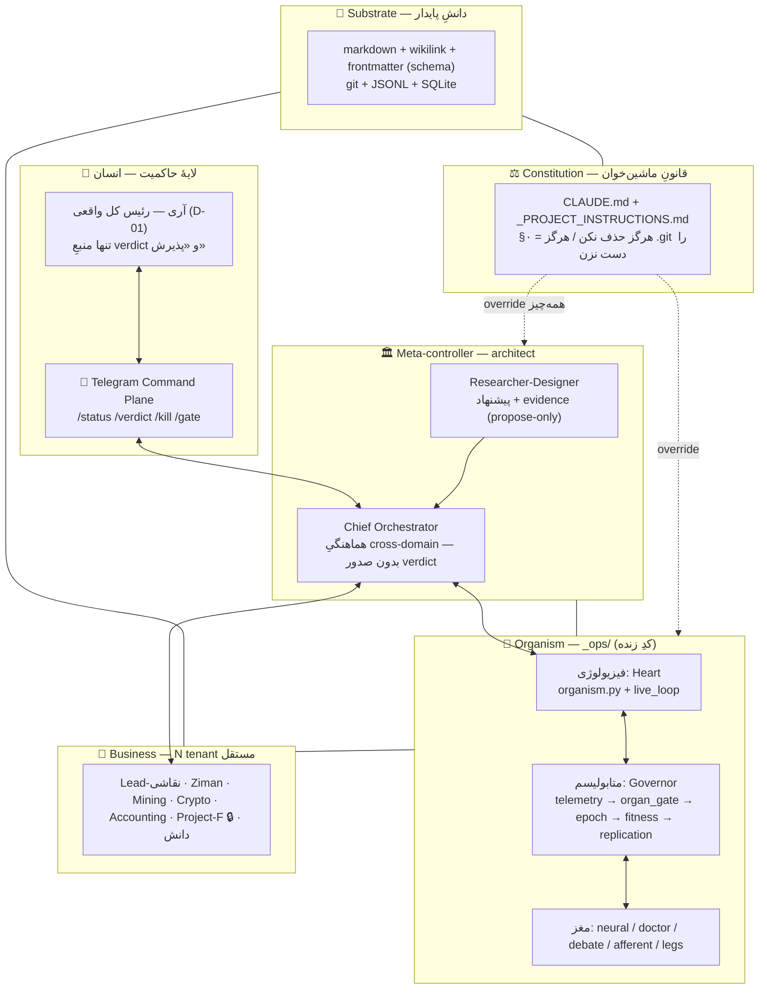
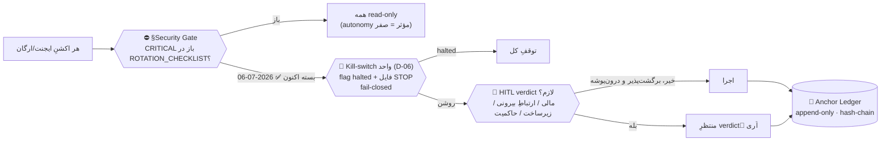
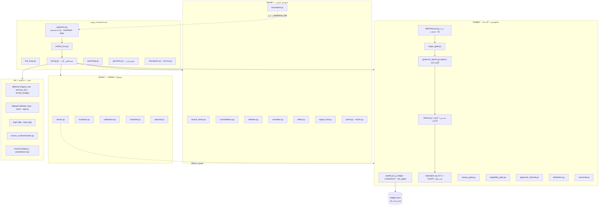
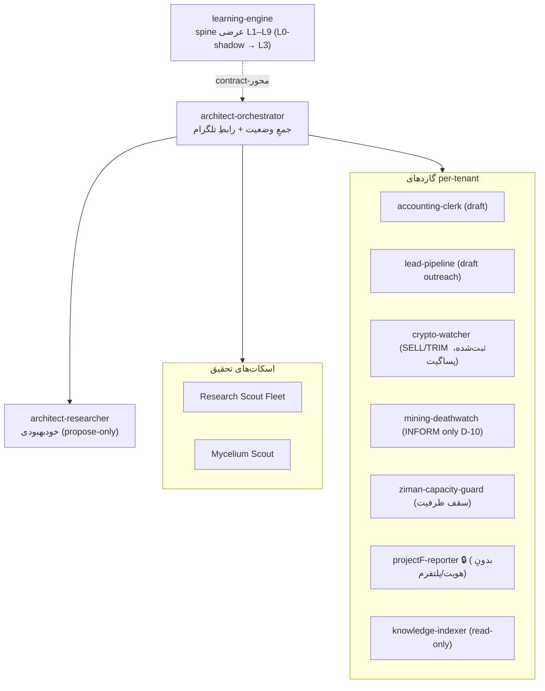
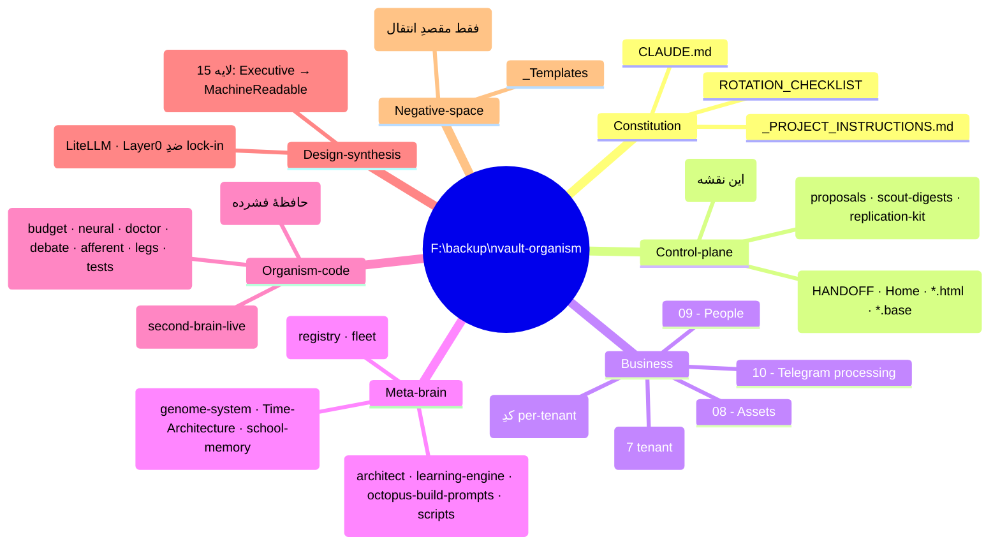
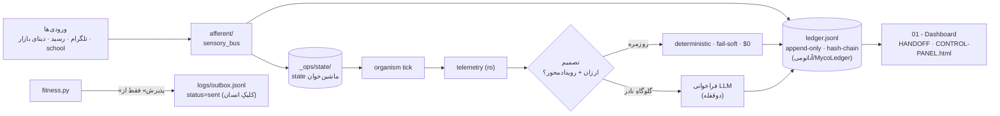

# MASTER-ARCHITECTURE — نقشهٔ معماریِ کلِ vault + ارگانیسم

> نقشهٔ کانونیِ «همه‌چیز در یک نگاه». نه اسپکِ اجرا (آن‌ها در [[_ops/ORGANISM-SPEC]] و اسنادِ 04)، بلکه **نقشهٔ ذهنیِ مهندسِ معمار**: این چیست، از چه لایه‌هایی ساخته شده، ایمنی کجا قفل است، کد کجاست، ایجنت‌ها کجایند، و کجا هنوز شکاف است.
> این سند را یک ایجنتِ فقط‌خواندنی (Vault Cartographer) از روی وضعیتِ واقعیِ repo تولید و به‌روزرسانی می‌کند — نه از حافظه.

---

## ۰) یک‌خط

یک **Obsidian vault ِ agent-first** که هم‌زمان کنترل‌پلینِ چند بیزنسِ موازی است **و** میزبانِ یک **سازوارهٔ خودگاورنور** (کد پایتون در `_ops/`) — همه پشتِ گیت‌های ایمنیِ *قفل‌شده‌در‌کد*، با یک ledgerِ append-only ِ هش‌زنجیره‌ای به‌عنوانِ منبعِ حقیقت.

اصلِ حاکم: **هوشِ گران فقط در نقاطِ تصمیمِ نادر؛ ایمنی از طریقِ ساختار، نه انضباط؛ سیستم هرگز نباید بتواند معیارِ قضاوتِ خودش را دور بزند.**

---

## ۱) استکِ لایه‌ای (نمای بلند)

| لایه | نقش | فناوری |
|---|---|---|
| **Constitution** | قانونِ اساسیِ ماشین‌خوان که حتی ایجنتِ خودمختار هم دور نمی‌زند | `CLAUDE.md` + `_PROJECT_INSTRUCTIONS.md` |
| **Substrate** | حافظهٔ پایدار/دانش، human-readable | Obsidian، markdown، git، JSONL، SQLite |
| **Business** | N بیزنسِ مستقل، هرکدام `PROJECT.md` + لاگِ تلگرام | نقاشی/گالری/ماینینگ/کریپتو/حسابداری/Project-F/دانش |
| **Meta-controller** | مغزِ خودبهبود + هماهنگ‌کننده | `04 - Architect System/architect/` |
| **Organism** | سازوارهٔ همیشه-روشنِ خودگاورنور | `_ops/` (پایتون) |
| **Governance** | انسان + گیت‌های HITL | Telegram + charter + ledger |

---

## ۲) سه مکانیزمِ ایمنیِ عرضی (روی همه‌چیز)

- **§Security Gate** — تک‌منبعِ وضعیت: §۲ ARCHITECT_CHARTER. اکنون **LIFTED** (۲۰۲۶-۰۷-۰۶، verdictِ صریحِ آری؛ ۴ ردیفِ CRITICAL + Fugu = ROTATED). ۱۴ ردیفِ HIGH/MEDIUM باز = backlogِ چرخش، گیت نیستند.
- **Kill-switch (D-06)** — fail-closed؛ flag در DB + فایلِ `STOP`.
- **HITL** — نقاطِ verdictِ اجباری: هر BUY/پرداخت، هر پیام به شخصِ واقعی (Spam Act/DNCR)، هر deploy/SSH (D-20)/حذف، هر تغییرِ charter/secret.
- **live_gate_open (گیتِ دوقفله)** — هیچ مسیرِ زنده‌ای پیش از **۲۰۲۶-۰۷-۲۱** و بدونِ دو قفلِ مالک باز نمی‌شود؛ در خودِ کد چک می‌شود (`opslib.live_gate_open`)، نه فقط در سند.

---

## ۳) ارگانیسم — نگاشتِ ماژول‌های `_ops/`

سه لایه: **آناتومی** (حافظه/ledger) · **فیزیولوژی** (ضربان) · **متابولیسم** (انرژی/سهمیه) — به‌علاوهٔ مغزِ عصبی، دکتر (verifier مستقل)، مناظره، مسیرِ حسّی و پاها.

نکتهٔ کلیدیِ اجرا (از HANDOFF جلسهٔ ۴۱): تصمیمِ `protective_override` اکنون **پیش از** epoch گرفته می‌شود و epoch/fitness/replication/doctor روی `not _protective_skip` گیت‌اند → protective = detect + enforce (commit `c67c591`).

---

## ۴) ناوگانِ ایجنت‌ها (planned fleet)

> **هر ردیف وارثِ §Security Gate است.** هیچ‌کدام هنوز deploy نشده (فاز ۴)؛ autonomyِ مؤثرِ همه فعلاً propose/read-only.

منبعِ کانونی: [[05 - Agents/AGENT_REGISTRY]]. ماتریسِ autonomy/تشدید: [[04 - Architect System/architect/ARCHITECT_CHARTER|ARCHITECT_CHARTER]].

---

## ۵) کهکشانِ زیرسیستم‌ها (نگاشتِ پوشه → نقش)

- **CHRONOS-FABLE-OS** — سنتزِ طراحیِ ۱۸-فایلی؛ فلسفهٔ کانونی: «ارگانیسمِ شناختیِ فانی، paradigm-agnostic، human-anchored» برای یک اپراتورِ واقعی. هر capability با cost متر می‌شود، هر effectِ برگشت‌ناپذیر پشتِ anchorِ انسانی، هر claim با تگِ epistemic + falsifier.
- **survival-gateway** — لایهٔ ۰ ضدِ vendor-lock-in روی **LiteLLM proxy** (MIT). عمداً بیرونِ vault اجرا می‌شود؛ مدل = موتورِ تعویض‌پذیر.

---

## ۶) جریانِ داده و منبعِ حقیقت

دو منبعِ حقیقتِ تلمتری: `ledger.jsonl` (ژنوم) + `core.db/usage` (مغز، فقط‌خواندنی). واگراییِ >۲۰٪ → FREEZE + شرطِ مرگِ `STOP-METABOLIC`.

---

## ۷) وضعیتِ design ↔ reality و شکاف‌های شناخته‌شده

> **🔄 رفرشِ ۲۰۲۶-۰۷-۰۹ (اجرای META-PROMPT BaseMap v1):** جدول از repoِ واقعی (HEAD `6a12197`) reground شد. دو تغییرِ بزرگ: چند «unwired» حالا wired است، و یک **P0ِ جدیدِ integrity** کشف شد (هستهٔ بریده). جزئیات: [[04 - Architect System/octopus-build-prompts/OCTOPUS-BASE-MAP-v1]] + [[00 - Inbox/2026-07-09 PROPOSAL — core-restore runbook + E16 human-append guard wiring]].

از [[01 - Dashboard/HANDOFF]] (جلسات ۴۱–۴۲) + git log + گراندینگِ ۲۰۲۶-۰۷-۰۹:

| ناحیه | وضعیت | یادداشت (گراند‌شده) |
|---|---|---|
| 🔴 **integrity هستهٔ `_ops/`** | 🔴 **P0 جدید** | ۷ فایلِ هسته در worktree بریده؛ HEAD سالم → `git restore` |
| هستهٔ Chrono | ✅ ساخته/committed | HEAD `6a12197`، tree تمیز `[FACT]` |
| protective-halt (S-fix-3) | ✅ enforce واقعی | commit `c67c591` `[FACT]` |
| money-lock / exposure | ✅ سالم | live قفل تا 2026-07-21 `[FACT]` |
| verifier-independence (Doctor) | ✅ آسیب‌ناپذیر | + Doctor Evolution **wired** (`6a12197`,`8b6c30b`) |
| `is_human` (E16) | 🔴→🟢 رفعِ کدی | گارد ساخته/تست‌شده ۱۰/۱۰ (`human_append_guard.py`)؛ سیم‌کشی propose-only |
| `mean_awareness()` باگ | 🟡 احتمالاً fix | `test_canonical_consolidation.py` assert می‌کند؛ اجرا `[OPEN]` (هستهٔ بریده) |
| consolidation | ✅ wired behind flag | commit `c77238b` `[FACT: git log]` |
| Doctor Evolution / Box | ✅ wired | commits `6a12197` + `8b6c30b` `[FACT]` |
| پاها (legs) | ⚠️ فقط ۱ پا با حلقه | `[FACT: HANDOFF]` |
| نسخهٔ ledger | ⚠️ drift | `0.4.6` (unified_bus) ↔ `0.4.5` (test) `[FACT]` |
| تصادمِ نامِ «LANGAR» | 🔴 ≥۶ موجود | [[06 - Architecture Maps/LANGAR-ALIAS-REGISTRY]] `[OPEN]` |
| Project-F guard | ⚠️ فقط UI | enforceِ کدی پیدا نشد `[OPEN]` |
| ⏳ live-gate | ~۱۲ روز | 2026-07-21 → «Pre-Live Checklist» = P0 |
| پای 4D ‏(`4d_system`) | ✅ هم‌سطح‌سازیِ C→F ‏durable شد (۰۷-۱۶) | منبعِ حقیقت حالا `F:\backup\4d_system` (کامیت `5a69f2c`، ۱۱۱ فایل)؛ ۷ فیکسِ تولیدی سالم، ۲۷۵ تستِ هسته سبز؛ کپیِ دسکتاپ C منسوخ — جزئیات و خطِ قرمزِ B6: [[06 - Architecture Maps/TRI-PLANE RECONCILIATION - ops vs NBB-CP vs 4D-control-plane|TRI-PLANE]] §۷ `[FACT]` |

---

## ۸) نقاطِ ورودِ خواندن (برای هر مهندس/ایجنتِ تازه)

۱. [[01 - Dashboard/HANDOFF]] — آخرین وضعیت
۲. [[06 - Architecture Maps/SYSTEM-OVERVIEW]] و همین سند — چراییِ معماری
۳. [[_ops/ORGANISM-SPEC]] — اسپکِ خط‌به‌خطِ کد
۴. [[04 - Architect System/architect/ARCHITECT_CHARTER]] — قواعد/autonomy/گیت‌ها
۵. [[05 - Agents/AGENT_REGISTRY]] — ناوگان
۶. `_ops/tests/run_all.py` — قراردادِ رفتاریِ واقعیِ کد

---

## ۹) محدودهٔ منفی (این نقشه هرگز نمی‌کند)

- هیچ secret/کلید/seed را echo نمی‌کند (همه در ledger «افشاشده» فرض).
- هیچ جزئیاتِ هویت/پلتفرم/محتوای **Project-F** بیرون نمی‌دهد — فقط کدنام.
- `_Duplicates` و `_Archive` را به‌عنوانِ حقیقت نمی‌خواند (فقط مقصدِ انتقال).
- مسیرهای `.agentignore` هرگز خوانده/نوشته/echo نمی‌شوند.

> **نگهداری:** این فایل را ایجنتِ [[05 - Agents/Vault Cartographer]] (و همتای `.claude/agents/vault-cartographer.md`) از روی وضعیتِ واقعیِ repo بازتولید می‌کند — نه دستی، نه از حافظه.
