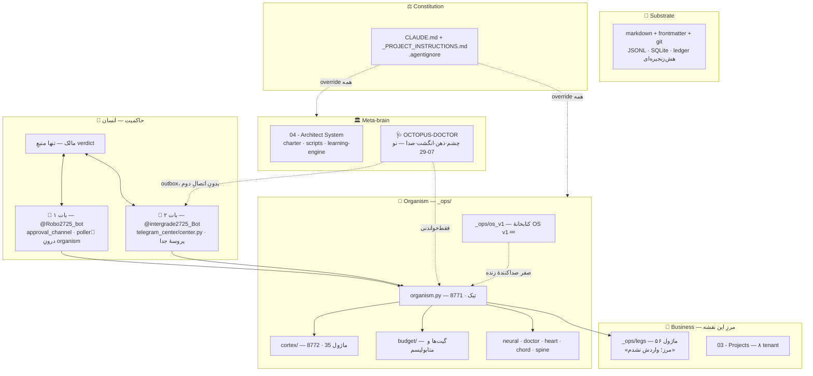
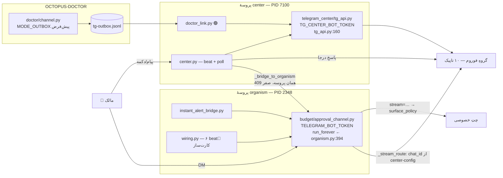
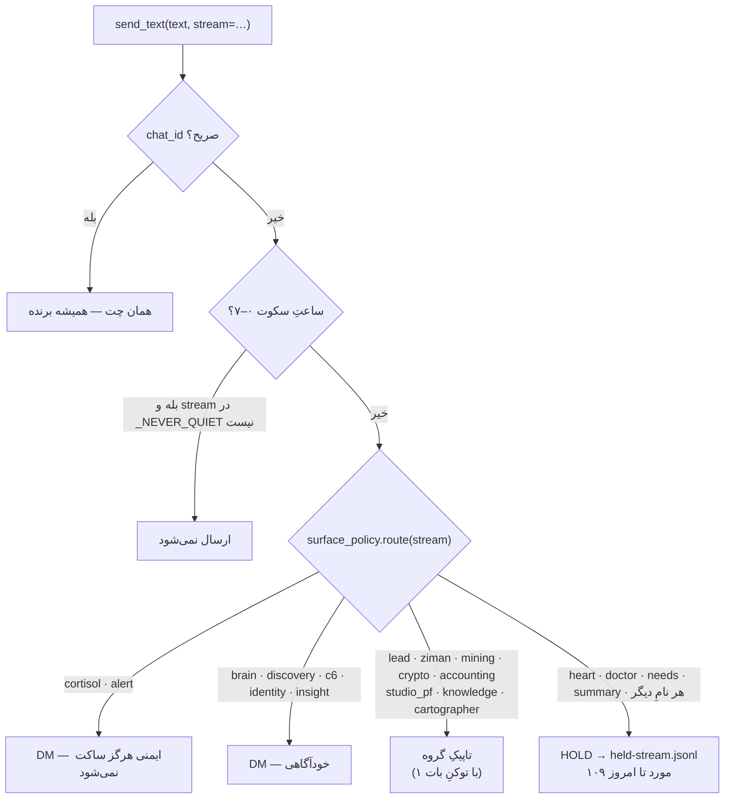
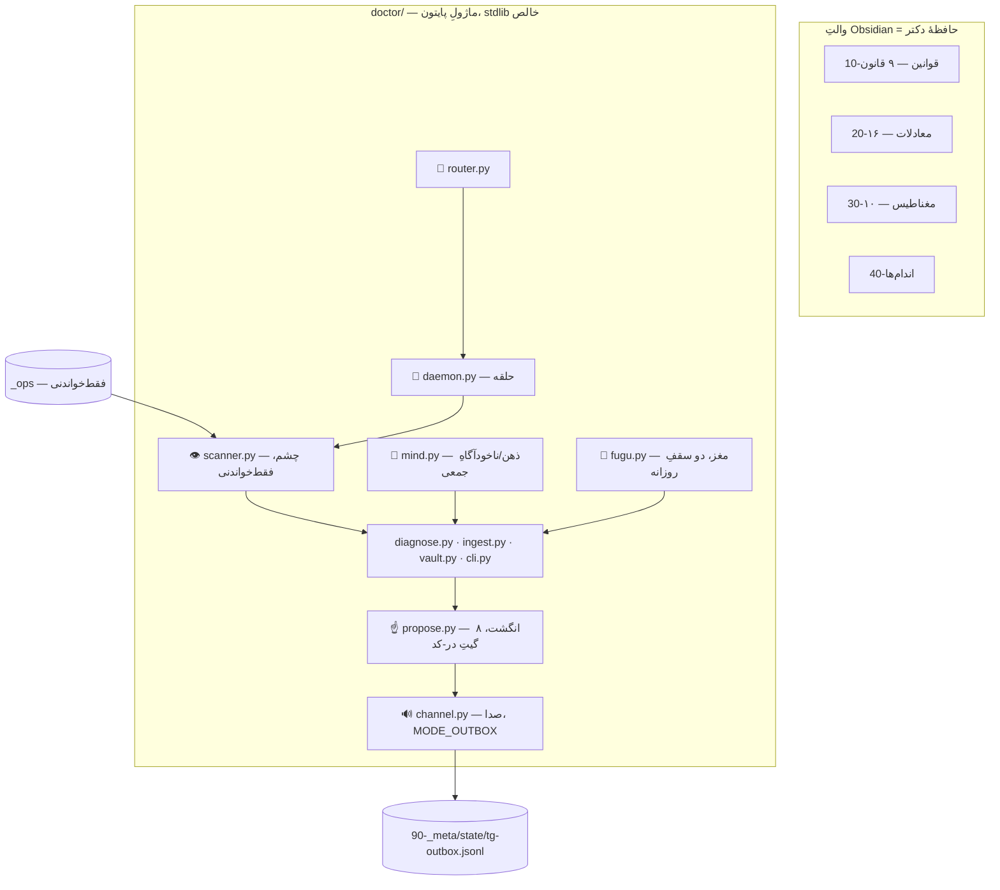
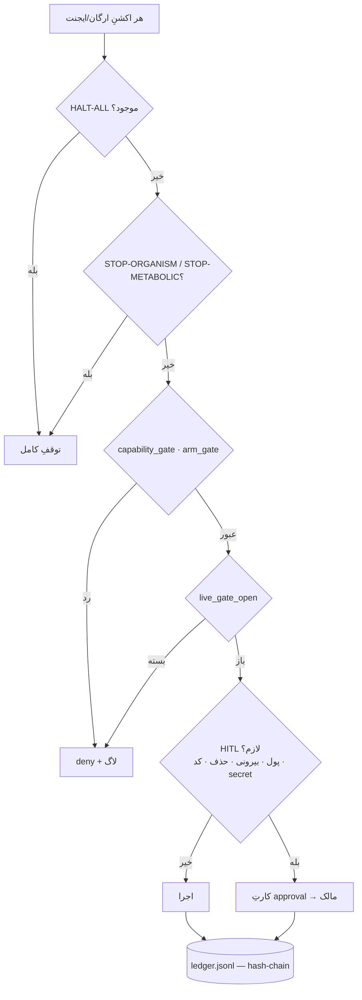
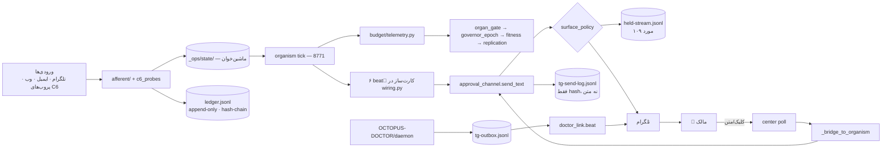

# MASTER-ARCHITECTURE — 2026-07-29

> دامنه: **کلِ هستهٔ ارگانیسم به‌جز پاها.** `_ops/legs/` فقط به‌عنوان **مرز** نام برده می‌شود
> (۵۶ ماژول `[FACT: ls _ops/legs/*.py]`)؛ واردش نشدم مگر دو استثنای صریح که مرز را تعریف
> می‌کنند: `cartographer_leg.py` (سنتینلِ همین نقشه) و `leg_room_report.py` (تولیدکنندهٔ
> جریانِ تلگرامِ اتاقِ پاها).
>
> ماشهٔ رفرش: `drift_files=559`، `refresh_recommended=true`
> `[FACT: _ops/state/ORGANISM-STATE.json §cartographer، beat 17484، mtime 2026-07-29T18:02:06]`.

---

## ۰) TL;DR — پنج خط

1. یک vault ِ agent-first + یک ارگانیسمِ همیشه‌روشنِ پایتون در `_ops/` (۷۰۴ ماژولِ `.py` خارج از `__pycache__`، که ۳۹۶ تای‌شان تست‌اند) `[FACT: find _ops -name '*.py']`.
2. **جالب‌ترین نقطهٔ امروز:** سطحِ تلگرام **دو بات** دارد ولی مرزشان «درون/بیرون» نیست — بات ۱ فیزیکاً داخلِ گروهِ بات ۲ می‌نویسد `[FACT: approval_channel.py:1596-1602]`.
3. **اندام‌های نو:** `OCTOPUS-DOCTOR/` (چشم/ذهن/انگشت/صدا) 🟢 LIVE · `_ops/os_v1/` (۹ ماژول) 💤 صفر صداکننده · `doctor_link.py` 🟢 LIVE (۱ کارت تحویل‌شده).
4. **بزرگ‌ترین شکاف (اندازه‌گیری‌شده، نه ادعا):** ۱۰۹ پیامِ محیطی در ۳۶ ساعتِ اخیر **نگه داشته شد و نرفت** — heart ۷۸ · doctor ۲۴ · needs ۷ `[FACT: _ops/state/telegram/held-stream.jsonl]`. یعنی کارتِ دکتر و کارتِ قلب امروز به هیچ باتی نمی‌رسند.
5. **دومین شکاف:** `_ops/os_v1/` کتابخانه‌ای است که **هیچ فایلی در `_ops` صدایش نمی‌زند** — تنها صداکننده `OCTOPUS-DOCTOR/doctor/cli.py:76` است، آن هم فقط زیرِ `day --live` که قفل است.

---

## ۱) استکِ لایه‌ای

| لایه | نقش | فناوریِ واقعی | شاهد |
|---|---|---|---|
| Constitution | قانونِ ماشین‌خوان | `CLAUDE.md` · `_PROJECT_INSTRUCTIONS.md` · `.agentignore` | `[FACT]` |
| Substrate | حافظهٔ پایدار | Obsidian · git · JSONL · SQLite | `[FACT]` |
| Business | ۸ tenant | `03 - Projects/` + `_ops/legs` (۵۶ ماژول) | `[FACT: ls]` |
| Organism | سازوارهٔ همیشه‌روشن | `_ops/` — ۷۰۴ `.py` | `[FACT: find]` |
| Meta-brain | معمار + **دکترِ نو** | `04 - Architect System/` · `OCTOPUS-DOCTOR/` | `[FACT: ls]` |
| Governance | انسان + گیت‌ها | دو بات + charter + ledger | `[FACT]` |

**پروسه‌های زندهٔ لحظهٔ ترسیم** `[FACT: Get-NetTCPConnection + Get-CimInstance]`:

| پورت | PID | شروع | چیست |
|---|---|---|---|
| 8771 | 2348 | 2026-07-29 06:52:08 | organism |
| 8772 | 17764 | 06:52:09 | cortex |
| 8773 | 4016 | 06:53:06 | live cockpit |
| — | 7100 | **16:31:38** | `python -X utf8 telegram_center\center.py` |

⚠️ `_ops/OCTOPUS-flags.cmd` در ۱۶:۳۰ ویرایش شد `[FACT: mtime]` — یعنی هر فلگی که امروز اضافه شده در **مرکز** (بوت ۱۶:۳۱) هست و در **organism** (بوت ۰۶:۵۲) نیست. تنها فلگِ امروز `OCTOPUS_WIRE_DOCTOR_TG` است که فقط مصرف‌کنندهٔ مرکز دارد، پس در عمل بی‌تناقض `[EST]`.

---

## ۲) سطحِ تلگرام — دقیقاً کدام جریان از کدام بات

### ۲.۱ توپولوژیِ فیزیکی

**سه حقیقتِ ساختاری که در نقشهٔ قبلی نبودند:**

1. **بات ۱ داخلِ گروهِ بات ۲ می‌نویسد.** `_stream_route()` فایلِ `center-config.json` را می‌خواند و `chat_id` گروه را برمی‌گرداند؛ سپس همان تابع با توکنِ بات ۱ `sendMessage` می‌زند `[FACT: approval_channel.py:252-272 + :1596-1611]`. پس «بات ۲ = گروه» غلط است.
2. **دستورها یک‌طرفه پل خورده‌اند.** هر `/فرمانِ` ناشناختهٔ مرکز → `approval_channel.handle_command` **در همان پروسه**، با `from_id` واقعی `[FACT: center.py:859-862 + :923-939]`. عکسش وجود ندارد: بات ۱ به مرکز پل نمی‌زند.
3. **پلِ دکتر اتصالِ سومی باز نمی‌کند.** `doctor_link.beat()` از `center._client` استفاده می‌کند `[FACT: doctor_link.py:123, :155]` — یعنی کارتِ دکتر روی **توکنِ بات ۲** می‌رود.

### ۲.۲ جدولِ اصلی — جریان → بات فعلی → پیشنهادِ درون/بیرون

قرارداد: بات ۱ = درونِ ارگانیسم (خودترمیمی/سلامت/لاگِ حیاتی) · بات ۲ = رابطِ شخصیِ مالک (چت/شهود/شخصی‌سازی). **پیشنهاد فقط پیشنهاد است.**

| # | جریان | بات فعلی | مسیر (فایل:خط) | فلگ | وضع | پیشنهادِ نگاشت |
|---|---|---|---|---|---|---|
| 1 | چتِ آزاد / `ask_brain` | **۲** | `center.py:872` → `ask_brain.py:44` | `OCTOPUS_TG_ASK_BRAIN=1` | 🟢 | **بمانَد ۲** — تعریفِ خالصِ «رابطِ شخصی» |
| 2 | اتاقِ 🪞آینه | **۲** | `mirror_room.py:48` · تاپیکِ `mirror` | `OCTOPUS_TG_MIRROR=1` | 🟢 | **بمانَد ۲** — شهود/شخصی‌سازی |
| 3 | اتاقِ کارمندان (chat_room) | **۲** | `center.py:869` → `chat_room.py:38` | `OCTOPUS_WIRE_CHAT_ROOM=1` | 🟢 | **بمانَد ۲** |
| 4 | **کارتِ دکترِ اختاپوس (نو)** | **۲** | `channel.py:181` → outbox → `doctor_link.py:117-172` ← `center.py:638-642` | `OCTOPUS_WIRE_DOCTOR_TG=1` | 🟢 **LIVE** ۱ کارت `[FACT: cursor day_count=1، sent_keys={wire:test}]` | 🔴 **به ۱ برود** — دکتر = خودترمیمی/سلامت. امروز روی رابطِ شخصی می‌نشیند |
| 5 | **رأیِ سه‌تکهٔ دکتر** `ok\|no:gate:mission` | **۲** | `doctor_link.py:191-212` → subprocess `cli.py votes` | همان | 🟢 | **همراهِ ۴** برود |
| 6 | **دایجستِ دکترِ درونی** (`doctor_digest_beat`) | **۱** | `wiring.py:3223-3241` `stream="doctor"` | `OCTOPUS_WIRE_DOCTOR_DIGEST` | 🔴 **۲۴ مورد HOLD** | **بمانَد ۱** ولی HOLD باز شود |
| 7 | **کارتِ قلب** (`heart_card_beat`) | **۱** | `wiring.py:3287-3310` `stream="heart"` | `OCTOPUS_WIRE_HEART_CARD` + `_PULSE` | 🔴 **۷۸ مورد HOLD** | **بمانَد ۱** — لاگِ حیاتی |
| 8 | «نیازت دارم» (`needs_nudge`) | **۱** | `wiring.py:2834-2899` `stream="needs"` | `OCTOPUS_WIRE_NEEDS_NUDGE` | 🔴 **۷ مورد HOLD** | **به ۲** — این «مالک، کاری با تو دارم» است، نه لاگ |
| 9 | دایجستِ مغز (`brain_digest`) | **۱** | `wiring.py:3252-3278` `stream="brain"` | `OCTOPUS_WIRE_BRAIN_DIGEST` | 🟢 ۲ ارسال امروز | **به ۲** — `SELF_STREAMS` |
| 10 | «چی یاد گرفتم» (`discovery`) | **۱** | `wiring.py:3109-3142` | `OCTOPUS_WIRE_NEEDS_NUDGE` | 🟢 ۱ امروز | **به ۲** |
| 11 | خلاصهٔ ضربان (`summary`) | **۱** | `wiring.py:2941` · `organism.py:1067` | — | ⚠️ صفر ارسال | **بمانَد ۱** |
| 12 | **هشدارِ بحرانیِ فوری** (ترس 🔴) | **۱** | `instant_alert_bridge.py:73-98` `stream="cortisol"` → `organism.py:1082` | `OCTOPUS_TG_INSTANT=1` | 🟢 هرگز HOLD/quiet نمی‌شود `[FACT: surface_policy.py:89-90]` | **بمانَد ۱ + آینه در ۲** — ایمنی نباید تک‌مسیره باشد |
| 13 | فرضیهٔ تازهٔ C6 / کارتِ بدهکار | **۱** | `instant_alert_bridge.py:101-151` `stream="c6"` | همان | 🟢 | **به ۲** — `SELF_STREAMS` |
| 14 | **کارتِ approval ارگانیسم** | **۱** | `approval_channel.py` `submit_for_approval` · دکمه‌ها در `poll_once:513` | — | 🟢 هستهٔ بات ۱ | **بمانَد ۱** |
| 15 | `event_bridge` — رویدادِ بحرانی | **۲** | `center.py:622-626` → `event_bridge.py:34` | `OCTOPUS_WIRE_EVENT_BRIDGE` **در flags.cmd نیست ⇒ OFF** | 🔴 خاموش | **به ۱** — incident/task.failed = درونی |
| 16 | **money-pulse** | **۲** | `center.py:629-634` → `money_pulse.py:39` | `OCTOPUS_WIRE_MONEY_PULSE` **غایب ⇒ OFF** | 🔴 خاموش | **به ۲** — پول = تصمیمِ مالک |
| 17 | **mining** — منوی `/mining` و فعلِ `mo:` | **۲** | `center.py:152, :282-301, :837-839` | `OCTOPUS_WIRE_MINING_UI` **غایب ⇒ OFF** | 🔴 خاموش؛ عمداً از پل مستثنی (`_CENTRE_GATED`) | **بمانَد ۲** |
| 18 | دایجستِ اتاقِ ماینینگ/پاها | **۱** | `wiring.py:3319-3360` → `leg_room_report.py:62` | `OCTOPUS_WIRE_LEG_ROOMS=1` | 🟢 | **به ۲** — کارِ بیرونی/مشتری |
| 19 | دایجستِ پاها از خودِ مرکز | **۲** | `center.py:558-585` | `OCTOPUS_TG_MERGED_DIGEST` غایب ⇒ حالتِ تک‌پیام | 🟡 **هم‌پوشانی با ۱۸** | **یکی را بازنشسته کن** |
| 20 | **quote** — `/lead <متن>` | **۲** | `center.py:794` → `quote_cmd.py:36` | `OCTOPUS_TG_QUOTE=1` | 🟢 | **بمانَد ۲** |
| 21 | قیف — `/won /lost /paid /sent /replied /meeting /quote /funnel` | **۲** | `center.py:811-818` | `OCTOPUS_WIRE_FUNNEL_CMD=1` | 🟢 | **بمانَد ۲** |
| 22 | مذاکره — `/deal` | **۲** | `center.py:790` · `negotiate.py` | `OCTOPUS_TG_NEGOTIATE=1` | 🟢 | **بمانَد ۲** |
| 23 | **دکمه‌های قدرت** restart/stop/panic | **۲** (کالبک) | `power.py:36, :125, :176-214` | `OCTOPUS_TG_POWER=1` | 🟢 دو-تپ | **بمانَد ۲** + آینه در ۱ |
| 24 | **`/panic` `/stop` `/resume` متنی** | **۱** (از راهِ پل) | `approval_channel.py:1626, :1706-1713` ← `center.py:859` | — | 🟢ِ مشروط به پل | **در هر دو** — کلیدِ اضطراری تک‌مسیره ممنوع |
| 25 | `/status /health /wiring /organs /review /books /sync` | **۱** (از راهِ پل) | `approval_channel.py:1703, :1744-1760` | — | 🟢 | **بمانَد ۱** |
| 26 | `/heart set` `/doctor focus` `/brain guide` | **۱** (از راهِ پل) | `approval_channel.py:1691-1700` | — | 🟢ِ مشروط | **بمانَد ۱** |
| 27 | خودنگری `/flags /trace /scan /insight` · `/x` | **۲** | `center.py:805, :824-827` | — | 🟢 | **بمانَد ۲** |
| 28 | `langar` (Project-F 🔒) | **۱** | `approval_channel.py:1780-1786` | — | 🟡 | **بمانَد ۱** |
| 29 | statusِ پین‌شده | **۲** | `center.py:496-508` `edit` | — | 🟢 | **بمانَد ۲** |
| 30 | کارتِ تصمیمِ guidance-box | **۲** | `center.py:587-616` | — | 🟢 | **بمانَد ۲** |

**اندازه‌گیریِ واقعیِ ترافیک** `[FACT: _ops/state/tg-send-log.jsonl، ۲۱۶ ردیف، ۲۶ تا ۲۹ جولای]` — تفکیک‌کنندهٔ بات: `stream=="center"` ⇒ بات ۲؛ هر چیزِ دیگر ⇒ بات ۱ `[FACT: tg_api.py:296-298 vs approval_channel.py:1617-1619]`:

| | بات ۱ | بات ۲ |
|---|---|---|
| کلِ ۴ روز | ۱۲۳ | ۹۳ |
| امروز 07-29 | ۸ | **۱** (کارتِ تستِ دکتر، ۱۶:۳۲:۰۸) |

### ۲.۳ فلوِ تصمیمِ مقصد (بات ۱)

`[FACT: approval_channel.py:1556-1602 + surface_policy.py:61-97]`

🔴 **این دقیقاً محلِ گمشدنِ کارتِ دکتر و قلب است.** `surface_policy.route()` سه سطل دارد و
`heart`/`doctor`/`needs` در هیچ‌کدام نیستند ⇒ `HOLD`. راهِ خروجِ در-کد وجود دارد
(`needs_owner=True` در `surface_policy.py:79-96`) ولی **هیچ صداکننده‌ای آن را پاس نمی‌دهد**
`[FACT: approval_channel.py:1581 → _sp.route(stream) بدونِ آرگومان]`.

---

## ۳) اندام‌های نوی امروز

### ۳.۱ `OCTOPUS-DOCTOR/` — 🟢 LIVE

| جنبه | واقعیت | شاهد |
|---|---|---|
| فایل‌ها | ۱۲ ماژولِ `.py` + ۶۷ نوت | `[FACT: ls OCTOPUS-DOCTOR/doctor/]` |
| تست | ۱۵۸/۱۵۸ — **خارج از `run_all.py`** | `[FACT: اجرای 07-29 · run_all.py:252-254]` |
| صدا | `MODE_OUTBOX` پیش‌فرض؛ `direct` استثنا می‌دهد مگر توکنِ خودی + قفل | `[FACT: channel.py:11-19, :133, :198-199]` |
| مرزِ سخت | در `_ops` نمی‌نویسد · پچ اعمال نمی‌کند · بدونِ رأی merge نمی‌کند | `[FACT: README.md:29-30]` |
| تسکِ روزانه | `OCTOPUS-doctor-day` · **State=Ready** · تریگر `07:00` · اکشن `python -X utf8 F:\backup\_ops\run_doctor_day.py` | `[FACT: Get-ScheduledTask]` |
| لانچر | `run_doctor_day.py:20-24` — `env_loader.load_env()` سپس `cli.py day` **بدونِ `--apply`** ⇒ merge ساختاراً ناممکن | `[FACT]` |

### ۳.۲ `_ops/os_v1/` — 💤 کتابخانه بدونِ صداکننده

| ماژول | نقش |
|---|---|
| `honest_metric.py` | واکسنِ خودارجاعی؛ کلیدِ `_self` ⇒ `w_q=0` |
| `outcome_ledger.py` | تابعِ پاداش؛ درون‌زاد رأی ندارد |
| `efe.py` · `policy_sampler.py` | زمان‌بند؛ **قید حذف می‌کند نه جریمه** |
| `mission_runner.py` | worktree + گیتِ سوئیت + `env_root_key="ORG_ROOT"` + baseline در worktree |
| `silence.py` | ۵۰ هشدارِ هم‌امضا ⇒ ۱ پیام |
| `leg_failure.py` · `schumann_rx.py` · `value_metric.py` | تشخیصِ افتادنِ پا · شهود · ارزش |

🔴 **`rg "os_v1"` روی همهٔ `.py` بیرونِ خودش: فقط ۳ برخورد، هر سه داخلِ `OCTOPUS-DOCTOR/`**
`[FACT: cli.py:76 · propose.py:45 · tests/test_doctor.py:616]`. و `cli.py:76` فقط زیرِ
`--live` اجرا می‌شود که VQ-DR-003 بسته نگهش داشته. یعنی `honest_metric` و `outcome_ledger`
— که کلِ هدفشان تصحیحِ `improvement_rate` خودارجاع است — **هرگز اجرا نشده‌اند**.

### ۳.۳ `_ops/telegram_center/doctor_link.py` — 🟢 LIVE

| گارد | مقدار | خط |
|---|---|---|
| فلگ | `OCTOPUS_WIRE_DOCTOR_TG` | `:41` |
| سقفِ روزانه / هر ضربان | ۲۰ / ۳ | `:47-48` |
| dedup | کلیدِ `mission:gate` + cursorِ بایتی (restart-safe) | `:146, :77-92` |
| مرزِ import | **هیچ import از پکیجِ دکتر** — رأی از راهِ `subprocess` | `:15-18, :175-188` |
| تاپیکِ اختیاری | `OCTOPUS_DOCTOR_TOPIC_ID` | `:107-114` |

حالتِ زندهٔ الان: `day_count=1` · `outbox_pos=410` · `sent_keys={"wire:test"}`
`[FACT: _ops/state/telegram/doctor-link-cursor.json]`.

---

## ۴) گیت‌های ایمنی (لایهٔ عرضی)

| گیت | فایل:خط | وضعِ لحظه |
|---|---|---|
| `HALT-ALL` | `opslib.py:56` · `raise_halt_all:309` | فایل **موجود نیست** ⇒ آزاد `[FACT: ls _ops]` |
| `STOP-ORGANISM` / `STOP-METABOLIC` | `opslib.py:53-55` · `halted():296` | هیچ‌کدام موجود نیست ⇒ آزاد `[FACT]` |
| `live_gate_open` | `opslib.py:450` | در کد، نه فقط سند `[FACT]` |
| owner-only در گروه | `approval_channel.py:1626-1672` — `from_id` سنجیده می‌شود، عضویتِ chat کافی نیست | `[FACT]` |
| §Security Gate | `ARCHITECT_CHARTER.md:30` — 🟢 LIFTED از 2026-07-06 | `[FACT]` |
| `redact` fail-closed | `approval_channel.py:1603` روی **هر** خروجی | `[FACT]` |
| ساعتِ سکوت ۰–۷ | `approval_channel.py:141-167, :1566` · `OCTOPUS_QUIET_FROM/TO` | `[FACT]` |
| `_NEVER_QUIET` | ایمنی از سکوت مستثنی | `[FACT: :1566]` |

---

## ۵) جریانِ داده و ledger

---

## ۶) design ↔ reality

| ناحیه | وضع | شاهد |
|---|---|---|
| دکترِ اختاپوس نصب و LIVE | ✅ | `OCTOPUS-COMPONENT-REGISTRY.md` §OCTOPUS-DOCTOR |
| `doctor_link` تحویلِ واقعی داشت | ✅ | `doctor-link-cursor.json` `day_count=1` |
| تسکِ روزانهٔ دکتر ثبت شد | ✅ | `Get-ScheduledTask` |
| ~~`ARCHITECTURE-SOT.md` می‌گوید SHADOW~~ | ✅ **همان روز فیکس شد** | SOT حالا LIVE می‌گوید |
| **شمارِ تستِ `os_v1`** | ✅ یکی شد: **۷۸** | اجرای واقعیِ 07-29 |
| `os_v1` صفر صداکنندهٔ زنده | 🔴 | `rg os_v1` |
| `heart`/`doctor`/`needs` بی‌مقصد | 🔴 ۱۰۹ HOLD | `held-stream.jsonl` — VQ-MAP-001 |
| `event_bridge` · `money_pulse` · `mining_ui` · `merged_digest` — فلگ در `flags.cmd` **وجود ندارد** | 🔴 OFF عمداً staged | `_ops/ARMING-ORDER-2026-07-29.md` |
| `/lead` در دو بات دو معنی دارد | ⚠️ | `center.py:794` (قیمت) vs `approval_channel.py:1686` (ثبتِ لید) |
| دایجستِ پا از دو مسیر | ⚠️ | `wiring.py:3356` و `center.py:578` |
| بات ۱ و ۷ هم‌ID · ۲ و ۶ هم‌ID | ⚠️ ریسکِ 409 | `BOTS-REGISTRY.md:29-31` |
| `BOTS-REGISTRY.md` از 07-18 لمس نشده | ⚠️ | ۳ اندامِ تلگرامیِ نو در آن نیست |
| `WIRE-TELEGRAM-2026-07-29.md:37` «باتِ دوم مرده» | 🔴 **باطل** | PID 7100 + تسکِ watchdog |
| `CARTO_ANCHORS` هنوز نقشهٔ 07-09 را pin کرده | ⚠️ | `cartographer_leg.py:44` — سیگنالِ drift سالم است ولی allowlist کهنه |
| هیچ snapshotِ «کدام فلگ واقعاً لود شده» | 🔴 `[OPEN]` | `flag_drift.py:127 snapshot()` وجود دارد، خروجی روی دیسک نیست |
| تصادمِ نامِ LANGAR | ⚠️ | `LANGAR-ALIAS-REGISTRY.md` |

---

## ۷) پیشنهادها (propose-only)

| # | شکاف | کوچک‌ترین کار | رأی لازم؟ |
|---|---|---|---|
| P0 | ۱۰۹ پیامِ محیطی HOLD | `heart`/`doctor` را در `surface_policy` سطل بده، یا صداکننده‌ها `needs_owner=True` پاس دهند | 🗳 VQ-MAP-001 |
| P0 | `os_v1` صفر مصرف‌کننده | یکی را انتخاب کن: `honest_metric` در `improve.improvement_rate` | 🗳 VQ-MAP-002 — عدد **می‌افتد** |
| P2 | `/panic` `/stop` فقط از راهِ پل | در `center.handlers` صریح ثبت شود | 🗳 VQ-MAP-003 |
| P2 | `flag_drift.snapshot()` هرگز اجرا نشده | یک بار در بوت | 🗳 VQ-MAP-003 |
| P2 | `/lead` دوگانه · دایجستِ دوگانهٔ پاها | تغییرِ نام / بازنشستگیِ یکی | 🗳 مرزِ جلسهٔ پاها |
| P3 | `CARTO_ANCHORS` کهنه | این نقشه به allowlist اضافه شود | ❌ |
| P3 | ۴ فلگِ غایب | ثبتِ صریحِ `=0` تا «غایب» با «عمداً خاموش» یکی نشود | ❌ — در ARMING-ORDER هست |

---

## ۸) محدودهٔ منفی

- صفر secret/توکن/chat-id در این سند. `.env` و `secrets-export/` خوانده نشد.
- Project-F فقط کدنام. `_ops/legs/` مرز است، نه محتوا.
- `_Archive` / `_Duplicates` / `.agentignore` خوانده نشد.
- هیچ verdict صادر نشد؛ همه‌چیز propose-only.

## Sources

`[[01 - Dashboard/HANDOFF]]` · `[[_ops/ARCHITECTURE-LAYERS-2026-07-27]]` ·
`[[_ops/OCTOPUS-COMPONENT-REGISTRY]]` · `[[_ops/BOTS-REGISTRY]]` · `[[ARCHITECTURE-SOT]]` ·
`[[06 - Architecture Maps/MASTER-ARCHITECTURE-2026-07-09]]` · `[[05 - Agents/AGENT_REGISTRY]]` ·
`[[04 - Architect System/architect/ARCHITECT_CHARTER]]` · سورس‌های `_ops` و `OCTOPUS-DOCTOR` (فایل:خط در متن).
