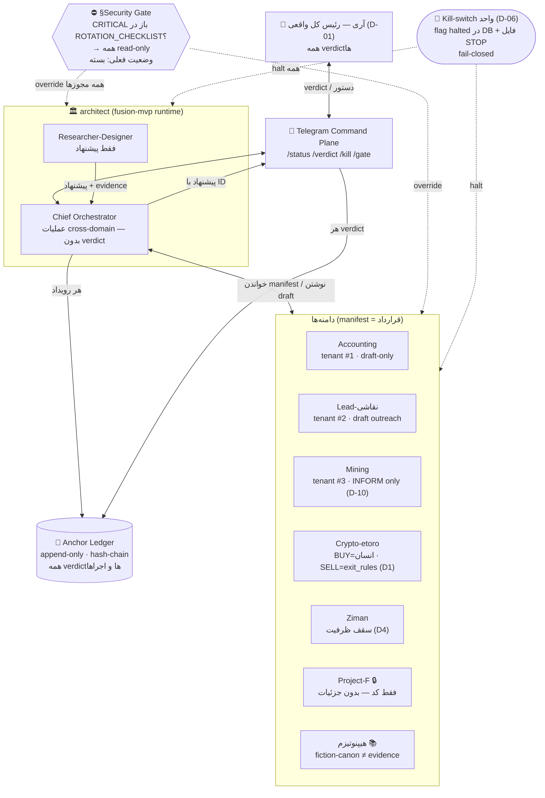

# SYSTEM_MAP — نقشه کل سیستم

> حلقه: architect ↔ دامنه‌ها ↔ تلگرام ↔ verdict انسانی. سه مکانیزم ایمنی روی همه‌چیز: **HITL**، **Kill-switch**، **§Security Gate**. منبع قواعد: [[04 - Architect System/architect/ARCHITECT_CHARTER|ARCHITECT_CHARTER]].

## گیت‌های HITL (نقاط verdict اجباری)

| نقطه | چه چیزی بدون انسان رد نمی‌شود |
|---|---|
| مالی | هر BUY · SELL اختیاری · هر پرداخت/خرج (charter §۳، §۷) |
| ارتباط بیرونی | هر پیام به مشتری/شخص واقعی (Spam Act / DNCR در Lead) |
| زیرساخت | deploy، تغییر کد، SSH (D-20)، حذف |
| حاکمیت | تغییر charter/قواعد/مجوزها — فقط انسان، هرگز ایجنت |
| گیت امنیتی | باز/بسته کردن §Security Gate — فقط verdict ثبت‌شده |

## وضعیت لایه‌ها (2026-07-03)

کاغذ (فاز ۱–۳): ✅ کامل · runtime (فاز ۴): ⏳ منتظر rotation + TOP-5 آدیت — [[00 - Inbox/Prompt - Phase 4 Real Integration|پرامپت Phase 4]]
