# Dependency graph — 2026-08-18

Laptop `DESKTOP-KA9RFN5` / `192.168.0.191`. Continuity-candidate `.180` is **not** in this graph as a live node.

Edge legend:

- **proven** — live process, listen port, scheduled task action, or file this pass
- **inferred** — code comments, Inbox/charter, or HANDOFF; not re-proven by SSH/network

`.180` has **zero proven edges** from this host (no process, no listen, no scheduled task targeting it).

```mermaid
flowchart TB
  subgraph laptop["DESKTOP-KA9RFN5 192.168.0.191 CANONICAL"]
    flags["OCTOPUS-flags.cmd + OCTOPUS.env + F:\\backup\\.env"]
    tcb["trust-boundary.json + .sig"]
    priv["owner Ed25519 private pem PROFILE"]
    sch["Task Scheduler"]

    d4["4d_daemon pid 24588"]
    org["organism.py :8771/:8777 pid 7416"]
    ctx["cortex.py :8772"]
    live["live/server.py :8773"]
    tg["center.py :8776"]
    mini["miniapp_gateway :8774"]
    cf["cloudflared octopus-miniapp"]
    bcp["board_cp :8801 TLS"]
    oll["ollama :11434"]

    wd["watchdog_pack 5 tasks"]
    hourly["germline-hourly"]
    daily["germline-daily LastResult=1"]
    cock["OCTOPUS-Cockpit-Brain"]
    obs["Desktop run_observatory.py"]

    vault["F:\\backup git + _ops/state"]
    germ["E:\\germline vault.git + bundles"]
    q["commands.sqlite"]
    pulse["pulse JSON/JSONL"]
    ledg["genome ledger.jsonl"]
  end

  subgraph not_on_laptop["NOT ON THIS HOST this pass"]
    nats182["nats-server Sensorium .182 FILE-EVIDENCE"]
    boards["legs/board pull of :8801 FILE-EVIDENCE"]
    cand["192.168.0.180 continuity-candidate NO EDGE"]
  end

  flags -->|proven env load| d4
  flags -->|proven BAT/watchdog| org
  flags -->|proven| ctx
  flags -->|proven OCTOPUS.env| bcp
  tcb -->|proven enforce flag=1| d4
  priv -->|proven path exists| tcb

  sch -->|proven| hourly
  sch -->|proven| daily
  sch -->|proven| wd
  sch -->|proven| cock
  sch -->|proven| obs

  wd -->|proven port/cmdline probes| org
  wd -->|proven| ctx
  wd -->|proven| live
  wd -->|proven| tg
  wd -->|proven| mini

  org -->|proven writes| pulse
  org -->|proven writes| vault
  ctx -->|proven listen| live
  live -->|proven code probe| org
  live -->|proven code probe| ctx
  live -->|proven code probe| oll
  mini --> cf
  bcp --> q
  d4 -->|proven| vault
  hourly -->|proven git-serialize| vault
  hourly -->|proven push/bundle| germ
  daily -->|proven script| germ
  cock -->|proven log path| pulse
  tg -->|proven pulse file| pulse
  d4 --> ledg
  daily -->|proven ledger verify| ledg

  ctx -.->|inferred CORTEX_LOCAL_FIRST| oll
  bcp -.->|inferred LAN pull| boards
  nats182 -.->|inferred no leaf| cand
  org -.->|inferred NOT wired| beat["beat_lease.py unarmed"]
  d4 -.->|inferred git_watcher enabled| vault
  tg -.->|inferred| tgapi["api.telegram.org"]
  cf -.->|inferred| cfdns["Cloudflare named tunnel"]
```

## Proven edges (this pass)

| From | To | Proof |
|---|---|---|
| python 24588 | `4d_system/outputs/daemon_state.json` | pid match + `last_tick_at` advancing |
| python 26932 | TCP `0.0.0.0:8801` | Get-NetTCPConnection |
| python 7416 | TCP `127.0.0.1:8771` and `8777` | listen table |
| python 15368 | TCP `127.0.0.1:8772` | listen table + RUN-CORTEX.bat |
| python 19228 | TCP `127.0.0.1:8773` | listen table + run-live-headless.bat |
| python 27844 | TCP `127.0.0.1:8776` + `tg-center.json` | listen + pulse pid |
| python 22768 | TCP `127.0.0.1:8774` | listen table |
| cloudflared 11080 | tunnel `octopus-miniapp` → 8774 | command line |
| Task `germline-hourly` | `germline-hourly.ps1` | Get-ScheduledTask Actions |
| `germline-hourly.ps1` | `git-serialize.ps1` + `E:\germline` | script text + hourly.log |
| Task watchdogs | BAT/ps1 paths above | Get-ScheduledTask |
| `OCTOPUS_BOARD_CP=1` | board_cp process | key read from OCTOPUS.env / flags (value 1 only) |
| TCB files | daemon | `trust-boundary.json` lists `brain/daemon.py`; daemon env has `OCTOPUS_TCB_MANIFEST_ENFORCE` |
| Private signing key | profile path | Test-Path exists (not read) |

## Inferred edges (do not treat as live proof)

| Claim | Why inferred |
|---|---|
| Boards pull `https://<laptop>:8801` | restore/alignment notes; no SSH this pass |
| NATS lives only on `.182` | Sensorium charter + alignment markdown; laptop has no 4222 |
| `.182` NATS has no cluster to `.180` | charter text; not packet-captured |
| cortex uses Ollama | flags name `CORTEX_LOCAL_FIRST`; live/server.py probes 11434 |
| organism does not import beat_lease | module docstring; no runtime import probe |
| 4d git_watcher writes git | `daemon_state.git_watcher.enabled: true` but `check_count: 0` this run |
| Telegram center hits `api.telegram.org` | center.py contract; no packet capture |
| Desktop observatory writes Desktop tree | task cwd; contents not inventoried |
| SMB `E:\germline` mounted on boards | alignment note; not probed |

## Missing / anti-edges (important for `.180`)

- **No** laptop NATS process or port.
- **No** live `_ops/handshake/emit_cycle.py` process (sidecar only).
- **No** FastAPI/uvicorn process for `nbb_cp.api.http`.
- **No** edge from this host to `192.168.0.180`.
- FileLeaseStore **forbids** SMB — so `.180` cannot share a lease file over CIFS (code constraint).
- Dual-write anti-edge: `center.py` WORKLOCK + tg-center watchdog kill hung poller to avoid Telegram 409.

## How `.180` would attach (proposal only, not drawn as live)

A legal first attach is a **read-only consumer** of pulse JSON / evidence envelopes copied or served **without** becoming a git writer, command-queue owner, Telegram poller, or TCB signer. Any other attach is a new design, not an extra mermaid node on this laptop.
