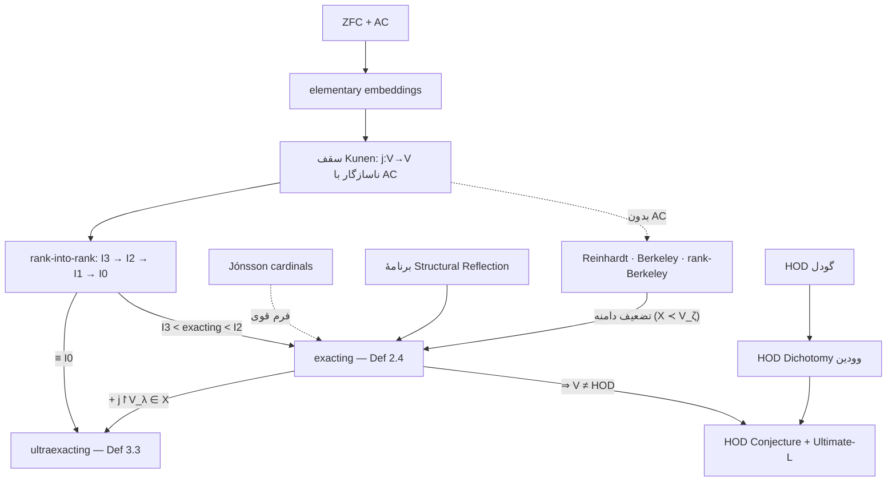

# کاردینال‌های Exacting و Ultraexacting — گزارش نهایی (فاز ۱۲ پروتکل مالک)

> روش: پروتکل ۱۲-فازی مالک ([[00 - Inbox/2026-07-16 1930 exacting-infinity-research-protocol|نوت پروتکل]]) با harness تحقیق عمیق (۵ زاویهٔ جستجو → ۱۹ منبع → استخراج ۸۵ ادعا → راستی‌آزمایی خصمانهٔ ۳-رأیه: **۲۵ تأیید، صفر رد، صفر نامشخص**) + استخراج مستقیم تعاریف از متن کامل v4. هیچ ریاضیاتی جعل نشده؛ هرجا اثبات مستقلاً بازبینی نشده، صریحاً علامت خورده.

## ۱. خلاصهٔ اجرایی

«Exacting Infinity» رسانه‌ای، در واقع **exacting/ultraexacting cardinals** است: کاردینال‌های بزرگِ جدیدی که Aguilera–Bagaria–Lücke در نوامبر ۲۰۲۴ معرفی کردند (arXiv:2411.11568) و با همکاری Goldberg در سپتامبر ۲۰۲۵ تدقیق شدند (arXiv:2509.10254). سه نتیجهٔ بنیادی: (۱) این کاردینال‌ها **با ZFC + اصل انتخاب سازگارند** (سازگاری نسبی از اصول rank-into-rank) — برخلاف Reinhardt/Berkeley؛ (۲) جایگاهشان دقیق است: exacting **اکیداً بین I3 و I2**، و ultraexacting **هم‌ارزِ سازگاری با I0**؛ (۳) وجود یک exacting **مستقیماً V ≠ HOD را اثبات می‌کند** — اولین کاردینال بزرگِ ZFC-سازگار که وجود مجموعه‌های تعریف‌ناپذیر را ایجاب می‌کند — و سازگاریِ «exacting بالای extendible» حکم HOD Conjecture و Ultimate-L Conjecture وودین را رد می‌کند، در حالی که ترتیبِ معکوس بی‌خطر است. وضعیت انتشار تا امروز (۲۰۲۶-۰۷-۱۶): هر دو مقالهٔ کامل preprint («Submitted»)؛ اعلان ۳-صفحه‌ایِ peer-reviewed در **PNAS (آوریل ۲۰۲۶)** منتشر شده.

## ۲. مرور ادبیات

| منبع | رده | نقش |
|---|---|---|
| [arXiv:2411.11568](https://arxiv.org/abs/2411.11568) ‏(v1 نوامبر ۲۰۲۴ → v4 سپتامبر ۲۰۲۵، ۴۲ص، MSC 03E55/18A15/03C55/03E45/03E65) | **اولیه — preprint** | مقالهٔ معرف؛ تعاریف 2.4/3.3، قضایای A/B/C |
| [arXiv:2509.10254](https://arxiv.org/abs/2509.10254) ‏(سپتامبر ۲۰۲۵، ۳۷ص؛ + Goldberg) | **اولیه — preprint** | کران‌های تنگ (بین I3 و I2)، هم‌ارزی با I0، توصیف‌های نو |
| [PNAS 123(15):e2528175123](https://www.pnas.org/doi/10.1073/pnas.2528175123) — «Large infinities and definable sets» (دریافت ۲۰۲۵-۱۰-۰۳، پذیرش ۲۰۲۶-۰۳-۰۴، انتشار آوریل ۲۰۲۶؛ ویراستار K. Ribet) | **اولیه — peer-reviewed** | اعلان داوری‌شدهٔ نتایج، بدون اثبات کامل (قضایا با cite به preprintها) |
| [صفحهٔ انتشارات Lücke](https://www.math.uni-hamburg.de/home/luecke/publications.html) + اسلایدهای Münster/Helsinki/Gdansk ‏۲۰۲۵ | اولیه | وضعیت «Submitted» هر دو مقاله + ارائه‌های کنفرانسی |
| [Goldberg — Measurable cardinals and choiceless axioms](https://math.berkeley.edu/~goldberg/Papers/MeasurableCardinalsAndChoicelessAxioms.pdf) | اولیه (زمینه) | پل بین کاردینال‌های فراانتخاب و ZFC |
| [Quanta ‏۲۰۲۵-۰۶-۲۰](https://www.quantamagazine.org/is-mathematics-mostly-chaos-or-mostly-order-20250620/) | ثانویهٔ معتبر | پوشش عمومی همخوان با مقالات |
| MathOverflow: ‏[Ultimate L vs exacting I](https://mathoverflow.net/questions/486029/ultimate-l-vs-exacting-cardinals) ‏· [II (inner models beyond HOD)](https://mathoverflow.net/questions/502122/ultimate-l-vs-exacting-cardinals-ii-inner-models-beyond-hod) | فروم تخصصی | بحث جامعهٔ پژوهشی |
| [IFLScience](https://www.iflscience.com/oops-newly-discovered-infinities-might-have-broken-the-mathematical-universe-77295) ‏· Yahoo ‏· ZME | رسانهٔ عمومی | منشأ برچسب «Exacting Infinities» (ساده‌سازی) |

**راستی‌آزمایی بین‌زبانی/اصطلاحی (فاز ۹):** اصطلاح فنی فقط «exacting/ultraexacting cardinal» است؛ «Exacting Infinity» برچسب ژورنالیستی است، mistranslation نیست بلکه ساده‌سازی است. هیچ منبع مقدم بر نوامبر ۲۰۲۴ برای این اصطلاح وجود ندارد (جستجوی خصمانه، ۳-۰).

## ۳. خط زمانی تاریخی (فاز ۲)

> ⚠️ آیتم‌های پیش از ۲۰۲۴ تاریخ‌نگاری استاندارد ریاضیات‌اند (از دانش مدل، نه راستی‌آزمایی این تحقیق) — برای استناد دقیق: Kanamori, *The Higher Infinite*.

- **۱۸۷۴/۱۸۹۱ Cantor** — ناشمارایی ℝ؛ برهان قطری؛ آغاز سلسله‌مراتب بی‌نهایت‌ها. → **۱۹۰۰ Hilbert** (مسئلهٔ اول: CH) → **۱۹۰۸ Zermelo** (اصل‌بندی + AC) → **۱۹۲۲ Fraenkel** (جایگزینی؛ ZF/ZFC).
- **۱۹۳۸ Gödel** — سازگاری AC/CH با L؛ **۱۹۴۶** طرح HOD. → **۱۹۶۱ Scott** — measurable ⇒ V≠L. → **۱۹۶۳ Cohen** — forcing، استقلال CH.
- **۱۹۶۷–۷۰ Reinhardt** — ‏j: V→V؛ **۱۹۷۱ Kunen** — ناسازگاری آن با AC (سقف Kunen). بازمانده‌های زیر سقف: I3، I2، I1، و **I0** ‏(Woodin، دههٔ ۸۰).
- **دههٔ ۲۰۱۰ Woodin** — ‏HOD Dichotomy، ‏HOD Conjecture، برنامهٔ Ultimate-L. ‏**Bagaria** — برنامهٔ Structural Reflection. **۲۰۱۹ Bagaria–Koellner–Woodin** — کاردینال‌های فراانتخاب (Berkeley و…).
- **✅ ۲۰۲۴-۱۱-۱۸** — ‏arXiv:2411.11568: معرفی exacting/ultraexacting. **۲۰۲۵-۰۶** پوشش Quanta؛ **۲۰۲۵-۰۹-۱۲** مقالهٔ دوم (کران‌های تنگ)؛ **۲۰۲۶-۰۴** اعلان PNAS.

## ۴. تعاریف صوری (فاز ۳ — عیناً از v4، راستی‌آزمایی کلمه‌به‌کلمه)

**Definition 2.4 (exacting).** کاردینال λ ‏**exacting** است اگر برای هر ζ > λ، زیرساختار مقدماتی ‏X ≺ V_ζ با ‏V_λ ∪ {λ} ⊆ X و جاسازی مقدماتی ‏j: X → V_ζ موجود باشد که ‏j(λ) = λ و ‏j↾λ ≠ id_λ ‏(هم‌ارز: crit(j) < λ).

**Definition 3.3 (ultraexacting).** همان شرایط + ‏**j↾V_λ ∈ X** (تحدید جاسازی به V_λ عضو دامنه باشد — همین شرط به‌ظاهر کوچک، قدرت را تا کلاس I0 بالا می‌برد).

**سه توصیف هم‌ارز (چکیده + Cor 4.8):** (۱) فرم ضعیفِ rank-Berkeley (تحدید دامنه از V_α به زیرمدل‌های مقدماتی)؛ (۲) فرم قویِ Jónsson ‏(Cor 2.8: هر ساختار به‌اندازهٔ λ در هر کلاس تعریف‌پذیر، زیرساختار مقدماتی سرهٔ هم‌اندازه در همان کلاس دارد و بالعکس)؛ (۳) اصل بازتاب ساختاری — ultraexacting ≡ ‏**Square Root Exact Structural Reflection**؛ در مقالهٔ دوم: فرم دو-کاردینالیِ strong unfoldability + توصیف با I3/I1 + محمول‌های OD.

**قیاس انگیزشی مؤلفان (heuristic، نه قضیه):** ‏exacting نسبت به rank-Berkeley ≈ weakly compact نسبت به measurable.

## ۵. جداول مقایسه (فاز ۵)

**جایگاه در سلسله‌مراتب (قدرت سازگاری، صعودی):**

| اصل | AC؟ | نسبت به exacting-family |
|---|---|---|
| measurable → strong → supercompact → extendible → huge | ✅ | همه بسیار پایین‌تر |
| ‏I3 ‏(j: V_λ→V_λ) | ✅ | **exacting اکیداً بالای I3** ‏(V_λ ⊨ کلاس سرهٔ I3) |
| **exacting** | ✅ | — (پایینِ iterability hierarchy بالای I3) |
| ‏I2 | ✅ | ‏I2 ⇒ Con(exacting)؛ حتی Con(Vopěnka + exacting + HOD Hypothesis) |
| ‏I1 | ✅ | زمینهٔ توصیف ultraexacting با OD |
| ‏I0 ‏(j: L(V_{λ+1})→L(V_{λ+1})) | ✅ | **ultraexacting ≡ I0** (هم‌ارزی سازگاری، Thm 4.5) |
| rank-Berkeley / Berkeley / Reinhardt | ❌ (ناقض AC) | الگوی مادر؛ exacting فرم ZFC-سازگارِ ضعیف‌شده |

**نتایج ساختاری کلیدی:**

| حکم | منبع | رده |
|---|---|---|
| ‏exacting ⇒ V ≠ HOD ‏(ZFC + exacting + V=HOD ناسازگار) | Thm 2.10 / PNAS Thm 1 | preprint-theorem + اعلان peer-reviewed |
| ‏exacting **بالای** extendible ⇒ «V far from HOD» ⇒ سازگاری‌اش HOD/Ultimate-L Conjecture را رد می‌کند | Thm B / PNAS Thm 3 (نسخهٔ strongly compact) | preprint-theorem + اعلان peer-reviewed |
| ‏extendible **بالای** exacting ⇒ ‏HOD Hypothesis را رد **نمی‌کند** ‏(I2 ⇒ Con(VP + exacting + HOD Hyp)) | ‏2509.10254 | preprint-theorem |
| ‏ultraexacting **زیر** measurable ⇒ Con(ZFC + کلاس سرهٔ I0) — چالش تصویر خطی-افزایشی | Thm D | preprint-theorem (چارچوب‌بندی «چالش» = تفسیر مؤلفان) |
| ‏Con(ZF + C⁽³⁾-Reinhardt + supercompact بالای دنبالهٔ بحرانی) ⇒ Con(ZFC + exacting بالای extendible) | Thm E | preprint-theorem |

**درس ساختاری:** هم بزرگی مطلق و هم **ترتیب نسبی** کاردینال‌ها بار حکمی دارد — ترکیب و ترتیب مهم‌اند، نه فقط قدرت تک‌تک اجزا.

## ۶. طرح برهان‌ها (فاز ۶ — فقط تا حدی که منابع اولیه گفته‌اند)

- **Thm A/C (سازگاری از I0):** از یک I0-embedding، مدلِ مجموعه‌ایِ ZFC با exacting ساخته می‌شود (ساخت L_{λ⁺}(Γ) از جاسازی I0)؛ ارتقا به هم‌ارزی کامل در مقالهٔ دوم با مدل‌های fine-structural گسترش‌دهندهٔ L(V_{λ+1}).
- **تکنیک‌های اعلامی مقدمه:** جاسازی‌های مقدماتی با هدف‌های «به‌قدر کافی صحیح» از سلسلهٔ V، اصول بازتاب ساختاری، و forcing (مثال نقضِ عدمِ استلزام مستقیم ultraexacting→I0 بعد از Thm 4.5).
- ⚠️ **اثبات‌های کامل (از جمله Thm 2.10) در این تحقیق مستقلاً بازبینی نشدند** — ‏«proof not independently verified — see preprint §2/§4». طبق قاعدهٔ پروتکل، چیزی بازسازی/جعل نشده.

## ۷. گراف وابستگی مفاهیم (فاز ۱۲.۷)



## ۸. کتاب‌شناسی BibTeX (فاز ۱۲.۸)

```bibtex
@misc{AguileraBagariaLuecke2024,
  author = {Aguilera, Juan P. and Bagaria, Joan and L{\"u}cke, Philipp},
  title  = {Large cardinals, structural reflection, and the {HOD} {C}onjecture},
  year   = {2024}, eprint = {2411.11568}, archivePrefix = {arXiv},
  primaryClass = {math.LO}, note = {v4, September 2025; 42 pp. Preprint (submitted)}
}
@misc{AguileraBagariaGoldbergLuecke2025,
  author = {Aguilera, Juan P. and Bagaria, Joan and Goldberg, Gabriel and L{\"u}cke, Philipp},
  title  = {Large cardinals beyond {HOD}},
  year   = {2025}, eprint = {2509.10254}, archivePrefix = {arXiv},
  primaryClass = {math.LO}, note = {37 pp. Preprint (submitted)}
}
@article{AguileraBagariaLuecke2026PNAS,
  author  = {Aguilera, Juan P. and Bagaria, Joan and L{\"u}cke, Philipp},
  title   = {Large infinities and definable sets},
  journal = {Proceedings of the National Academy of Sciences},
  volume  = {123}, number = {15}, pages = {e2528175123}, year = {2026},
  doi     = {10.1073/pnas.2528175123}, note = {Peer-reviewed announcement (3 pp., theorems without full proofs)}
}
@misc{GoldbergChoiceless,
  author = {Goldberg, Gabriel},
  title  = {Measurable cardinals and choiceless axioms},
  howpublished = {\url{https://math.berkeley.edu/~goldberg/Papers/MeasurableCardinalsAndChoicelessAxioms.pdf}}
}
@article{Quanta2025,
  author = {{Quanta Magazine}},
  title  = {Is Mathematics Mostly Chaos or Mostly Order?},
  year   = {2025}, month = jun,
  howpublished = {\url{https://www.quantamagazine.org/is-mathematics-mostly-chaos-or-mostly-order-20250620/}}
}
@misc{MO486029, title = {Ultimate {L} vs exacting cardinals},
  howpublished = {\url{https://mathoverflow.net/questions/486029}}, note = {MathOverflow discussion} }
@misc{MO502122, title = {Ultimate {L} vs exacting cardinals {II}: inner models beyond {HOD}},
  howpublished = {\url{https://mathoverflow.net/questions/502122}}, note = {MathOverflow discussion} }
```

## ۹. نقشهٔ مطالعه مبتدی → پژوهشگر (فاز ۱۲.۹)

1. **عمومی:** مقالهٔ Quanta (ژوئن ۲۰۲۵) → درک شهودی بدون فرمالیسم.
2. **پایه:** ‏Jech, *Set Theory* یا Kunen, *Set Theory* — ‏ZFC، ترتیبی‌ها، L و HOD (مرجع استاندارد، از دانش عمومی).
3. **کاردینال‌های بزرگ:** ‏Kanamori, *The Higher Infinite* — تا فصل rank-into-rank (I3…I0) و ناسازگاری Kunen.
4. **پل پژوهشی:** مقالهٔ ۳-صفحه‌ای PNAS (خلاصهٔ داوری‌شدهٔ کل برنامه) → سپس اسلایدهای Lücke ‏(Gdansk/Münster 2025).
5. **متن اصلی:** ‏arXiv:2411.11568 ‏(§2 تعاریف، §4 بازتاب ساختاری) → ‏arXiv:2509.10254 (کران‌های تنگ).
6. **حاشیهٔ پژوهش:** مقالهٔ choiceless گلدبرگ + دو رشتهٔ MathOverflow.

## ۱۰. مسائل باز (فاز ۱۰ — از تحقیق تأییدشده)

1. آیا Con(ZFC + exacting بالای extendible/strongly compact) — پیکربندی ردکنندهٔ HOD Conjecture — از فرضی ZFC-سازگار و پذیرفته‌شده اثبات‌پذیر است؟ (فعلاً فقط از فرض‌های choiceless مناقشه‌برانگیز — سرنوشت Ultimate-L به همین دوراهی PNAS Thm 3 گره خورده.)
2. آیا مقالات کامل داوری ژورنال را با اثبات‌های دست‌نخورده می‌گذرانند؟ (وضعیت «Submitted» — پایش شود.)
3. ساختار دقیق شکست استلزام مستقیم ultraexacting→I0 (مثال نقض forcing) و دیگر تعامل‌های غیرخطی خانوادهٔ exacting با کاردینال‌های استاندارد؟
4. واکنش مکتوب خود Woodin؟ (هیچ منبع اولیه‌ای verify نشد — شکاف صریح گزارش.)

## ۱۱–۱۲. امتیاز اطمینان + رده‌بندی ادعاها (فاز ۱۲.۱۱/۱۲.۱۲)

| # | ادعای کلیدی | رده | اطمینان |
|---|---|---|---|
| ۱ | منشأ اصطلاح: 2411.11568 (۲۰۲۴)؛ چهار مؤلف مقالهٔ دوم (شامل Lücke) | fact (منبع اولیه) | ۹۸٪ |
| ۲ | تعاریف 2.4/3.3 همان‌گونه که در §۴ آمده | fact (verbatim) | ۹۸٪ |
| ۳ | سازگاری نسبی با ZFC+AC از I0؛ ‏ultraexacting ≡ I0 | preprint-theorem + اعلان PNAS | ۹۵٪ |
| ۴ | ‏exacting اکیداً بین I3 و I2 | preprint-theorem + PNAS Thm 2 | ۹۵٪ |
| ۵ | ‏exacting ⇒ V≠HOD | preprint-theorem + PNAS Thm 1 | ۹۵٪ |
| ۶ | ‏Con(exacting بالای extendible) ⇒ ردّ HOD/Ultimate-L Conjecture؛ ترتیب معکوس بی‌خطر | preprint-theorem + PNAS Thm 3 | ۹۵٪ |
| ۷ | چالش «تصویر خطی-افزایشی» | قضیه (Thm D) + **تفسیر مؤلفان** در چارچوب‌بندی | ۹۰٪ / تفسیر |
| ۸ | وضعیت انتشار: preprint + اعلان PNAS آوریل ۲۰۲۶ | fact (حساس به زمان) | ۹۵٪ (تا ۰۷-۱۶) |
| ۹ | پذیرش جامعه: مثبت (coauthorship گلدبرگ، PNAS، سخنرانی‌ها؛ بدون retraction/نقد) | شواهد جانبی — نه ادعای مستقیماً verify شده | ۷۰٪ |
| ۱۰ | «Exacting Infinities» = ساده‌سازی رسانه‌ای | media interpretation (تأییدشده) | ۹۵٪ |
| ۱۱ | خط زمانی پیش از ۲۰۲۴ | تاریخ‌نگاری استاندارد (دانش مدل) | ۸۰٪ |
| ۱۲ | قیاس exacting:rank-Berkeley ≈ wc:measurable | heuristic انگیزشی مؤلفان — **نه قضیه** | تفسیر |

**تفکیک نهایی رده‌ها:** قضیهٔ ژورنال‌داوری‌شدهٔ کامل: **هنوز هیچ** · ‏peer-reviewed announcement: ‏PNAS 2026 · ‏preprint-theorem: تمام قضایای فنی · ‏conjecture: ‏HOD/Ultimate-L (وودین؛ موضوع مطالعه، نه ادعای مقالات) · ‏informal speculation: هیچ‌کدام از ادعاهای این گزارش · ‏media interpretation: «بی‌نهایت‌های جدید ریاضیات را شکستند».

## کاربرد برای اختاپوس

نگاشت صادقانهٔ جداگانه: [[07 - Knowledge/EXACTING-to-OCTOPUS-impact-v1|EXACTING-to-OCTOPUS-impact-v1]] — تأثیر مستقیم الگوریتمی صفر؛ یک تست معماری کدشدنی + سه قاعدهٔ دکترینی.
