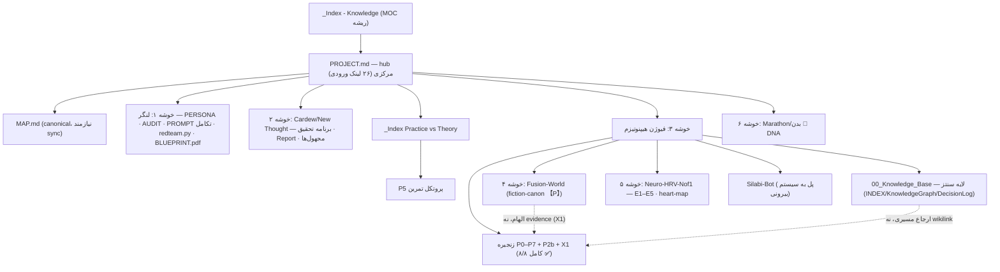

# 🕸️ KNOWLEDGE_MAP — نقشه‌ی دانش

## خوشه‌های اصلی (۶)

## Hubها (بیشترین لینک ورودی wikilink)

| فایل | لینک ورودی |
|---|---|
| `PROJECT.md` | ۲۶ |
| `MAP.md` | ۵ |
| `_Index - Practice vs Theory.md` | ۵ |
| `knowledge_base.md` | ۳ |
| `Report - Cardew…` / `Report - HRV…` / `برنامه_تحقیق…` | ۳ / ۳ / ۳ |

## دو رژیم لینک‌دهی — مهم‌ترین یافته‌ی ساختاری

لایه‌ی بالایی پروژه (PROJECT/MAP/ایندکس‌ها/گزارش‌ها) با **wikilink** به هم بافته شده و سالم است. کل زیرشاخه‌ی `فیوژن هیپنوتیزم` (۵۲ فایل) **صفر wikilink** دارد و به‌جایش از ارجاع مسیریِ backtick استفاده می‌کند. نتیجه: در گراف Obsidian این ۵۲ فایل «یتیم» دیده می‌شوند، ولی از نظر معنایی از طریق `INDEX.md` و `KnowledgeGraph.md` کاملاً متصل‌اند. این یک انتخاب سبکی است، نه گسست واقعی — اما گراف بصری Obsidian و هر ابزار backlink-محور را کور می‌کند.

**یتیم‌های واقعی (بدون هیچ اتصال، حتی مسیری):** `تحقیق مخفی.txt`، `photos/photo_786….jpg`، `Marathon/Plan is to copy this guy.txt`، `Marathon/تمرینات ورزشب/دیتا.txt`.

## لینک‌های شکسته (از دید این scope)

1. `[[04 - Architect System/…/Report - Architect - Adversarial Review v3 2026-07-04]]` در نُت «۱۰ رویکرد فلسفی» — مقصد خارج از `07 - Knowledge` است؛ احتمالاً در vault کامل سالم است (تأیید نیازمند دسترسی ریشه).
2. `[[ROTATION_CHECKLIST]]` در `PROJECT.md` — نام کامل فایل `ROTATION_CHECKLIST - هیپنوتیزم` است؛ لینک بدون پسوند نام، match نمی‌شود. **fix یک‌خطی.**

## ناسازگاری‌های نقشه با واقعیت (stale)

| سند | ادعا | واقعیت |
|---|---|---|
| `MAP.md` | «P4 تا P7 — فقط پرامپت، نساخته» | P4–P7 ساخته و web-verified (۰۷-۰۴) |
| `Projects.md` | زنجیره P0–P7: ۵۰٪ | ۸/۸ کامل + P2b + X1 |
| `Roadmap.md` | P4→P7 مسیر پیش‌رو | انجام شده؛ roadmap باید به «بعد از P7» برود |
| `TODO.md` | توکن Silabi در کد hardcode | در کد فعلی اصلاح شده (`TELEGRAM_TOKEN` از env)؛ فقط revoke/rotate با owner مانده |
