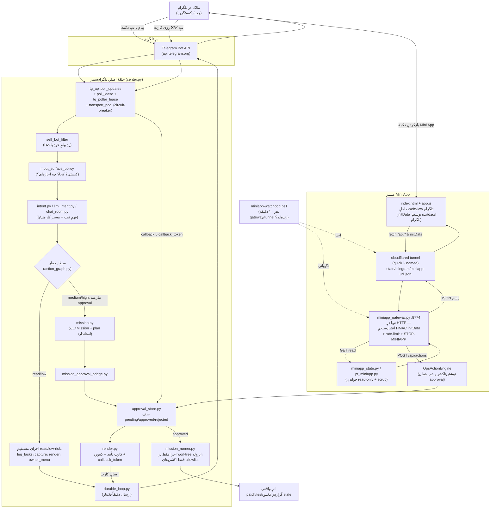

> **روش:** یک Workflow با ۱۲ agent موازی — ۱۰ agent هرکدام یک خوشه از کد زندهٔ `_ops/telegram_center`
> + مینی‌اپ + اسکریپت‌های عملیاتی را کامل خواندند (۹۱ فایل مجموعاً)، یک agent اسناد دانش/audit قبلی
> را برای آشتی خلاصه کرد، و یک agent سنتزکننده همه را به این گزارش تبدیل کرد. همه از مسیرهای
> absolute زیرِ `F:/backup` خوانده‌اند (نه از worktree ایزوله‌ای که این جلسه در آن اجرا شد — نسخهٔ
> آن worktree از چند فایلِ `telegram_center` قدیمی/ناقص بود). بخش ۶ این سند هشدارِ کامل دربارهٔ
> اعتبار زمانیِ این snapshot را دارد — قبل از تصمیم‌گیری حساس، بندهای علامت‌خورده را دوباره روی
> `main` راستی‌آزمایی کن.

# معماری اختاپوس — بات تلگرام و Mini App

## ۱. مقدمه

اختاپوس یک سامانهٔ کنترلِ چند-بیزنسی است که یک اپراتورِ تنها (فارسی‌زبان، سیدنی) از طریق تلگرام کل زندگیِ عملیاتیِ چند کسب‌وکارِ همزمانش (نقاشی/لید، Ziman Galerry، معدن، کریپتو، حسابداری، اونلی‌فنز و…) را می‌بیند و کنترل می‌کند. نیازِ واقعی این نیست که «یک بات باحال داشته باشیم» — نیاز این است که یک نفر، بدونِ تیم و بدونِ دستیار، بتواند از داخلِ یک اپلیکیشنی که همین الان روی گوشی‌اش باز است (تلگرام)، وضعیتِ هر پا را ببیند، به پیشنهادها رأی بدهد، کارها را دنبال کند، و در صورتِ خرابی سیستم را متوقف کند — بدونِ اینکه هرگز مجبور باشد به هیچ داشبوردِ جدا سر بزند یا حافظه‌اش را برای فرمان‌ها به کار بیندازد. تلگرام‌سنتر (`_ops/telegram_center`) این لایه است، و Mini App وبی که داخلِ همان اپِ تلگرام باز می‌شود، نسخهٔ بصری‌تر و غنی‌ترِ همان کنترل‌پنل است. اصلِ حاکم بر کلِ این معماری، که در کامنت‌های ده‌ها فایل تکرار شده، یک جمله است: **هیچ اقدامِ خطرناکی بدونِ رأیِ صریحِ مالک اجرا نمی‌شود، و هیچ‌چیز هرگز سبزِ دروغین نشان داده نمی‌شود.**

---

## ۲. مسیرِ واقعیِ یک پیام/اکشن

نکتهٔ کلیدیِ این نمودار: مسیرِ تلگرامِ معمولی و مسیرِ Mini App **دو درِ ورودیِ کاملاً جدا** به همان جهانِ state هستند — یکی از طریقِ poll (فقط center.py حق دارد getUpdates بزند) و دیگری از طریقِ یک gateway HTTP محلی که هرگز مستقیم به تونل وصل نمی‌شود مگر از پشتِ دیوارِ HMAC initData. هر دو مسیر، برای هر اقدامِ نوشتنی، به همان صفِ تأییدِ مالک (`approval_store.py`) می‌رسند.

---

## ۳. خوشه‌های کد

### ۳.۱ حلقهٔ اصلی و ترنسپورت (core_loop)

قلبِ عملیاتیِ سیستم: `center.py` (۶۲۱۲ خط) کلِ فرمان‌ها، دکمه‌ها، دایجست‌ها و پلِ بین‌باتی را در یک شیءِ `Center` پیاده می‌کند؛ بقیهٔ فایل‌های این خوشه زیرساختِ سخت‌شده‌ای هستند که در واکنش به حوادثِ واقعیِ زنده (هنگِ ۲.۵ساعته، ۴۰۹ Conflict، قفلِ آنتی‌ویروس رویِ config) اضافه شدند.

- **`__init__.py`** — چه‌کاری می‌کند: فقط پکیج‌مارکر با دو خط کامنتِ توصیفی. چرا وجود دارد: بدونش import از پوشه ممکن نبود.
- **`center.py`** — چه‌کاری می‌کند: نقطهٔ تجمیعِ کلِ رابطِ تلگرام — `ensure_setup`، `beat` (ضربانِ دوره‌ای)، `handle_update/_handle_message/_handle_callback` (روتینگِ کاملِ فرمان‌ها/دکمه‌ها)، و `run_once/run_forever` (حلقهٔ اصلیِ poll+dispatch با STOP-gate چندلایه). چرا وجود دارد: تنها نقطهٔ ورود/خروجِ واقعیِ بینِ مالک و کلِ سیستمِ چندبیزنسی؛ حجمِ عظیمش خودش پاسخ به الگویِ مکررِ «قابلیت ساخته شد ولی صداکننده نداشت» است.
- **`durable_loop.py`** — چه‌کاری می‌کند: ماشین‌حالتِ صریحِ ارسال دقیقاً-یک‌بار (RECEIVED تا CLOSED) با رکوردِ روی‌دیسک برای هر آپدیت. چرا وجود دارد: بدونش کرشِ بینِ ارسال و تأییدِ ارسال یعنی یا پیام گم می‌شد یا دوباره فرستاده می‌شد؛ پشتِ فلگِ خاموش `OCTOPUS_TG_DURABLE_OUTBOX`.
- **`transport_pool.py`** — چه‌کاری می‌کند: circuit-breaker به‌ازای هر بات + استخرِ محدودِ ترنسپورت با deadline سخت. چرا وجود دارد: پاسخِ مستقیم به هنگِ زندهٔ ۲۰۲۶-۰۸-۲۱ (DNS بدونِ timeout که هیچ thread نمی‌تواند کنسلش کند) — حکمِ صریحِ مالک.
- **`transport_subprocess.py`** — چه‌کاری می‌کند: اجرایِ هر تماسِ HTTP در یک subprocess جدا که واقعاً kill می‌شود. چرا وجود دارد: تنها راهِ تضمینیِ کشتنِ یک DNS-resolve گیرکرده؛ پشتِ فلگِ owner-gated.
- **`tg_api.py`** — چه‌کاری می‌کند: تنها کلاینتِ واقعیِ Bot API (۱۰۲۸ خط) — send/edit/poll/get_file با مدیریتِ کاملِ ۴۲۹/۴۰۹ و sanity-health خودِ poll. چرا وجود دارد: مرزِ واحدِ بینِ اختاپوس و شبکهٔ واقعیِ تلگرام؛ سلامت‌سنجیِ صریحِ poll جلوی ابهامِ «مالک ننوشت یا poller خاموش شد» را گرفت.
- **`tg_poller_lease.py`** — چه‌کاری می‌کند: گاردِ فایلی/PID «یک poller در هر توکن» در سطحِ استارتِ پروسه. چرا وجود دارد: دو مرکز روی یک توکن یعنی ۴۰۹ و بلعیدنِ دکمه‌ها — واقعاً شبِ ۷/۲۹ رخ داد.
- **`poll_lease.py`** — چه‌کاری می‌کند: لیسِ اتمیکِ sqlite در سطحِ هر فراخوانیِ `getUpdates`، با circuit-breaker جدا. چرا وجود دارد: لایهٔ دومِ همان دفاع، دقیق‌تر و پایدارتر از `tg_poller_lease.py`.
- **`rate_limit_queue.py`** — چه‌کاری می‌کند: صفِ نرخ‌محدودِ کاملِ sqlite (admit/enqueue/dead_letter). چرا وجود دارد: طرحِ آماده برایِ آیندهٔ owner-approved؛ **صداکنندهٔ زندهٔ صفر** — کاملاً وصل‌نشده.
- **`process_identity.py`** — چه‌کاری می‌کند: ثبتِ pid/git-hash/هشِ center.py هنگامِ هر بوت. چرا وجود دارد: پاسخ به یافتهٔ «کدام نسخه واقعاً در حالِ اجراست».
- **`bounded_io.py`** — چه‌کاری می‌کند: اجرایِ هر I/O در workerِ کران‌دارِ زمانی. چرا وجود دارد: قفلِ آنتی‌ویروس رویِ config دو بار مرکز را برای همیشه هنگ کرده بود.
- **`config_manager.py`** — چه‌کاری می‌کند: مالکِ واحدِ snapshot ایمنِ config با last-known-good. چرا وجود دارد: پاسخِ مستقیم به همان هنگِ config.

### ۳.۲ دستورات و مسیریابیِ intent (commands_routing)

لایهٔ «فهمِ نیت» بینِ پیامِ آزادِ مالک و اثرهای واقعی؛ همه propose/read-only‌اند و اجرای هر اقدامِ خطرناک را به گیت‌های موجود حواله می‌دهند.

- **`build_cmd.py`** — چه‌کاری می‌کند: «بساز: …» را به taskِ صفِ `code_brain` تبدیل و وضعیتِ صادقانهٔ حلقهٔ خودساخته را گزارش می‌کند. چرا وجود دارد: قبلاً `code_brain.enqueue_task` صداکننده‌ای در تلگرام نداشت.
- **`funnel_cmd.py`** — چه‌کاری می‌کند: `/sent /won /lost /paid`… را به `FunnelStore` وصل می‌کند و کارتِ قیفِ فروش می‌سازد. چرا وجود دارد: `funnel_store.py` شش‌ایجنتی یتیم پیدا شده بود — سیستم برد/باخت را هیچ‌وقت نمی‌فهمید.
- **`quote_cmd.py`** — چه‌کاری می‌کند: `/lead …` را پارس و به `legs/lead_quote.py` وصل می‌کند تا کارتِ قیمت بسازد. چرا وجود دارد: موتورِ قیمت‌دهی ساخته شده بود ولی صفر مصرف‌کننده داشت.
- **`introspect_cmd.py`** — چه‌کاری می‌کند: `/flags /trace /scan /insight` + کارتِ هفتگیِ Brier که ساختاراً نمی‌تواند جعل شود. چرا وجود دارد: جداشده از `center.py` برایِ ریسکِ کمِ دیف؛ پاسخ به سه موردِ جعلِ Brier در ۲۴ ساعت.
- **`intent.py`** — چه‌کاری می‌کند: طبقه‌بندِ خالصِ کلیدواژه‌ایِ متنِ آزاد به نیت+پا+سطحِ خطر. چرا وجود دارد: تست‌پذیریِ خالص و منبعِ حقیقتِ واحدِ callbackهای `lg:*`.
- **`llm_intent.py`** — چه‌کاری می‌کند: فهمِ عمیق‌ترِ متنِ آزاد با LLM (پشتِ فلگ) + دفاعِ لایه‌دومِ `autonomy_matrix`. چرا وجود دارد: محدودیتِ طبقه‌بندِ کلیدواژه‌ای.
- **`live_commands.py`** — چه‌کاری می‌کند: `/id /box /code /live` + حالتِ خلوتِ فشرده. چرا وجود دارد: جداسازی از center.py + پاسخ به بریفِ «خلوت برایِ ذهنِ ADHD».
- **`leg_commands.py`** — چه‌کاری می‌کند: ۹ فرمانِ طبیعیِ فارسی برایِ اتاقِ کنترلِ پاها با تطابقِ کامل نه substring. چرا وجود دارد: تشخیصِ فرمان از کار (اشتباهاً ثبت‌شدنِ «وضعیت» به‌عنوانِ یک تسک).
- **`leg_activation.py`** — چه‌کاری می‌کند: قالبِ فعال‌سازیِ تدریجیِ پاهای خلوت + `zero_template_guard`. چرا وجود دارد: ~۱۰۰٪ پیام‌هایِ گروه template بودند.
- **`leg_tasks.py`** — چه‌کاری می‌کند: مدلِ Task چهاروضعیتی (QUEUED/WORKING/BLOCKED/DONE) به‌ازای هر پا. چرا وجود دارد: ستونِ فقراتِ state برایِ مدلِ «هر پیام = یک کار».
- **`menu_integration.py`** — چه‌کاری می‌کند: مسیریابیِ کاملِ پنلِ ۶گزینه‌ایِ مالک. چرا وجود دارد: تجمیعِ منطقِ پنل در یک فایلِ تست‌پذیر، جدا از center.py.
- **`owner_menu.py`** — چه‌کاری می‌کند: منبعِ حقیقتِ منو + تبدیلِ نیتِ مهم به envelopeِ Mission. چرا وجود دارد: hardcode بودنِ callback_data در render.py و اتصال‌نشدنِ گزینهٔ ② مأموریت.

### ۳.۳ سطحِ ورودی، فیلتر و ضبط پیام (surface_filters)

تصمیم می‌گیرد هر پیام از کجا مجاز است بیاید، هر خروجی به کجا برود، و چطور یک پیامِ خام به نوت و اقدام تبدیل شود.

- **`surface_router.py`** — چه‌کاری می‌کند: مسیریابیِ هر جریانِ خروجی به کلاینت/chat/topicِ درست از رویِ `surface-routing.json`. چرا وجود دارد: قراردادِ دسترسیِ جدید گروه را legs-only کرد؛ جریانِ مبهم دیگر نباید به گروه بریزد.
- **`surface_policy.py`** — چه‌کاری می‌کند: سیاستِ مسیریابیِ پیام‌هایِ داخلیِ ارگانیسم به GROUP/DM/HOLD. چرا وجود دارد: ۸۵٪ پیام‌هایِ گروه در General می‌نشستند در حالی که هفت تاپیکِ بیزنسی خالی بودند.
- **`input_surface_policy.py`** — چه‌کاری می‌کند: گیتِ ورودی — پنج حالتِ core_conversation/status_approval/leg_scoped/clarify/deny. چرا وجود دارد: قراردادِ TG-UI-CHARTER گروه را deny-by-default برایِ فرمان‌ها کرد؛ سه گپِ امنیتیِ واقعی (از جمله `pw:panic` که leg_scoped می‌گرفت) با تست بسته شد.
- **`self_bot_filter.py`** — چه‌کاری می‌کند: ردِ پیامِ ارسالی از یک بات (from.is_bot). چرا وجود دارد: جلوگیری از حلقهٔ بازخوردِ بات-به-بات.
- **`chat_room.py`** — چه‌کاری می‌کند: مسیریابیِ کلیدواژه‌ایِ متنِ آزاد به یکی از ۸ کارمند یا یکی از پاها. چرا وجود دارد: ۶۱ فرمان تبلیغ می‌شد ولی مشکل کشف/دسترسی بود، نه نبودِ قابلیت.
- **`mirror_room.py`** — چه‌کاری می‌کند: اتاقِ گفتگویِ خودآگاهی با context ساختاریافته + ثبتِ دائمیِ تصحیح‌هایِ مالک. چرا وجود دارد: حافظهٔ per-room برایِ گفتگو، global برایِ حقیقتِ خودشناسی.
- **`transcribe.py`** — چه‌کاری می‌کند: متن‌سازیِ ویس با نردبانِ faster-whisper→openai-whisper، هرگز جعلِ متن. چرا وجود دارد: رأیِ منشور «ویس → نوتِ ساختاریافته»؛ محدودیت‌هایِ کش از اندازه‌گیریِ واقعیِ RAM/CPU آمده.
- **`metadata_scan.py`** — چه‌کاری می‌کند: walkِ فقط‌خواندنیِ کلِ vault برایِ `/map`. چرا وجود دارد: قبلِ اضافه‌شدنِ `.claude` به exclude، ۴۹٬۹۳۹ از ۵۰٬۰۰۰ رکوردِ اسکن مالِ worktreeهایِ کهنه بود.
- **`capture.py`** — چه‌کاری می‌کند: طبقه‌بندی/ثبت/مسیریابیِ هر پیامِ آزادِ DM (متن/ویس) به vault و صفِ کار. چرا وجود دارد: پیادهٔ مستقیمِ «Inbox-اول»؛ باگِ ValueError روی `_vault_root` که کلِ capture را بی‌صدا می‌کشت رفع شد.

### ۳.۴ تأیید مالک، گیت‌ها و canary (approvals_gates)

هیچ اثری بدونِ رأیِ صریحِ مالک اجرا نمی‌شود.

- **`approval_store.py`** — چه‌کاری می‌کند: پلِ بینِ تاریخچهٔ verdictِ قدیمی و صفِ pending فازِ ۱؛ افزودن/تأیید/ردِ اتمیک با قفلِ بین‌پروسه‌ای. چرا وجود دارد: پاسخِ مستقیم به حادثهٔ VQ-APPROVAL-DUALWRITE-001 که رأیِ مالک را بی‌صدا پاک می‌کرد.
- **`hold_policy.py`** — چه‌کاری می‌کند: ماشین‌حالتِ SEND/DIGEST/HOLD برایِ پیام‌هایِ محیطی. چرا وجود دارد: رأیِ مالک برایِ جلوگیری از غرق‌شدن در جزئیات؛ باگِ نشانگرِ گیرکردهٔ دایجست (۲۵۴ بار/روز) رفع شد.
- **`callback_token.py`** — چه‌کاری می‌کند: توکنِ HMAC کوتاه برایِ دکمه‌هایِ `ap:`. چرا وجود دارد: دفاعِ لایه‌دوم در برابرِ جعل/replay دکمه.
- **`canary_window.py`** — چه‌کاری می‌کند: گاردِ توالیِ سختِ CANARY-01..05. چرا وجود دارد: پاسخ به شکستِ پنجرهٔ ۲۰۲۶-۰۸-۲۱ که دستورها متنِ آزاد و بدونِ چکِ توالی بودند.
- **`verify_production_canary.py`** — چه‌کاری می‌کند: راستی‌آزماییِ مستقلِ artifactهایِ روی‌دیسک برایِ ادعایِ «به تولید رسیده». چرا وجود دارد: «آرتیفکتِ خودساخته شاهد نیست».
- **`verify_shadow.py`** — چه‌کاری می‌کند: خواننده و راستی‌آزمایِ مستقلِ گزارشِ shadow. چرا وجود دارد: هرگز ادعایِ production نمی‌کند؛ همیشه blockers را می‌گوید.
- **`shadow_verify.py`** — چه‌کاری می‌کند: شبیه‌سازِ قطعیِ لولهٔ durable با transport جعلی. چرا وجود دارد: اثباتِ end-to-end قبل از ادعایِ production.
- **`question_budget.py`** — چه‌کاری می‌کند: سقفِ ۳۰ سؤال/هفته با تفکیکِ ثبت از تحویل. چرا وجود دارد: پیادهٔ مستقیمِ رأیِ ۲۴ منشور؛ باگِ بودجهٔ زودسوز که هیچ سؤالی هرگز نمی‌رسید، رفع شد.
- **`question_producers.py`** — چه‌کاری می‌کند: پنج تولیدکنندهٔ سؤال از artifactهایِ واقعی (کارِ بلاک‌شده، لیدِ گیرکرده، فلگِ خاموش، ماهِ بدونِ درآمد، هدفِ راکد). چرا وجود دارد: صفِ سؤال از ابتدا سالم بود ولی صفر تولیدکننده داشت.
- **`negotiate.py`** — چه‌کاری می‌کند: جوابِ سومِ مذاکره (شرط‌گذاری) به‌جایِ فقط تأیید/رد. چرا وجود دارد: کارت‌های قبلی فقط آره/نه اجازه می‌دادند.
- **`mission.py`, `mission_runner.py`, `mission_approval_bridge.py`, `action_graph.py`, `actions.py`** (نگاه کنید ۳.۵)

### ۳.۵ مأموریت‌ها و اجرایِ اقدام (missions_actions)

حلقهٔ propose→approve→execute کامل، بدونِ اجرایِ خودسرانهٔ هیچ کدِ پرخطر.

- **`mission.py`** — چه‌کاری می‌کند: تبدیلِ هر خواستهٔ مالک به یک Mission با plan استاندارد و ماشین‌حالتِ ۱۲تایی annotate-first. چرا وجود دارد: بدونش خودکدنویسی هیچ ردِ قابلِ audit/rollback نداشت.
- **`mission_runner.py`** — چه‌کاری می‌کند: اجرایِ فقط اکشن‌های allowlist (code.plan/test/diff/review) در worktree ایزوله. چرا وجود دارد: بستنِ حلقهٔ گم‌شدهٔ Mission Genome بدونِ لمسِ درختِ زنده.
- **`mission_approval_bridge.py`** — چه‌کاری می‌کند: وصل‌کردنِ کارتِ owner_gate به صفِ approval واقعی. چرا وجود دارد: planner کارت می‌ساخت ولی هیچ سطحی به مالک نمی‌رساند.
- **`action_graph.py`** — چه‌کاری می‌کند: رجیستریِ خالصِ ریسک/approval هر اکشن. چرا وجود دارد: منبعِ حقیقتِ واحدِ «چه‌کسی خطرناک است».
- **`actions.py`** — چه‌کاری می‌کند: رجیستریِ callback_data (اسکلتِ فازِ F، هنوز جزئی مصرف می‌شود — فقط `render.py`). چرا وجود دارد: هدفِ نهایی جایگزینیِ hardcodeهایِ پراکنده، ولی refactor کامل موکول شده.
- **`acceptance_journey.py`** — چه‌کاری می‌کند: سفرِ ۱۲فازیِ بدونِ ناظر که با پیامِ واقعی/artifact واقعی هر قابلیت را می‌سنجد. چرا وجود دارد: خواستِ صریحِ مالک «۶ ساعت خودت را امتحان کن»؛ چند سبزِ کاذبِ واقعی مستند و رفع شده.
- **`weekly_review.py`** — چه‌کاری می‌کند: مرورِ شنبه‌صبح هر بیزنس با اصلِ «هیچ عدد ساختگی». چرا وجود دارد: پیادهٔ مستقیمِ رأیِ ۱۲ مالک.
- **`power.py`** — چه‌کاری می‌کند: اکشن‌هایِ مرکزِ فرمان (مکث/ری‌استارت/پنیک/فلگ/بودجه) با گاردهایِ رده A/B. چرا وجود دارد: تنها نقطهٔ دسترسیِ امن به کنترل‌هایِ حیاتی؛ سه اکشنِ اضطراری عمداً بدونِ گیتِ فلگ‌اند.

### ۳.۶ بک‌اند Mini App (miniapp_backend)

- **`miniapp_gateway.py`** — چه‌کاری می‌کند: تنها فرآیندِ HTTP رویِ 8774؛ اعتبارسنجیِ HMAC initData برایِ هر `/api/*`، مسیریابیِ خواندنی/نوشتنی، redaction دولایه، STOP-MINIAPP/HALT-ALL. چرا وجود دارد: بدونش تونلِ عمومی مستقیم به سرورِ بدونِ احرازِ 8773 می‌رسید.
- **`miniapp_state.py`** — چه‌کاری می‌کند: خلاصه‌های scrub‌شدهٔ read-only از کلِ وضعیتِ ارگانیسم برایِ هر تبِ مینی‌اپ. چرا وجود دارد: قراردادِ فاز۴ — fail-closed، هرگز عددِ صفرِ جعلی.
- **`miniapp_registration.py`** — چه‌کاری می‌کند: چکِ واقعیِ اینکه تلگرام Mini App را می‌شناسد (نه فقط دسترس‌پذیریِ پورت). چرا وجود دارد: ۸۸ ساعت فقط یک نشستِ احرازشده بود چون دکمهٔ منو اصلاً ثبت نشده بود.
- **`miniapp_decision_ledger.py`** — چه‌کاری می‌کند: nonce یک‌بارمصرفِ SQLite برایِ اکشن‌هایِ جهش‌زا. چرا وجود دارد: زیرساختِ آمادهٔ آیندهٔ nonce-based replay-guard؛ **هنوز فقط shadow، هیچ مسیرِ زنده صدایش نمی‌زند**.
- **`pf_miniapp.py`** — چه‌کاری می‌کند: شش کارتِ read-only برایِ پروژهٔ اونلی‌فنز با مرزِ سخت (هرگز متنِ درفت). چرا وجود دارد: GO صریحِ مالک برایِ دیدنِ آن پروژه در مینی‌اپ بدونِ نقضِ قاعدهٔ #۷.
- **`webapp_adapter.py`** — چه‌کاری می‌کند: ثبتِ درخواستِ WebApp در intel_spine. چرا وجود دارد: پوششِ WebApp مثلِ تلگرام/ابسیدین؛ **صداکنندهٔ تولیدیِ صفر** — درخواست‌هایِ واقعیِ مینی‌اپ هرگز از این مسیر ثبت نمی‌شوند.

### ۳.۷ فرانت‌اند Mini App (miniapp_frontend)

- **`index.html`** — چه‌کاری می‌کند: اسکلتِ RTL/dark با CSP سخت‌گیر و ۹ تب. چرا وجود دارد: تیرگیِ hardcoded دفاعی در برابرِ شکستِ JS.
- **`app.js`** — چه‌کاری می‌کند: کلِ منطقِ کلاینتِ Mini App (۲۵۴۱ خط) — fetch/act/render برایِ ده‌ها endpoint. چرا وجود دارد: تنها رابطِ بصریِ کاملِ مالک؛ کامنت‌هایش تاریخچهٔ باگ‌هایِ واقعی (mojibake، XSS نزدیک‌به‌وقوع، حالتِ سالمِ ساختگی) را مستند می‌کنند.
- **`style.css`** — چه‌کاری می‌کند: تنها شیت‌شیتِ dark-only. چرا وجود دارد: قفلِ صریحِ تصمیمِ مالک «نمی‌خواهم تغییرپذیر باشد».
- **`tg_shell.js`** — چه‌کاری می‌کند: پوستهٔ Mini Apps 2.0 (safe-area، فیچر-دیتکشن)؛ تمِ تلگرام عمداً هرگز اعمال نمی‌شود. چرا وجود دارد: رفعِ باگِ تکرارشوندهٔ «اپ سفید است» ناشی از بازنویسیِ رنگِ CSS با themeParams تلگرام.
- **`tg_shell.test.js`** — چه‌کاری می‌کند: سوییتِ دستیِ نودی که رفتارِ واقعی (نه نیت) را می‌سنجد. چرا وجود دارد: نسخهٔ قبلیِ تست دقیقاً رفتارِ غلط را assert می‌کرد و همیشه سبز بود.
- **`_ops/owner_cockpit/miniapp/index.html`** — چه‌کاری می‌کند: یک Mini App دوم و کوچک‌تر با باک‌اندِ کاملاً جدا (`/state /approve /reject /freeze`). چرا وجود دارد: سطحِ کنترلیِ مستقل، ولی approve/reject در آن **بدونِ پنجرهٔ لغوِ ۱۰ثانیه‌ای** اجرا می‌شود — مغایر با الگویِ اپِ اصلی.

### ۳.۸ نمایِ مالک، رندر و اعلان‌ها (owner_ui_notify)

- **`owner_debug.py`** — چه‌کاری می‌کند: دکترِ لایتِ فقط‌خواندنی برایِ گزینهٔ ⑤ منو. چرا وجود دارد: نمایِ فوری بدونِ اجرایِ Doctor سنگین.
- **`owner_readiness.py`** — چه‌کاری می‌کند: پروبِ هشت‌خانوادگیِ «ساعتِ اولِ واقعی کار می‌کند؟». چرا وجود دارد: اثباتِ زنده‌بودنِ وعده‌هایِ منشور در پروسه، نه فقط در کد. **هیچ صداکنندهٔ زنده‌ای در center.py پیدا نشد.**
- **`owner_views.py`** — چه‌کاری می‌کند: مدلِ خواندنِ مشترکِ تصمیم‌های معلق/وضعیتِ پاها. چرا وجود دارد: جلوگیری از دو منبعِ حقیقتِ جدا.
- **`render.py`** — چه‌کاری می‌کند: تنها لایهٔ نمایش — فیدها را جمع و به متن/کیبوردِ تلگرامی تبدیل می‌کند. چرا وجود دارد: جداسازیِ نمایش از ارسال؛ تنها جایِ مجازِ echo نام‌هایِ حساس.
- **`living_card.py`** — چه‌کاری می‌کند: کارتِ همیشه-ویرایش‌شونده به‌جایِ سیل‌شدن. چرا وجود دارد: ۳۲۸ ویرایش/روز و ۶ تولیدکنندهٔ بی‌خانه.
- **`notif_inbox.py`** — چه‌کاری می‌کند: صندوقِ اعلانِ مینی‌اپ برایِ کاهشِ فشارِ ارسالِ مستقیم. چرا وجود دارد: یک شب چند تولیدکننده مالک را غرق کردند.
- **`notify_budget.py`** — چه‌کاری می‌کند: اجرایِ کدیِ سقفِ ۵ پیامِ قطع‌کننده/روز. چرا وجود دارد: قاعده فقط در سند بود، هیچ کدی اجرایش نمی‌کرد.
- **`reminders.py`** — چه‌کاری می‌کند: پارسرِ زمانِ فارسی + یادگیریِ تطبیقیِ پنجرهٔ سکوت. چرا وجود دارد: «فکر کن حافظه ندارم».
- **`brief.py`** — چه‌کاری می‌کند: بریفِ صبح/جمع‌بندیِ شب از leg_tasks+reminders. چرا وجود دارد: خلاصهٔ کوتاهِ روزانهٔ خواستهٔ مالک.
- **`guide.py`** — چه‌کاری می‌کند: متنِ ثابتِ راهنمایِ گروه/DM. چرا وجود دارد: هیچ راهنمایی داخلِ خودِ تلگرام وجود نداشت.
- **`doctor_link.py`** — چه‌کاری می‌کند: پلِ یک‌طرفهٔ Doctor→تلگرام (Doctor هرگز مستقیم poll نمی‌زند). چرا وجود دارد: جلوگیری از تصادمِ poller.

### ۳.۹ سلامت، ری‌استارت و قابلیتِ‌اطمینانِ تحویل (health_reliability)

- **`health_metrics.py`** — چه‌کاری می‌کند: تاکسونومیِ پنج‌گانهٔ هنگ + `watchdog_truth()`. چرا وجود دارد: اصلاحِ معیارِ سلامتِ اشتباه (last_update به‌جایِ last_poll_completed).
- **`restart_control.py`** — چه‌کاری می‌کند: ری‌استارتِ سه‌فازیِ کامل/جزئی با پروسهٔ جداشدهٔ PowerShell. چرا وجود دارد: درخواستِ صریحِ `/restart` مالک.
- **`delivery_reconciliation.py`** — چه‌کاری می‌کند: هفت حالتِ حقیقتِ تحویل + صفِ آشتیِ کران‌دار. چرا وجود دارد: جلوگیری از هم ارسالِ تکراری، هم جعلِ message_id.
- **`stall_probe.py`** — چه‌کاری می‌کند: نخِ نگهبانِ نبض + دامپِ پشته هنگامِ استال. چرا وجود دارد: دو هنگِ ۲.۵ساعته بدونِ هیچ traceback.
- **`event_bridge.py`** — چه‌کاری می‌کند: پلِ push از رویدادهایِ ارگانیسم به تلگرام با سقفِ سخت. چرا وجود دارد: مرکز فقط pull است؛ هشدارِ ۳۴۸باره بدونِ سقف قبلاً رخ داده بود.
- **`sender_bridge.py`** — چه‌کاری می‌کند: راننده‌ای برایِ `rate_limit_queue.py` روی یک `send_fn` تزریقی. چرا وجود دارد: جداسازیِ منطقِ ارسال از ترنسپورت. **هیچ importer‌ای در مسیرِ زندهٔ center.py نیست.**
- **`ask_brain.py`** — چه‌کاری می‌کند: جوابِ واقعیِ متنی به سؤالِ آزادِ مالک با نردبانِ محلی→پولی. چرا وجود دارد: سیزده فرمان و صفر جوابِ واقعی.
- **`ask_vault.py`** — چه‌کاری می‌کند: retrieval واقعیِ ripgrep-محور رویِ vault، فقط با مغزِ محلی. چرا وجود دارد: هیچ مسیری برایِ «تو نوت‌هام چی دارم؟» وجود نداشت؛ فیکسِ ۵برابرشدنِ نتایج از کپی‌هایِ worktree.

### ۳.۱۰ اسکریپت‌های راه‌اندازی، تانل و کانفیگ عملیاتی (ops_entrypoints)

- **`RUN-TG-CENTER.bat`** — چه‌کاری می‌کند: حلقهٔ سوپروایزرِ بی‌مرگِ center.py با کلیدِ STOP-TG-CENTER. چرا وجود دارد: بدونش یک کرش سیستم را برایِ همیشه خاموش نگه می‌داشت.
- **`RUN-JOURNEY.cmd`** — چه‌کاری می‌کند: یک تیکِ زمان‌بندی‌شده از `acceptance_journey.py`. چرا وجود دارد: عمداً هرگز poll نمی‌زند تا با center رقابت نکند.
- **`run-miniapp-tunnel.ps1`** — چه‌کاری می‌کند: تونلِ quick با هاست‌نیمِ تصادفی + نوشتنِ `miniapp-url.json`. چرا وجود دارد: راهِ ساده‌ترِ اولیهٔ HTTPS عمومی.
- **`run-miniapp-tunnel-named.ps1`** — چه‌کاری می‌کند: تونلِ named با هاست‌نیمِ ثابتِ ثبت‌شده. چرا وجود دارد: تلگرام از ۲۰۲۶-۰۷-۲۰ origin ثبت‌شده می‌خواهد؛ تونلِ quick دیگر کافی نیست.
- **`arm-canary.ps1`** — چه‌کاری می‌کند: کشتنِ کنترل‌شدهٔ center برایِ اثباتِ واقعیِ کارکردِ حلقهٔ ری‌استارت. چرا وجود دارد: اثباتِ رفتار، نه فقط خواندنِ کد.
- **`surface-routing.json`** — چه‌کاری می‌کند: دادهٔ مالکِ نقشهٔ هر جریان به بات/سطح/تاپیک. چرا وجود دارد: پاسخ به اسکنِ ۵۸ پیامِ نامرتبطِ ریخته‌شده در یک تاپیک.
- **`miniapp-watchdog.ps1`** — چه‌کاری می‌کند: هر ۱۰ دقیقه gateway/تونل را چک و در صورتِ لزوم احیا می‌کند. چرا وجود دارد: زنده‌نگه‌داشتنِ Mini App هنگامِ غیابِ مالک؛ دو حادثهٔ واقعیِ self-kill و فلگِ ناقص رفع شد.
- **`setup-telegram.ps1`** — چه‌کاری می‌کند: انتقالِ یک‌بارمصرفِ سکرت‌هایِ TELEGRAM_* به `.env` مرکزی. چرا وجود دارد: تجمیعِ سکرت‌ها در یک مکانِ واحد.

---

## ۴. نقاط قابل‌توجه

**کدِ ساخته‌شده ولی وصل‌نشده (صداکنندهٔ زنده صفر):**
- `rate_limit_queue.py` — صف کاملِ نرخ‌محدودِ sqlite، خودِ docstring اعلام می‌کند «هنوز به فرستندهٔ زنده سیم‌کشی نشده».
- `sender_bridge.py` — راننده‌ای برایِ همان صف، بدونِ importer در مسیرِ تولیدی؛ نیاز به «wiring کاناریِ تأییدشدهٔ مالک».
- `miniapp_decision_ledger.py` — دفترِ nonce کاملاً ساخته و تست‌شده، فقط از یک مسیرِ shadow صدا زده می‌شود (`_shadow_consume_decision_nonce` در miniapp_gateway.py، پشتِ فلگِ خاموش).
- `webapp_adapter.py` (intel_spine) — درخواست‌هایِ واقعیِ Mini App هرگز از این مسیر ثبت نمی‌شوند؛ تنها مصرف‌کننده یک تستِ واحد است.
- `owner_readiness.py` — پروبِ جامعِ آمادگی، بدونِ صداکنندهٔ زنده در center.py/menu_integration.py؛ به‌نظر ابزارِ دستی/CI است نه بخشِ حلقهٔ زنده.
- `mission_approval_bridge.py` — فلگش (`OCTOPUS_WIRE_MISSION_APPROVAL`) عمداً از flags.cmd غایب است؛ پل ساخته شده ولی هنوز مسلح نشده.

**الگویِ افزونگیِ عمدی (نه اشتباه، ولی هزینهٔ شناختی دارد):**
- دو مکانیزمِ کاملاً مستقلِ «یک poller در هر توکن» (`tg_poller_lease.py` مبتنی‌بر فایل/PID در سطحِ بوت، و `poll_lease.py` مبتنی‌بر sqlite در سطحِ هر فراخوانی).
- `transport_subprocess.py` و تابعِ مشابه در `transport_pool.py` — کدِ تقریباً یکسانِ تکرارشده (نه استفادهٔ تکراری، بلکه منطقِ تکراری).
- `actions.py` و `action_graph.py` — دو رجیستریِ جدا و هم‌پوشان (callback_data در برابرِ contract اجرا/approval)؛ اگر یکی به‌روز شود و دیگری نه، ناهماهنگ می‌شوند.
- `surface_router.py` و `surface_policy.py` — نام‌گذاریِ بسیار شبیه ولی دو لایهٔ کاملاً مجزا برایِ دو دنیای متفاوت (پیامِ ورودیِ تلگرام در برابرِ رویدادهایِ داخلیِ ارگانیسم)؛ ریسکِ واقعیِ اشتباه‌گرفتنِ این دو در ویرایش‌هایِ آینده.

**ریسک‌های ساختاری/عملیاتی:**
- `health_metrics.py` یک لاگِ دیباگِ باقی‌ماندهٔ absolute (`f:\backup\debug-4ab476.log`) دارد که مستقل از این‌که چه worktree ای ماژول را اجرا کند، همیشه به همان فایلِ واحد در `F:\backup` می‌نویسد — ردِ یک نشستِ دیباگِ فراموش‌شده، نه رفتارِ عملیاتیِ عمدی.
- `bounded_io.py` واقعاً threadِ استال‌شده را نمی‌کشد؛ فقط منتظرش نمی‌ماند (متفاوت از `transport_subprocess.py` که واقعاً kill می‌کند) — تفاوتی که در کامنتِ خودِ ماژول صریح نیست.
- `owner_cockpit/miniapp/index.html` (Mini App دوم) approve/reject را بدونِ پنجرهٔ لغوِ ۱۰ثانیه‌ایِ اجباریِ اپِ اصلی اجرا می‌کند — مغایرتِ معماریِ ایمنی که هیچ توضیحی برایش در کد نیست.
- `OCTOPUS/admin-telegram/index.html` — یک داشبوردِ استاتیکِ کاملِ سومی که هیچ ارجاعی به آن در `telegram_center` یا `tests` پیدا نشد؛ وضعیتش نامعلوم است (ممکن است باقی‌ماندهٔ یک پایپ‌لاینِ موازی باشد)، نه لزوماً مرده.
- `owner_views.py`: کلیدهایِ `mining`/`crypto` مقدارِ `state=None` هاردکد دارند و همیشه خاکستری برمی‌گردند — ناهماهنگ با مدلِ ۹پاییِ `render.py`.
- `canary_window.py` عمداً fail-open است — هر خطا در فراخوانیِ آن مانعِ ادامهٔ مرکز نمی‌شود (طراحیِ آگاهانه، نه سهل‌انگاری).
- `callback_token.py`: طولِ توکن به ۹ کاراکترِ hex کاهش یافته به‌خاطرِ سقفِ ۶۴بایتیِ `callback_data` تلگرام — افتِ آگاهانهٔ ۳۶بیتی چون این توکن دفاعِ اصلی نیست.

**بدهیِ تستِ ثبت‌شده:**
- `approval_store.py` هنوز read-consistency ندارد (خواندن‌ها قفل نمی‌گیرند) و گاردِ id-تکراری فقط سطلِ pending را می‌بیند — طبقِ آخرین ممیزیِ شناخته‌شده رفع نشده مانده.

---

## ۵. آشتی با مستندات قبلی

**همخوانی (کد زنده مطابقِ تصمیم/رفعِ مستندشده است):**
- رِیسِ دو-نویسندهٔ `approval_store.json` (VQ-APPROVAL-DUALWRITE-001) — سندِ ۱۹ می‌گفت با `opslib.LockedJson` رفع شده؛ کدِ زنده دقیقاً همین قفلِ فایلی را دارد و کامنتِ ابتدایِ `approval_store.py` کاملِ حادثه را مستند می‌کند.
- الگویِ deep-link بینِ‌باتی (`t.me/<bot>?start=<payload>` به‌جایِ callback_data) — دقیقاً همان تصمیمِ ثبت‌شده در سندِ ۱۹.
- دو توکنِ کاملاً مستقل برایِ دو بات (`TG_CENTER_BOT_TOKEN` جدا از `TELEGRAM_BOT_TOKEN`) — همان‌طور که در گزارش‌هایِ GLM آمده، `tg_api.py` این را رعایت می‌کند.
- «قابلیت همیشه مجاز است، هرگز رد نمی‌شود — فقط پشتِ گیتِ مالک» — این فلسفهٔ صریح در `owner_menu.py` تکرار شده و در سراسرِ خوشهٔ approvals_gates/missions_actions اجرا می‌شود.
- LLM/GLM فقط پشتِ فلگِ `OCTOPUS_TG_LLM_ASK` — `llm_intent.py` دقیقاً همین را رعایت می‌کند، به‌علاوهٔ دفاعِ لایه‌دومِ `autonomy_matrix.is_important`.
- عدمِ ادغامِ `actions.py`/`action_graph.py`/`mission.py` — تصمیمِ صریحِ «ادغام = رفکتورِ بزرگ، فعلاً لایه‌هایِ مکمل» دقیقاً همان چیزی است که این اسکن پیدا کرد (بخشِ ۴).
- معماریِ «دیوارِ قبل از داده»یِ Mini App — `miniapp_gateway.py` دقیقاً همان الگو است: تنها bind بر رویِ 127.0.0.1:8774، تونل هرگز مستقیم به 8773 نمی‌خورد.
- کلیدِ کشتارِ سه‌لایهٔ Mini App — `STOP-MINIAPP`، `HALT-ALL`، و مسیرِ ری‌استارتِ کارتِ تأیید همگی در `miniapp_gateway.py` موجودند.
- سیاستِ ریتمِ خروجیِ hold_policy (سکوتِ شبانه، fail-safe هرگز HOLD، بدونِ replay بک‌لاگ) — `hold_policy.py` دقیقاً همین چهار قاعده را پیاده می‌کند.
- فایروالِ رضایتِ لید (`channel="telegram_manual"`) — با معماریِ `capture.py`/`quote_cmd.py` سازگار است (ثبتِ دستیِ مالک، نه کانالِ بیرونی).
- گپِ عکسِ ثبت‌نشده در capture و نبودِ reaction تأییدی — هیچ مدرکی در این اسکن پیدا نشد که این دو رفع شده باشند؛ توضیحِ `capture.py` در این اسکن اشاره‌ای به بایگانیِ فایلِ عکس ندارد — همچنان به‌نظر بازِ باز.

**عدمِ‌همخوانی / درزهایِ تازه یا هنوز رفع‌نشده:**
- ممیزیِ ۰۸-۲۱ (اسنادِ ۷۶/۷۷) صراحتاً می‌گفت «صفِ Rate-limit کاملاً وجود ندارد» — این اسکنِ زنده نشان می‌دهد **وجود دارد** (`rate_limit_queue.py` کامل و تست‌شده است) اما **وصل نیست**. یعنی حکمِ ممیزیِ قبلی نیمه‌درست بوده: صف نبودِ کامل نبود، مردهٔ وصل‌نشده بود.
- شرطِ C2 (nonce ضدِ replay برایِ اکشن‌هایِ نوشتنی) از ممیزیِ ۰۸-۲۱ اکنون یک پیاده‌سازیِ آماده دارد (`miniapp_decision_ledger.py`) اما همچنان **shadow-only** است — پیشرفتِ جزئی، نه رفعِ کامل؛ ممیزی هنوز نمی‌تواند EVIDENCE_BACKED_PASS بدهد.
- TelBotِ مکالمه‌ایِ محدود (can_execute=false طبقِ bots.yaml) — این اسکن هیچ فایلی برایِ چنین باتی پیدا نکرد؛ همان‌طور که در `GLM-TELBOT-ROLE-AUDIT.md` ثبت شده، این هنوز فقط یک قراردادِ مستندشده است، نه کد.
- آلارمِ گمراه‌کنندهٔ `outbound_worker` که سندِ ۱۹ آن را به‌عنوانِ رفع‌نشده (به‌خاطرِ قفل‌بودنِ `_ops/legs/**`) ثبت کرده بود — `funnel_cmd.py` در این اسکن به `outbound_worker._counter_path()` ارجاع می‌دهد ولی هیچ مدرکی از رفعِ آن آلارم دیده نشد؛ همچنان بازِ منتظرِ رأیِ مالک به‌نظر می‌رسد.
- بندِ TTL/skewِ initData (C1، ادعایِ عدد ۳۰۰ثانیه در برابرِ ۳۶۰۰ثانیهٔ کد) از ممیزیِ ۰۸-۲۱ — این اسکنِ زنده مقدارِ عددیِ دقیقِ TTL را در `miniapp_gateway.py` مجدداً استخراج نکرده؛ **وضعیتِ این بند از رویِ داده‌هایِ همین بررسی قابلِ تأیید یا ردِ قطعی نیست** و باید جداگانه راستی‌آزمایی شود.
- برچسب‌گذاریِ صریحِ سیاست‌هایِ نرخ با `[LOCAL CONSERVATIVE POLICY]`/`[LOCAL FAIL-SAFE POLICY]` (C4) — هیچ ارجاعِ متنیِ چنین برچسبی در فایل‌هایِ اسکن‌شدهٔ `tg_api.py`/`rate_limit_queue.py` دیده نشد؛ به‌نظر هنوز اعمال نشده.

---

## ۶. هشدارِ عملیاتی — این ممیزی از کدامین درخت خوانده شده

ده agentِ این ممیزی همه از مسیرهایِ absolute زیرِ **`F:/backup`** خوانده‌اند، چون این بررسی داخلِ یک **worktreeِ جداگانه** (`octopus-p0-fixes-418a9a`، برنچِ `claude/telegram-webapp-deep-scan-d9d2bd`) اجرا شده — نسخه‌ای که خودش شامل چند فایلِ کهنه/ناقصِ `telegram_center` بود (یکی از agentها این را صریحاً در گزارشش علامت زده). طبقِ درسِ ثبت‌شدهٔ همین vault («ایزولاسیونِ worktree نخِ فیکس را قطع می‌کند» و «نظمِ مسیرِ worktree» — commit در worktreeِ ایزوله هرگز به‌طورِ خودکار به شاخهٔ اصلی نمی‌رسد)، **این گزارش را نباید به‌عنوانِ عکسِ صد-در-صد دقیقِ آخرین کدِ درختِ زندهٔ اصلی تلقی کرد.**

مهم‌تر: طبقِ `git status` در ابتدایِ این جلسه، درختِ اصلیِ `F:/backup` رویِ برنچِ `equip/g10-cognition-20260816` است و dirty (چند فایلِ modified/untracked، از جمله دو فایلِ کاملاً جدید در `telegram_center`: `poll_lease.py` و `transport_subprocess.py`). worktreeِ این جلسه خودش رویِ برنچِ جداگانه‌ای نشسته و تاریخِ کامیت‌هایِ اخیرش (`agent-checkpoint: phase 5A step 0 — MCP v2 migration inventory`, `boardlink-merge`, …) نشان می‌دهد چند خطِ کاریِ موازیِ دیگر هم‌زمان در حالِ حرکت بوده‌اند. الگویِ شناخته‌شدهٔ این vault («دو جلسه روی یک برنچ»، «برخوردِ ایجنتِ موازی روی درختِ زنده») یعنی احتمالِ واقعی وجود دارد که:

1. برخی از یافته‌هایِ «هنوز رفع نشده» در این گزارش، در یک worktree/برنچِ دیگر همین حالا در حالِ رفع‌شدن باشند.
2. برخی جزئیاتِ عددیِ ذکرشده (مثلِ خطِ دقیقِ کد یا مقدارِ دقیقِ TTL) با کدِ فعلیِ `main` کمی فرق داشته باشد، چون agentها یک snapshot را در یک لحظهٔ مشخص خوانده‌اند نه یک استریمِ زنده.

**توصیهٔ عملیاتی:** قبل از تصمیم‌گیری بر پایهٔ این گزارش (به‌خصوص بخشِ «نقاط قابل‌توجه» و «آشتی با مستندات قبلی»)، هر بندِ حساس (به‌ویژه وضعیتِ TTL initData، وضعیتِ وایرینگِ `rate_limit_queue.py`/`miniapp_decision_ledger.py`، و وجودِ فایل‌هایِ `telegram_center` که این worktree «قدیمی/ناقص» می‌دانست) باید مستقیماً رویِ `main` در `F:/backup` (نه در این worktree) دوباره grep/راستی‌آزمایی شود.
