# نقشهٔ ساختار — هیپنوتیزم و خودآگاهی

> canonical (تأییدشده ۲۰۲۶-۰۷-۰۴). خروجی آدیت 2026-07-04. گره‌های **بنفش نقطه‌چین = fiction-canon** (هرگز evidence نیستند)، **قرمز = دادهٔ شخصی فقط-لپ‌تاپ (O-04)**، **خاکستری نقطه‌چین = خالی**، **آبی = سیستم بیرونی (رابطه، نه evidence)**، **زرد = نساخته/TODO**.

```mermaid
graph TD
  ROOT["پروژه: هیپنوتیزم و خودآگاهی"]

  ROOT --> DOCS["اسناد ریشه"]
  DOCS --> KB["knowledge_base — بدنهٔ دانش"]
  DOCS --> RES["برنامهٔ تحقیق Cardew + ۱۶ مجهول"]
  DOCS --> TG["لاگ تلگرام"]
  DOCS --> IDX["ایندکس Practice vs Theory"]
  DOCS --> PDFB["PDFهای build و roadmap"]
  DOCS --> PDFC["PDFهای canon فیوژن ×۴"]:::fiction
  DOCS --> LG["LANGAR BLUEPRINT — لنگر/لنگرزاد"]:::fiction

  ROOT --> FH["فیوژن هیپنوتیزم"]
  FH --> KB17["00_Knowledge_Base — ۱۷ بخش + نوت‌های موضوعی"]
  FH --> HR["Hypnosis-Research — تئوری علمی"]
  HR --> NODES["نودها: P0 · P1 · P2 · P2b · P3 · X1"]
  HR --> P47["P4 تا P7 — فقط پرامپت، نساخته"]:::todo
  FH --> HRV["Neuro-HRV-Nof1 — پروتکل n-of-1"]
  FH --> SB["Silabi-Bot — roadmap + کد ربات"]
  FH --> FW["Fusion-World — جهان داستانی"]:::fiction

  ROOT --> MA["Marathon — بدن و عملکرد"]
  MA --> BW["امواج مغزی — DNA و EEG"]:::personal
  MA --> EX["تمرینات ورزشی — دیتا"]:::personal
  MA --> ME["دیتوکس · ویتامین‌ها — خالی"]:::empty

  ROOT --> KH["خویشتن — خالی"]:::empty
  ROOT --> FA["فیوژن آگاهی — خالی"]:::empty

  %% روابط کلیدی
  FW -. "الهام، نه evidence — مقایسه در X1" .-> HR
  IDX -. "لاگ‌های تمرین آینده + O-04" .-> HRV
  LG -. "پل مفهومی fiction ↔ سیستم واقعی" .-> AL["Anchor Ledger — architect / fusion-mvp"]:::external

  classDef fiction fill:#f3e8ff,stroke:#9333ea,stroke-dasharray:5 5;
  classDef personal fill:#fee2e2,stroke:#dc2626;
  classDef empty fill:#f4f4f5,stroke:#a1a1aa,stroke-dasharray:2 3;
  classDef external fill:#e0f2fe,stroke:#0284c7,stroke-width:2px;
  classDef todo fill:#fef9c3,stroke:#ca8a04,stroke-dasharray:3 3;
```

## خوانش نقشه

- **سه رجیستر معرفتی:** تئوری علمی (`Hypnosis-Research`، `knowledge_base`) · تمرین/داده (`Neuro-HRV`، `Marathon`، لاگ‌های آیندهٔ Practice) · داستان (`Fusion-World` و PDFهای canon). مرز رجیسترها با استایل گره‌ها مشخص است.
- **پل لنگر ↔ Anchor Ledger:** فقط ردیابی خاستگاه ایده است؛ جهت مجاز الهام از fiction به سیستم واقعی است، نه استناد.
- **گره‌های خالی/TODO** کاندیدهای تصمیم مالک‌اند: پر شوند، placeholder بمانند، یا حذف.

## نوت‌های مرتبط

- [[07 - Knowledge/هیپنوتیزم  و خودآگاهی/PROJECT.v2-proposal|PROJECT.v2-proposal]] — جزئیات Inventory و سوالات باز
- [[07 - Knowledge/هیپنوتیزم  و خودآگاهی/_Index - Practice vs Theory|_Index - Practice vs Theory]]

## پیوند بیرونی (cross-link افزوده 2026-07-06)

- [[07 - Knowledge/Time-Architecture/PROJECT|Time-Architecture (معماری زمان)]] — نظریهٔ «ادراک زمان هولوگرافیک زیر ترس» (C1..C8/E1..E5) با محور HRV/ترس/آگاهی این حوزه هم‌پوشان است؛ خصوصاً C3 (Yerkes-Dodson)، C6 (کورتیزول/هیپوکامپ) و E3 (HRV).
