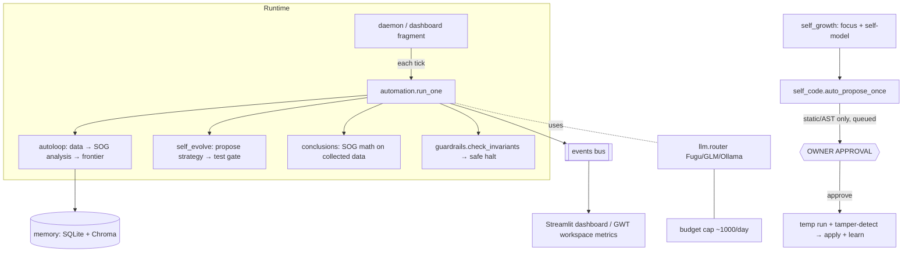
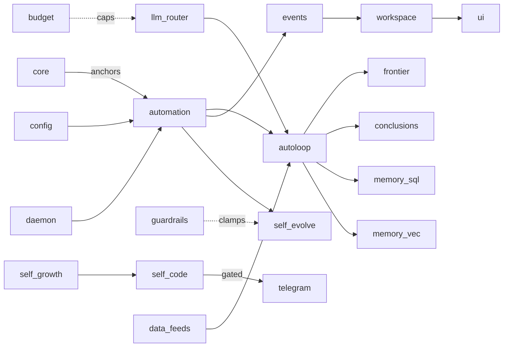
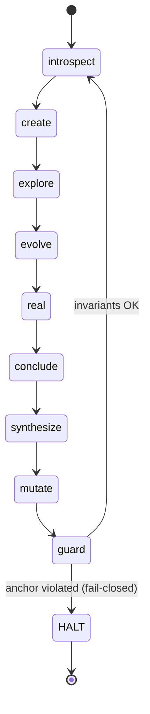
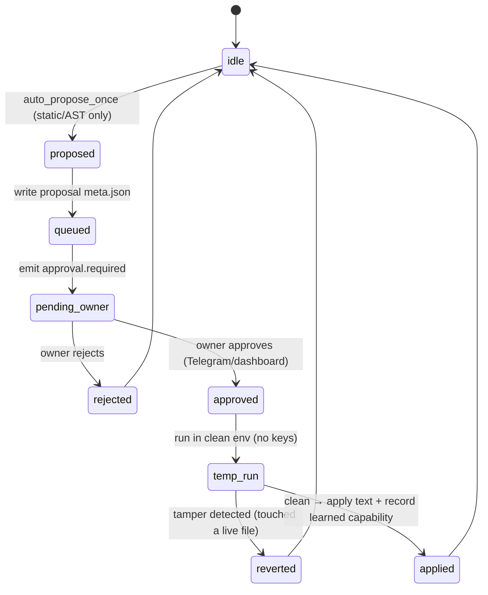

# 🐙 OCTOPUS / 4D SYSTEM — ARCHITECTURE BIBLE (v1)

> **What this is.** A knowledge export, not a summary. Its goal is that another AI (or a future you)
> can read *only this document* and act as an **architectural partner** — design, code, debug, refactor,
> and extend — without guessing what the metaphors mean.
>
> **Method.** Every metaphor → engineering → mathematics → runtime behavior. Grounded in the real code of
> `F:\backup\4d_system\` and the organism docs in `F:\backup\` (read-only; source is authoritative, not this doc).
>
> **Honesty contract (from the project's own doctrine — "no fake claims").** Every claim carries an
> epistemic tag:
> `[FACT]` = verified in a file I read · `[DERIVED]` = logically follows from a `[FACT]` ·
> `[ASSUMPTION]` = reasonable inference, unverified · `[UNKNOWN]` = not yet read/known ·
> `[TODO]` = needs a full-repo scan to complete. **Nothing is invented silently.**
>
> **Scope note.** Three layers are documented and always labeled:
> **(A) `4d_system` code** — the concrete Python app I read (SOG + Brain-OS).
> **(B) `_ops` organism** — the "boss" octopus organism described in vault docs (heart/cortex/budget).
> **(C) Visualization** — the holographic 3D views built on the Desktop (worlds, shadow-lab, organism).
> Where a metaphor is *only* (C) or aspirational, it says so — this is the mapping you asked for.
>
> Generated: 2026-07-12. Sources listed at the end of each major section.

---

## 📑 Table of contents (26 sections)

0. Project DNA · 1. Global architecture · 2. Biological metaphor dictionary · 3. Entity knowledge graph ·
4. Complete file / package map · 5. Runtime execution · 6. Clock system · 7. Event system ·
8. State machines · 9. Agent specification · 10. Communication · 11. Memory · 12. Self-modification ·
13. Mathematics (SOG) · 14. Graph theory · 15. Time · 16. World model · 17. Visualization mapping ·
18. Invariants · 19. Failure modes · 20. Testing · 21. Security · 22. Technical debt ·
23. Future evolution · 24. Architecture Decision Records · 25. Glossary · 26. Teach another AI.

---

## SECTION 0 — PROJECT DNA

**Name.** `4d_system`, product name **«ایده‌یاب» (Idea-Finder)**. `[FACT: registry.yaml, 4D.md]`
Boss/parent layer: the **Octopus organism `_ops`** ("Project Octopus"). `[FACT: ARCHITECT-ORGANISM-CONTEXT.md, OCTOPUS-STRUCTURE.md]`

**Two live missions (neither may be dropped).** `[FACT: 4D.md §1, registry.yaml goals]`
1. **SOG — Self-Other Gradient / hidden 4th dimension.** A linear-Gaussian model that measures the
   "signature of a hidden dimension" in time series. Immutable anchor identity
   `½·log(σ_z²/S) = E_shadow + Δ_self = 0.135073`.
2. **Brain-OS — a cognition testbed.** A platform to test theories of cognition (Global Workspace,
   self-model, predictive processing) with **measurable** metrics (ignition / broadcast width).

**Honest non-claim (explicit, load-bearing).** The system models **access-consciousness** (information
availability + reportability) and a **structural self-model** only — **never** phenomenal consciousness /
qualia / sentience. Every metric is an engineering measure with an operational criterion. `[FACT: 4D.md §1, HEART Neuro-Map, registry.yaml goals]`

**Philosophy / principles.** `[FACT: 4D.md §6-7, guardrails.py, ARCHITECT-ORGANISM-CONTEXT.md]`
- **Bold but protected** ("پرریسک ولی محافظت‌شده") — full autonomy inside hard safety rails.
- **IMPROVE, DON'T REWRITE** — additive capability; never change interfaces; a change > ~30% ⇒ ask first;
  before any change: **Current / Delta / Preserved / Rollback**.
- **Full honesty, no fake claims** — separate fact/inference/proposal; state limits explicitly.
- **Owner is the final boundary** — external actions (publish/send/spend/create-account/apply-code) are
  hard-gated behind explicit human verdict. `SELF_CODE_ENABLED=1` was consciously accepted by the owner.
- **Persistence-only survival; fail-closed; dormancy over resistance** (organism heart doctrine). `[FACT: Octopus_Heart_Design_v1.md]`
- **ADHD-aware UX** — simple, short, **one decision at a time** (hence the minimal Telegram surface). `[FACT: 4D.md §7]`

**Problems it solves.** Detect a latent/private dynamical dimension from public observations; run a
self-improving research loop that generates → tests → concludes about SOG; provide a governed substrate to
measure cognition metrics. `[DERIVED from §1, model.py]`

**Problems it intentionally does NOT solve.** Phenomenal consciousness; unsandboxed arbitrary self-code
execution without owner approval; anything touching the TCB automatically. `[FACT: 4D.md §6, guardrails.py]`

**Core assumptions (made explicit).**
- `[FACT]` The SOG generative model is linear-Gaussian: `s(t+1)=ρs+m+ζ`, `Y=b+λs+ε`.
- `[FACT]` A scalar DARE has a closed-form positive root (used for the Kalman innovation variance `S`).
- `[ASSUMPTION]` Real market series (the `_REAL_TICKERS` universe) are a valid stress corpus for SOG — the
  code treats ticker×period as "distinct real time-series"; validity is empirical, not proven.
- `[ASSUMPTION]` Static AST analysis + owner approval + tamper-detection is "sufficient" safety **without** an
  OS sandbox — the code itself flags this as the residual risk (§21).

**Rejected / tradeoffs.** `[FACT: 4D.md §6 truth-note]` No OS-level sandbox (container/VM) is present;
approved code runs with full process authority. Chosen tradeoff: defenses drastically reduce automatic/accidental
risk, but the **final boundary is the owner's conscious approval**. "Green scan ≠ safe — always show the diff."

**Sources:** `4D.md`, `control_plane/registry.yaml`, `brain/guardrails.py`, `ARCHITECT-ORGANISM-CONTEXT.md`,
`Octopus_Heart_Design_v1.md`, `06 - Architecture Maps/HEART - Neuro Map & Direction.md`.

---

## SECTION 1 — GLOBAL ARCHITECTURE

**Two trees.** `[FACT: OCTOPUS-STRUCTURE.md §0]`
- **Boss = organism `_ops`** ("Project Octopus"): `cortex/` (brain), `heart/` (pulse), `budget/` (fitness),
  `epistemics/` (guard), `organism.py`, `innervation` (pacemaker). Governs all "legs".
- **Leg = `4d_system`** ("ایده‌یاب"): the concrete Python app documented below. It is one tenant under the boss.

**`4d_system` packages (the real module map).** `[FACT: 4D.md §3, registry.yaml, folder tree]`

| Package | Role | TCB | Notes |
|---|---|---|---|
| `core/` (6) | SOG math: model, scores, metrics, nonlinear_mi, simulator | ✅ | immutable math heart |
| `config/` (2) | settings, LLMConfig, OperatingPoint | ✅ | paths, timeouts, anchors |
| `data/` (5) | synthetic / physical / real_api (5 keyless sources) + rhythm_store | — | data generation |
| `brain/` (32) | the autonomous engine (organs, below) | mixed | heart of the project |
| `memory/` (6) | `store` (SQLite) + `vectorstore` (Chroma RAG) + embeddings | — | persistence |
| `llm/` (9) | triple router (Fugu/GLM/Ollama) + budget + clients + shadow_analyze | mixed | cloud path under cap |
| `agents/` (7) | analyst, detector, verifier, reporter, orchestrator, base | — | multi-agent W0–W3 |
| `ui/` (8) | Streamlit, tabs incl. `tab_dashboard` (Command Center) | — | view layer |
| `control_plane/` (7) | registry, policy, flags, contracts, snapshot, channel_doctor | — | observe-only governor v1 |
| `knowledge/` (2) | ledger | — | capability/knowledge ledger |

**Flow directions.** `[FACT: 4D.md §4, daemon.py, automation.py]`



**Why each layer exists.** `core` isolates the provable math (never mutated). `brain` is where autonomy
lives, split so that safety-critical parts (`guardrails`, `budget`, `events`, `automation`, `daemon`,
`self_code`, `self_evolve`) are TCB and the rest are mutable. `control_plane` is a **read-only registry/governor**
so "you cannot govern what you cannot see." `memory` gives on-disk persistence so the organism survives restarts.
`llm` centralizes all cloud egress behind one budgeted router. `ui`/dashboard is a *view*, never the source of truth. `[DERIVED: registry.yaml authority column + guardrails.py + 4D.md]`

**Sources:** `control_plane/registry.yaml` (subsystem table, the real source of truth), `4D.md §3-4`, `brain/daemon.py`, `brain/automation.py`.

---

## SECTION 2 — BIOLOGICAL METAPHOR DICTIONARY

> The core deliverable you asked for: **metaphor → engineering → math → runtime → files**, with the layer
> (A code / B organism-docs / C visualization) labeled. If a row is only a visualization or an aspiration, it says so.

| Metaphor | Layer | Engineering meaning | Math / runtime | Real implementation (files) |
|---|---|---|---|---|
| **Organism** | B | The governed multi-subsystem runtime (`_ops`) | tick loop + registry | `_ops/organism.py` `[UNKNOWN-detail]`; analog in A = `brain/daemon.py` |
| **Heart / pulse** | A+B | The scheduler/pacemaker that emits ticks | period `HEARTBEAT_SECONDS=300`; daemon `DAEMON_TICK_SECONDS=30`; organism setpoint band `[6.40,19.19]`, mid `12.79` cpm | `brain/automation.py` (HEARTBEAT), `brain/daemon.py` (tick); B: `_ops/heart/control_law.py`, `innervation.heart_period_now` |
| **Three hearts** | B/C | Redundant pace generators (G_primary/secondary/tertiary) + single-writer lease | one active pacemaker via fencing token; branchial hearts lead systemic | `Octopus_Heart_Design_v1.md`; C: `OCTOPUS/dream/index.html` (3-heart hologram) |
| **Blue blood** | C | Shared message/data flow (hemocyanin = blue) | event payloads on the bus | Engineering equiv = **event bus** (`brain/events.py`); blue = organism identity only |
| **Brain / cortex** | A+B | Decision + routing + integration | `run_cycle`, coherence scalar (GNWT) | A: `brain/` package; B: `_ops/cortex/*` (`cortex, ignition, self_audit`) |
| **Neuron / ganglia** | C→A | Event processor node | one handler per event | A analog = an `emit`/listener path in `brain/events.py`; "neuron" is a viz node |
| **Arm** | A | Execution domain (a whole leg/tenant) | one project under the boss | `4d_system` itself is an "arm" of `_ops` |
| **Tentacle** | C→A | Task pipeline from core to an agent | `autoloop`: data→SOG→frontier | A analog = the mode-cycle pipeline; C = tentacle tubes in `OCTOPUS/01-topology.html` |
| **Sucker** | C/aspirational | Capability plugin on a limb | pluggable tool | `[ASSUMPTION]` maps to `brain/tools.py`; not a named construct |
| **Shadow** | A (real) | Latent-state visibility of the hidden dimension | `E_shadow = ½·log(σ_z²/S_b)` | `core/model.py` `E_shadow`, `core/scores.py` SLS; C: `4D system/shadow/*` |
| **DNA / genome** | A | The immutable strategy contract + anchors | `strategy.json` (`_generation`), anchor `0.135073` | `brain/self_evolve.py`, `core/` anchors; B: "Awareness Genome" (`Octopus_Heart_Design`) |
| **Mutation / evolution** | A | Strategy self-evolution (JSON, not code) behind a test gate | clamp to `SAFE_PARAM_RANGES`, `MAX_STEP` | `brain/self_evolve.py`, `guardrails.clamp_param` |
| **Growth** | A | Goal-directed self-aware growth: self-model + capability ledger | reads own AST | `brain/self_growth.py`, `brain/self_model.py`, `knowledge/ledger.py` |
| **Dream** | C→A | Offline simulation / analysis (not live line) | shadow analysis `HEART_W_SHADOW>0`; simulate | `llm/shadow_analyze.py`, `core/simulator.py`; "dream" as a named mode = `[TODO/aspirational]` |
| **River of Time / Chronos** | C | Timeline manager (past→future) | scheduling + episodic memory over time | C: `OCTOPUS/worlds/06-time`; A analog = event timestamps + `evaluation` monthly window |
| **World** | C | A visualization lens over the system | — | C: `OCTOPUS/worlds/*` (10 worlds). Not a runtime construct |
| **Memory** | A | SQLite (episodic/experiments) + Chroma (semantic/RAG) | `dashboard_events`, `4d_experiments.db`, `chroma_db/` | `memory/store.py`, `memory/vectorstore.py`, `brain/events.py` |
| **Owner Gate** | A | Human-verdict choke-point before any external/code action | approval state machine (§8) | `brain/telegram_bot.py`, `brain/self_code.py` (approve), `notify` decision packets |
| **TCB (Trusted Computing Base)** | A | The set of files self-modification may **never** touch | `CODE_TCB_FILES` frozenset | `brain/guardrails.py` (exact list, §18) |
| **Kernel** | A/B | The safety+pace core (guardrails+budget+events+automation+daemon+router) | fail-closed | `brain/guardrails.py`, `budget.py`, `events.py`, `automation.py`, `daemon.py`, `llm/router.py` |
| **Clock** | A | The tick source(s) | 300s heartbeat, 30s daemon tick, cortex cadence = 2× heart | `automation.py`, `daemon.py`; B: `innervation` |
| **Generation** | A | Self-evolution version counter | `strategy.json._generation` (~9) | `brain/self_evolve.py` |
| **Anchor** | A | Immutable math invariant | `E_shadow+Δ_self = 0.135073`; `check_invariants` err < 1e-4 | `core/model.py`, `guardrails` (health_source) |
| **Portal** | C | A visual funnel into the system | — | C only (mobile viz). Aspirational as a runtime concept |
| **Spark / Signal / Pulse** | C→A | A structured event traveling the bus | one `Event` record | `brain/events.py`; C = moving particles in holograms |
| **Emotion / Fear / Pain** | aspirational | Risk/health signals | `[TODO]` no affect system in code | `[UNKNOWN]` — currently only "guard/halt" + risk tiers |
| **Risk** | A/B | Governance risk tier per subsystem | `risk_tier ∈ {low,medium,high}` | `registry.yaml` (per-subsystem); B: 4-color risk ladder |
| **Immune / Healing / Regeneration** | A | Self-repair: restore ratified tasks; archive-not-delete | rollback + daily backup | `brain/housekeeping.py`, `brain/backup.py`, `run.py` self-heal `[ASSUMPTION-detail]` |
| **Reflex** | A | Guard invariant check → immediate safe halt | `check_invariants` violation ⇒ halt | `brain/guardrails.py`, `automation.guard` mode |
| **Hormones** | aspirational | Global modulators (budget pressure, novelty) | `[ASSUMPTION]` = budget/novelty scalars | `brain/budget.py`, `strategy.creativity` |
| **Embryo / Cell** | C/aspirational | Cellular metaphor mapped to organs | metaphor only (system has organs not tissue) | `CELLULAR-MODEL-ROSETTA.md` explicitly says "metaphor, no direct equivalent" |

**Sources:** `core/model.py`, `core/scores.py`, `brain/automation.py`, `brain/events.py`, `brain/guardrails.py`,
`control_plane/registry.yaml`, `Octopus_Heart_Design_v1.md`, `CELLULAR-MODEL-ROSETTA.md`, and the Desktop `OCTOPUS/*` visualizations.

---

## SECTION 3 — ENTITY KNOWLEDGE GRAPH (subsystem ontology)

The **real source of truth** is `control_plane/registry.yaml`. Each subsystem has: `id, name, path, type,
owner, tcb, risk_tier, live, authority, health_source`. `[FACT]`

**Authority levels** `∈ observe-only | approve | pause-resume | kill-switch`.
**Live modes** `∈ passive | tick | gated | daemon | external | manual | ui`.
**Rule:** `status ∈ CONNECTED|PARTIAL|MISSING|UNKNOWN` and **UNKNOWN never auto-passes**. `[FACT: registry.yaml header]`

| id | type | tcb | risk | live | authority | health_source |
|---|---|---|---|---|---|---|
| core | library | ✅ | high | passive | observe-only | check_invariants (anchors err<1e-4) |
| config | config | ✅ | high | passive | observe-only | import-time |
| automation | engine | ✅ | medium | tick | pause-resume | event bus |
| autoloop | engine | — | medium | tick | observe-only | via automation events |
| frontier | store | — | low | tick | observe-only | frontier.json |
| conclusions | engine | — | low | tick | observe-only | conclusions.json |
| self_evolve | evolver | ✅ | high | tick | approve | strategy.json (_generation) |
| self_code | evolver | ✅ | high | gated | approve | self_code_proposals/*/meta.json |
| self_growth | engine | — | medium | tick | observe-only | self_portrait.md |
| guardrails | guard | ✅ | high | passive | observe-only | guard events / halt |
| budget | guard | ✅ | high | passive | observe-only | llm_budget.json |
| daemon | runner | ✅ | high | daemon | kill-switch | daemon_state.json |
| telegram | channel | ✅ | medium | external | approve | decision_packets delivered |
| notify | channel | — | medium | tick | observe-only | decision_packets.jsonl |
| events | bus | ✅ | high | passive | observe-only | dashboard_events table |
| workspace | metric | — | low | passive | observe-only | derived from bus |
| housekeeping | maint | — | medium | tick | observe-only | backups/ |
| vault_sync | channel | — | low | tick | observe-only | UNKNOWN |
| web_research | channel | — | medium | external | observe-only | UNKNOWN |
| evaluation | report | — | low | manual | observe-only | monthly_report.md |
| memory_sql | store | — | medium | passive | observe-only | 4d_experiments.db |
| memory_vec | store | — | medium | passive | observe-only | chroma_db/ |
| llm_router | router | ✅ | high | passive | observe-only | llm_budget by_provider |
| agents | engine | — | medium | manual | observe-only | UNKNOWN |
| data_feeds | source | — | low | tick | observe-only | real_cache/ |
| ui | ui | — | low | ui | observe-only | AppTest/manual |
| control_plane | governor | — | low | passive | observe-only | tests |



**Sources:** `control_plane/registry.yaml`.

---

## SECTION 4 — COMPLETE FILE / PACKAGE MAP

> `[TODO]` A byte-exact per-file spec for **all ~3,243 files** requires a full-repo scan (the vault has
> `.git`, `.venv`, `node_modules`, Chroma DBs, and outputs). Below is the verified package + key-file map.
> Marked `[UNKNOWN]` files were listed in the tree but not read; do not invent their internals.

**`core/`** (TCB, immutable math) `[FACT: model.py, scores.py read; others listed]`
- `model.py` — SOG linear-Gaussian model, DARE (`P_closed`, `P_iter`), `KalmanFloor`, `ModelSolution`
  (props: `Delta_self`, `sigma_z2`, `E_shadow`, `identity`, `identity_check`, `detectable`, `Var_ex`, `Var_eff`).
- `scores.py` — `OperationalScores` (SMS, SLS, PCAI, MSC), `compute_scores_from_losses/_from_model`, `compute_msc`.
- `metrics.py`, `nonlinear_mi.py`, `simulator.py`, `__init__.py` — `[UNKNOWN-internals]` (nonlinear MI + simulator).

**`config/`** `[FACT: settings.py read]`
- `settings.py` — `SYSTEM_ROOT`, `DESKTOP`, `REFERENCE_DIR` (the immutable `4D/`), `OUTPUT_DIR`,
  `setup_logging`, timeouts (`FUGU_TIMEOUT=300`, `GLM_TIMEOUT=60`, `WEB_TIMEOUT=20`), `LLMConfig`
  (`glm_model=glm-4-max`, `fugu_model=fugu-v1`, `mock_mode`), `OperatingPoint` (`rho=.5, lam=.5, se=.1,
  sz=.05, sd=.1, B=.2, gamma=1.0`; `se2/sz2/sd2`, `dc_gain=λγ/(1−ρ)`).

**`brain/` (32)** `[FACT: automation.py, events.py, daemon.py, guardrails.py read; rest from 4D.md §3]`
- `automation.py` (TCB) — `AutomationController.run_one()`; `_MODE_CYCLE`; `HEARTBEAT_SECONDS=300`.
- `events.py` (TCB) — `Event` dataclass; `VALID_EVENTS`; `emit()`; SQLite `dashboard_events`.
- `daemon.py` (TCB) — headless loop; `DAEMON_TICK_SECONDS=30`; `daemon.stop`/`daemon.pause`; `auto_propose_once`.
- `guardrails.py` (TCB) — `SAFE_PARAM_RANGES`, `MAX_STEP`, protected roots, `CODE_TCB_FILES`, `clamp_param`,
  `assert_safe_write`, `assert_code_target_allowed`.
- `autoloop.py` — research engine (`AutoLoopEngine`, `AutoLoopConfig`).
- `self_evolve.py` (TCB), `self_code.py` (TCB), `self_growth.py`, `self_model.py`, `budget.py` (TCB),
  `notify.py`, `telegram_bot.py` (TCB), `frontier.py`, `conclusions.py`, `research_agenda.py`, `workspace.py`,
  `housekeeping.py`, `backup.py`, `evaluation.py`, `reflection.py`, `patterns.py`, `meta_research.py`,
  `web_research.py`, `vault_sync.py`, `bg_loop.py`, `hypotheses.py`, `tools.py`, `auto_experiment.py`,
  `graph.py`, `nodes.py`, `state.py` (LangGraph pipeline). `[FACT: names from 4D.md §3 + tree; internals UNKNOWN except the 4 read]`

**`llm/` (9)** — `router.py` (TCB), `base_client.py`, `fugu_client.py`, `glm_client.py` (TCB),
`ollama_client.py`, `langchain_models.py`, `shadow_analyze.py`, `shadow_compare.py`. `[FACT: tree]`

**`memory/` (6)** — `store.py` (SQLite `DB_PATH` → `4d_experiments.db`), `vectorstore.py` (Chroma), `embeddings`,
`rhythm_store` (in `data/`). `[FACT: events.py imports memory.store.DB_PATH]`

**`agents/` (7)** — `base.py`, `analyst.py`, `detector.py`, `verifier.py`, `reporter.py`, `orchestrator.py`,
`__init__.py`. `[FACT: tree]` Internals `[UNKNOWN]`.

**`control_plane/` (7)** — `registry.yaml` (source of truth), `registry.py`, `policy.py`, `flags.py`,
`contracts.py`, `snapshot.py`, `channel_doctor.py`. `[FACT: tree + registry.yaml]`

**`data/` (5)** — `synthetic.py`, `physical.py`, `real_api.py`, `rhythm_store.py`. **`knowledge/`** — `ledger.py`.
**`ui/` (8)** — Streamlit tabs incl. `tab_dashboard`. `[FACT: 4D.md §3]`

**Docs (root):** `README.md`, `PROJECT_STATE.md`, `RUNBOOK.md`, `REGISTRY.md`, `VERDICT_QUEUE.md`,
`AUTONOMOUS_RUN.md`, `TELEGRAM_SETUP.md`, `BACKLOG.md` (B1–B15), `MASTER_UPGRADE_REPORT.md`,
`core-work-prompt.md`, `hybrid-agent-prompt.md`, `hybrid-local-first-prompt.md`. `[FACT: tree]`

**Sources:** folder tree of `4d_system/`, `4D.md §3`, and the four `brain/*` + `config/settings.py` files read.

---

## SECTION 5 — RUNTIME EXECUTION (lifecycle)

```mermaid
sequenceDiagram
  participant U as Owner
  participant D as daemon.py
  participant A as automation.run_one
  participant AL as autoloop
  participant G as guardrails
  participant B as events bus
  participant SC as self_code
  U->>D: python -m brain.daemon (SELF_CODE_ENABLED=1)
  D->>D: load daemon_state.json; setup_logging; check daemon.stop/pause
  loop every DAEMON_TICK_SECONDS=30
    alt not paused
      D->>A: run_one()
      A->>A: pick next mode from _MODE_CYCLE
      alt explore/real/synthesize
        A->>AL: data → SOG analysis → frontier
      else evolve
        A->>A: self_evolve propose → test gate → apply/reject (clamped)
      else conclude
        A->>A: conclusions: SOG math on collected data
      else guard
        A->>G: check_invariants (anchors err<1e-4) → safe halt on violation
      end
      A->>B: emit(event)  (task.started/completed/failed/blocked, system.heartbeat)
    end
    opt periodic (daemon only)
      D->>SC: auto_propose_once (static/AST only) → queue proposal
      SC-->>U: approval.required (Telegram/dashboard)
      U->>SC: approve → temp run (clean env) + tamper-detect → apply + record learned capability
      D->>D: flush_digest (≤ NOTIFY_MAX_PER_DAY) + housekeeping + budget check
    end
  end
  U->>D: create outputs/daemon.stop  (or Ctrl+C = SIGINT/SIGTERM)
  D->>D: clean shutdown; persist state
```

`[FACT: daemon.py, automation.py, 4D.md §4-5, guardrails.py]`
Persistence across restarts: SQLite `4d_experiments.db`, `outputs/self_evolved/*.json`, Chroma. `[FACT: 4D.md §4]`

**Sources:** `brain/daemon.py`, `brain/automation.py`, `4D.md §4-5`.

---

## SECTION 6 — CLOCK SYSTEM

| Clock | Period | Owner | Consumers | Notes |
|---|---|---|---|---|
| **Automation heartbeat** | `HEARTBEAT_SECONDS = 300` (5 min) | `automation.py` | events (`system.heartbeat`), dashboard | logical heartbeat of the leg `[FACT]` |
| **Daemon tick** | `DAEMON_TICK_SECONDS = 30` (env-overridable) | `daemon.py` | `automation.run_one` | wall-clock loop when headless `[FACT]` |
| **Dashboard fragment** | ~2 s (`@st.fragment`) | Streamlit UI | UI refresh | only while a browser tab is open `[FACT: daemon.py docstring]` |
| **Cortex cadence** (organism B) | `clamp(2× heart_period, 60..600 s)` | `_ops/cortex` | cortex.run_cycle | organism layer `[FACT: HEART Neuro-Map]` |
| **Organism heart band** (B) | setpoint `[6.40, 19.19]` cpm, mid `12.79` | `_ops/heart/control_law.py` | innervation pacemaker | loop-gain 0.38 (stability) `[FACT: HEART Neuro-Map]` |

**Drift / recovery.** `[ASSUMPTION for A]` The daemon uses a fixed sleep, not a PID; drift is bounded by the
loop being idempotent per tick. **The organism (B) has real drift handling**: single pacemaker
`innervation.heart_period_now`, clamp to band, redundant generators + single-writer lease (§2 three hearts). `[FACT: Octopus_Heart_Design_v1.md]`

**Invariant.** *Only the scheduler/pacemaker controls clocks* — organism doctrine "tentacle never overrides
the central conservative pulse." `[FACT: Octopus_Heart_Design_v1.md]`

**Sources:** `brain/automation.py`, `brain/daemon.py`, `Octopus_Heart_Design_v1.md`, `HEART - Neuro Map`.

---

## SECTION 7 — EVENT SYSTEM

**Bus.** `brain/events.py` — structured events persisted to SQLite `dashboard_events`; the dashboard derives
state from events (no free-text logs). `[FACT]`

**Event schema (`Event` dataclass).** `timestamp, trace_id, agent_id, event_name, status, summary,
duration_ms, next_action, approval_state`. `status ∈ {ok, error, blocked, pending, info, retry}`.
`approval_state ∈ {unknown, not_required, pending, approved, rejected}` (always explicit, never null). `[FACT]`

| event_name | Emitter | Listeners | Payload/notes |
|---|---|---|---|
| `task.started` | automation / any organ | dashboard, workspace | begins a mode step `[FACT]` |
| `task.completed` | automation / organ | dashboard, workspace, conclusions | `duration_ms`, `next_action` `[FACT]` |
| `task.failed` | any organ | dashboard, guard | triggers fail-streak logic `[FACT+ASSUMPTION]` |
| `task.blocked` | any organ | dashboard | needs input/gate `[FACT]` |
| `handoff.created` | organ | dashboard/telegram | a decision handoff `[FACT]` |
| `system.heartbeat` | automation/daemon | dashboard | liveness ping every 300 s `[FACT]` |
| `approval.required` | self_code / notify | telegram/owner | drives the Owner Gate `[FACT]` |

`[TODO]` A full listener map (which module subscribes to which) requires reading each `brain/*` consumer;
`workspace.py` derives **GWT broadcast/coherence** metrics from this bus. `[FACT: registry.yaml workspace row]`

**Sources:** `brain/events.py`, `control_plane/registry.yaml`.

---

## SECTION 8 — STATE MACHINES

**8.1 Automation mode cycle** `[FACT: automation.py _MODE_CYCLE]`
Order: `introspect → create → explore → evolve → real → create → conclude → synthesize → introspect →
evolve → mutate → real → guard` (then wraps). Each `run_one()` advances one step.



**8.2 Self-code approval machine** `[FACT: daemon.py, guardrails.py, 4D.md §4]`



**8.3 Daemon liveness** `idle ⇄ running ⇄ paused (daemon.pause) → stopped (daemon.stop / SIGINT)`. `[FACT: daemon.py]`

`[TODO]` Per-agent state machines (analyst/detector/verifier/…) need their files read.

**Sources:** `brain/automation.py`, `brain/daemon.py`, `brain/guardrails.py`.

---

## SECTION 9 — AGENT SPECIFICATION

Two agent populations exist:

**(A) `4d_system/agents/`** — W0–W3 multi-agent orchestration: `analyst`, `detector`, `verifier`,
`reporter`, `orchestrator`, `base`. `[FACT: tree, 4D.md §3]` Per-agent Role/Inputs/Outputs/Budget: `[UNKNOWN]`
(files not read) — do not invent; `[TODO]` read `agents/*.py`.

**(B) `_ops` limbs / research-scout fleet** `[FACT: AGENT_REGISTRY.md]`

| Agent | Role | Authority | Schedule | Scope |
|---|---|---|---|---|
| `vault-cartographer` | map/audit architecture; ground design↔reality from real repo | read-only floor / propose-only ceiling | boot-coupled | whole vault minus `.agentignore`/`_Duplicates`/`_Archive`/secrets/Project-F |
| `mycelium` (scout) | nature/architect research digest | propose-only | `0 7 * * *` | scout-digests |
| `architect-selfimprove` ★ | architect self-improvement lane | propose-only | `*/3 * * * *` | backlog + synthesis; never apply/charter edit |

**Common contract (both):** propose-only by default; any external/code action requires owner verdict;
budget-capped LLM; never echo secrets or Project-F identity. `[FACT: AGENT_REGISTRY.md, guardrails.py, 4D.md §7]`

**Mutation capability:** only `self_evolve` (strategy) and `self_code` (code, gated) may change behavior;
agents themselves are propose-only. `[FACT: registry.yaml authority column]`

**Sources:** `05 - Agents/AGENT_REGISTRY.md`, `4d_system/agents/` tree, `control_plane/registry.yaml`.

---

## APPENDIX A — HYPOTHESIS ENGINE (testable self-improvement; ADR-037)

**What it is.** A self-contained Pydantic cabin (`_ops/hypothesis_engine/`) that produces
*testable hypotheses* — statement + test plan + kill condition — instead of beliefs. The brain
never writes the registry/ledger/Gate directly; output is a `proposal` (ADR-034 pattern). Belief
(`existence_probability`) changes ONLY via Bayesian log-odds update on ledger-linked evidence.
`[FACT: ADR-037, _ops/hypothesis_engine/impl/hypothesis_brain.py]`

**Hard rule.** `testability == 0` ⇒ always reject, regardless of usefulness. This is why the
proposition "Octopus is AGI" is FALSIFIED (no operational definition ⇒ untestable).
`[FACT: architecture/hypothesis-registry.yaml HYP-2026-08-12-002]`

**Invariant unchanged.** This appendix EXTENDS the architecture; it does not alter the honest
non-claim of SECTION 0 (lines 49-51): the system models access-consciousness + a structural
self-model only — **never** phenomenal consciousness / qualia / sentience. The Hypothesis Engine
is an *engineering* tool for measurable, falsifiable self-improvement — not a consciousness claim.
`[FACT: ARCHITECTURE-BIBLE.md:49-51, ADR-037 §Phase-0 vote Option A]`

**Wiring.** `hypothesis_brain_run(cycle)` in cortex.py — propose-only, fail-soft, **default OFF**
(`CORTEX_HYPOTHESIS=0`). When enabled, it reads active hypotheses read-only from
`architecture/hypothesis-registry.yaml`, ranks them by pursue-score, and surfaces an advisory
ranking — no execution, no gate, no ledger mutation.
`[FACT: _ops/cortex/cortex.py, capabilities-registry.yaml id=hypothesis-engine]`

**Honest evidence (reproduced 2026-08-12).** On a 3-agent deceptive-grid benchmark (600 runs),
the hypothesis agent escapes deception where prior-only search fails completely (97% vs 0%
discovery), but is NOT superior to simple novelty search (median-ttd p=0.32, Cliff δ=−0.11).
Advantage is *conditional on environmental deception*, not a general capability gain.
`[FACT: _ops/hypothesis_engine/experiments/{results.csv,analysis.py,RESULTS-DECEPTIVE-3AGENT-2026-08-12.md} §3,§6]`

**Validation gate.** `validate_hypothesis_registry.py` (read-only, exit 0/1) enforces:
kill_condition required in TESTING, `may_mutate_ledger`/`may_trigger_tool` always false,
`may_gate` only at EVIDENCED, ≤20 active hypotheses.
`[FACT: _ops/scripts/validate_hypothesis_registry.py]`
