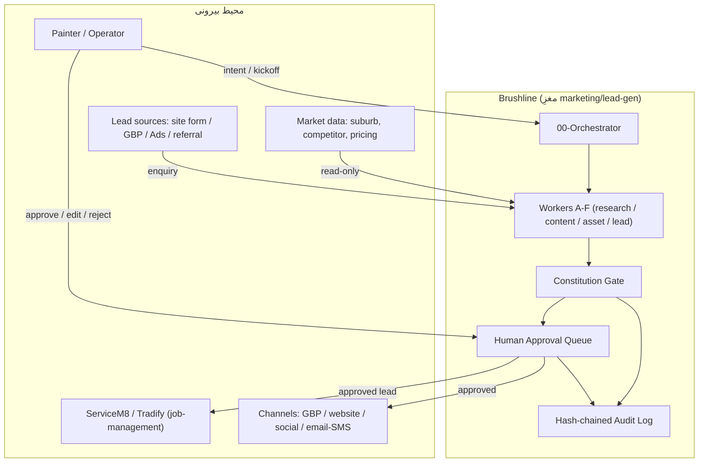
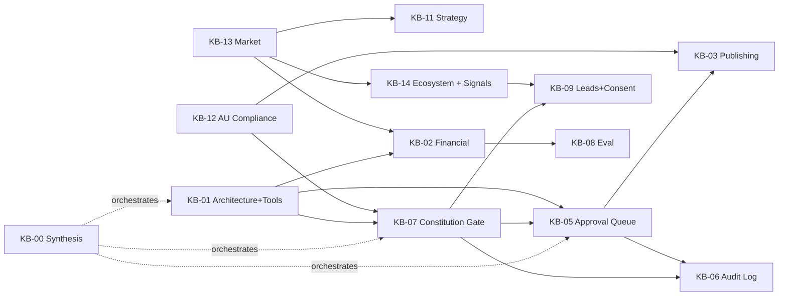
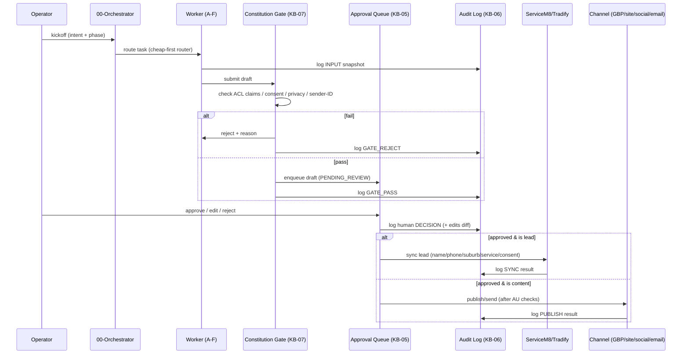
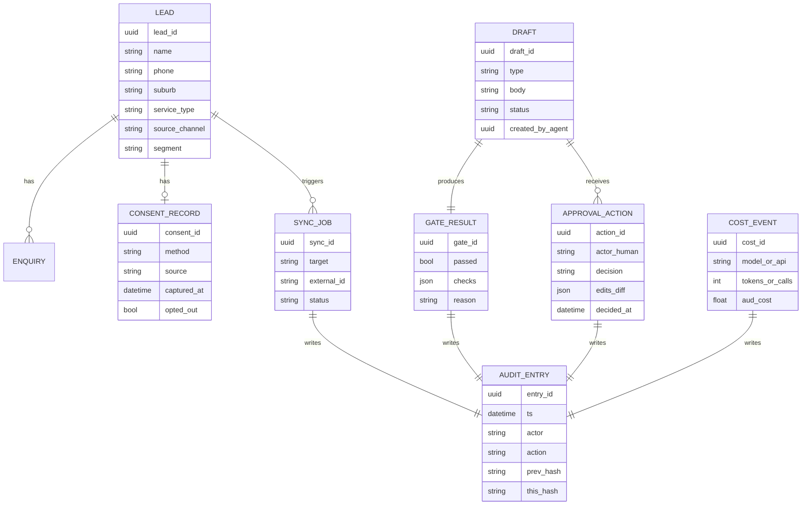
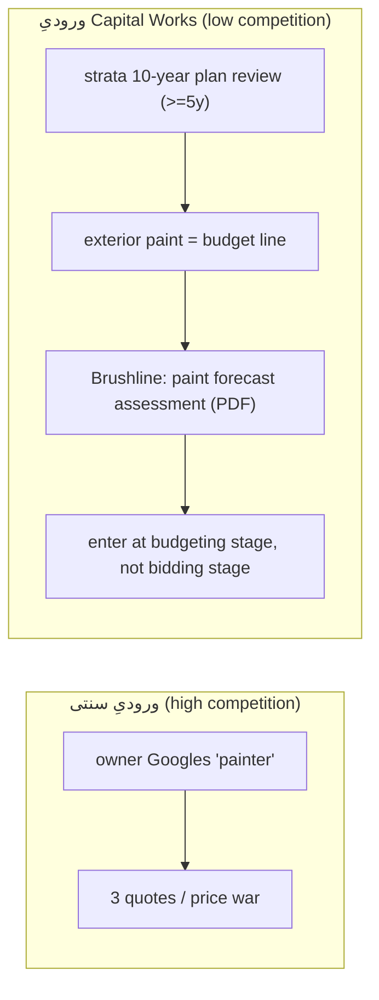

# KB-00 — Master Synthesis (نقشهٔ متصلِ منابع)

> هدف: همهٔ ماژول‌های موجود و آینده را به‌هم وصل کند، جریان داده/وابستگی/هم‌پوشانی را بصری کند، و نقطهٔ مرجعِ واحد برای رفتن به «نیازمندی‌های MVP» باشد.
> دامنه: نقاشیِ ساختمان (داخلی/بیرونی) در سیدنی، استرالیا. معماری = reuse از LANGAR (خواهر)، نه از صفر.
> نسخه: v1.0 — سند ساخته‌شده در فاز تئوری. هیچ کدی ندارد؛ فقط تعریف سیستم.

---

## ۰. خلاصهٔ سریع — این سند چه می‌گیری؟

یک نقشهٔ واحد که نشان می‌دهد ۱۳ ماژول دانش، سه invariant حاکمیتی، و دو سیستم خارجی (ServiceM8/Tradify) چطور یک «مغزِ مارکتینگ/lead-gen» را می‌سازند که:

۱) محتوا و پاسخ را **draft** می‌کند (هرگز auto-publish)،
۲) از یک **Constitution Gate** و یک **Human Approval Queue** عبور می‌دهد،
۳) هر کنش را در یک **hash-chained Audit Log** ثبت می‌کند،
۴) lead را به job-management خارجی **sync** می‌کند (integrate, don't duplicate).

سه قانون تغییرناپذیر (از ROADMAP/SETUP) که کلِ معماری را قید می‌زنند:

> **Invariant-1:** هیچ publish/spend/پیام بدون human approval.
> **Invariant-2:** دادهٔ شخصی هرگز وارد LANGAR نشود؛ دادهٔ حساس مالیِ مشتری عمومی نشود.
> **Invariant-3:** هر auto-execution = kill switch + spend cap + hash-chained audit log.

---

## ۱. Context Diagram — Brushline در محیطش

نکتهٔ کلیدی: Brushline هیچ‌گاه مستقیم به PUB یا SM8 نمی‌نویسد. هر مسیر خروجی از QUEUE (انسان) رد می‌شود و در LOG ثبت می‌گردد.

---

## ۲. نقشهٔ ماژول‌ها و وابستگی‌ها

| KB | نقش | وضعیت | وابسته به | تغذیه‌کنندهٔ |
|---|---|---|---|---|
| KB-00 (این سند) | Master Synthesis | جدید | همه | همه |
| KB-01 | Architecture + Tool Registry + ServiceM8/Tradify integration | آماده | KB-13 | همه |
| KB-02 | Financial Model (AUD) | جدید | KB-01, KB-11, KB-13 | ROADMAP, MVP |
| KB-03 | Publishing + AU governance | دستهٔ ۲ | KB-12, KB-07 | KB-05 |
| KB-04 | Agent Memory | آینده | KB-01 | KB-09 |
| KB-05 | Human Approval Queue | جدید | KB-01, KB-07 | KB-06, KB-03 |
| KB-06 | Audit Log (tamper-evident) | جدید | KB-05, KB-07 | همه (forensics) |
| KB-07 | Constitution Gate | جدید | KB-12, KB-01 | KB-05, KB-06 |
| KB-08 | Eval (Wilson + cost-per-booked-job) | نیمه | KB-02 | ROADMAP |
| KB-09 | Leads + consent + CRM integration | آینده | KB-01, KB-07 | KB-06 |
| KB-10 | Prompt Library | آماده | KB-07 | KB-01 |
| KB-11 | Engineering strategy (owned vs rented) | آماده | KB-13 | همه |
| KB-12 | Australia compliance + market | آماده | — | KB-07, KB-03, KB-09 |
| KB-13 | Market research (deep) | آماده | — | KB-02, KB-14, KB-11 |
| KB-14 | Ecosystem mapping + Lead Signals | آماده | KB-13 | KB-09, KB-02 |

### نمودار وابستگی

---

## ۳. جریان داده — از enquiry/intent تا خروجی

این همان مسیری است که در BLUEPRINT/ROADMAP به‌صورت 00-Orchestrator → A..F → Gate → Approve → Audit آمده، و حالا با ماژول‌های جدید کامل می‌شود.

**هم‌پوشانی مفهومیِ مهم:** Constitution Gate (KB-07) و Evaluator-Optimizer (KB-01 §۲.۵) یک چیزند با دو نام؛ evaluator نقد می‌کند، generator بازنویسی، تا gate رد شود. در MVP این‌ها را یک کامپوننت واحد بدانیم تا duplication رخ ندهد.

---

## ۴. مدلِ مفهومیِ داده (ER سطح بالا)

موجودیت‌های مشترکی که چهار ماژول جدید + KB-09 روی آن‌ها می‌نشینند:

این مدل ER، قراردادِ مشترکِ KB-02 (COST_EVENT)، KB-05 (APPROVAL_ACTION/DRAFT)، KB-06 (AUDIT_ENTRY)، KB-07 (GATE_RESULT)، و KB-09 (LEAD/CONSENT_RECORD) است.

---

## ۵. لایهٔ استراتژیک — Capital Works به‌عنوان pre-intent wedge

این بخش، ایدهٔ «ورود به اکوسیستم Capital Works» را به KB-14 (Lead Signals) و سگمنت strata در KB-13 وصل می‌کند. **داده‌های قانونی ground شده‌اند** (سرچ‌شده، نه حدس):

- از **۱ آوریل ۲۰۲۶**، هر strata scheme در NSW هنگام تهیه یا بازنگریِ برنامهٔ ۱۰ سالهٔ capital works fund باید از **standard form اجباری** استفاده کند (Strata Schemes Legislation Amendment Act 2025؛ ابزار Strata Hub).
- رنگ‌آمیزی/waterproofing/structural از اقلام **capital works** است؛ برنامه باید هزینهٔ ۱۰ سال آینده را با تورم برآورد کند.
- بازنگری **حداقل هر ۵ سال** الزامی، و best practice سالانه در AGM است.
- نبودِ برنامهٔ سالم = red flag روی Section 184 Certificate و ریسک special levy و حتی انتصاب اجباریِ managing agent.

### چرا این برای Brushline طلاست

این دقیقاً یک **pre-intent signal** است (همان منطق KB-14): به‌جای انتظار برای اینکه owner در Google «painter» جستجو کند، Brushline می‌تواند در لحظهٔ **بودجه‌ریزی** strata manager وارد چرخه شود — جایی که رنگ‌آمیزی هنوز یک ردیف بودجه است، نه یک اضطرار.

### نگاشت به ماژول‌های موجود (نه یک محصول جدا)

| عنصر ایدهٔ Capital Works | کجای Brushline می‌نشیند |
|---|---|
| محصول «Exterior Paint Forecast / Assessment (PDF)» | یک نوع draft جدید در KB-01 Content Tools (`draft_capital_works_assessment`) + Asset/Image (before/after, condition photos) |
| هدف‌گیری strata managers | سگمنت موجود `strata / property-manager` در KB-13 §۳ |
| ایمیلِ پیشنهاد رایگان به مدیران | مسیر outreach → از Gate (ACL: no false claims) + Approval + consent (Spam Act؛ این B2B cold است، پس باید با دقت inferred-consent/legitimate-interest و sender-ID/unsubscribe مدیریت شود — KB-07/KB-12) |
| دیتابیس اختصاصی (عمر رنگ، هزینهٔ m²، فاصله از ساحل) | یک منبع داخلیِ Researcher (KB-01) که به‌مرور با داده‌های پروژه پر می‌شود؛ ورودیِ تخمین در KB-02 |

> هشدارِ صادقانه (governance): «ایمیل به ۱۰۰ مدیر strata» یک کمپین **cold B2B** است. Spam Act 2003 برای پیام تجاری به آدرسِ بدونِ consent محدودیت دارد. این مسیر «منع مطلق» نیست (رابطهٔ تجاریِ مرتبط/inferred-consent ممکن است صدق کند)، اما باید با sender-ID + ABN + unsubscribe ۵-روزه و suppression list اجرا شود و **هر پیام human-approved** باشد. این را KB-07/KB-12 enforce می‌کنند — نه یک exception برای Capital Works.

این لایه **scope جدید است**؛ پیشنهاد می‌شود به‌عنوان «سگمنت اولویت‌دارِ فاز ۵+» علامت بخورد، نه جایگزین مسیر residential/owned-channel که North Star فعلی است.

---

## ۶. شکاف‌های تحقیقاتیِ پرشده (در این batch)

| شکاف | وضعیت | منبع |
|---|---|---|
| pricing مدل‌های LLM (Haiku/Sonnet/Opus) | پر شد → KB-02 | docs/مراجع رسمی، ژوئن ۲۰۲۶ |
| pricing SERP/search API | پر شد → KB-02 | SerpApi/Serper/DataForSEO |
| pricing ServiceM8/Tradify (AUD) | پر شد → KB-02 | servicem8.com, مقایسه‌ها |
| اصلاحات Strata 2026 (Capital Works) | پر شد → §۵ بالا | nsw.gov.au و چند منبع حقوقی |
| Constitution Gate heuristics | پر شد → KB-07 | KB-12 + ACL/Spam/APP |
| Approval Queue state machine | پر شد → KB-05 | — |
| Audit Log tamper-evident structure | پر شد → KB-06 | — |
| FX نرخ AUD↔USD دقیق | **باز (config)** | باید روز سرچ شود؛ planning rate در KB-02 علامت‌دار |
| Google Places API نرخ دقیق per-request | **باز (verify)** | جایگزین Serper/DataForSEO در KB-02 modeled |
| Spam Act penalty units به‌روز | **باز (verify)** | فریم در KB-12؛ رقم دقیق غیر-load-bearing |

---

## ۷. قدم بعدی

۱. KB-02 / KB-07 / KB-05 / KB-06 (همین batch).
۲. سند MVP System Requirements (همین batch) — این Synthesis را به functional spec تبدیل می‌کند.
۳. دستهٔ بعد: KB-03 (publishing+AU)، KB-09 (leads+consent+CRM)، KB-08 (eval کامل)، KB-04 (memory).
۴. تصمیمِ استراتژیک برای Operator: آیا لایهٔ Capital Works (§۵) وارد ROADMAP به‌عنوان سگمنت فاز ۵+ شود؟ (تصمیم با توست؛ من فقط ریسک/فرصت را شفاف گذاشتم.)
