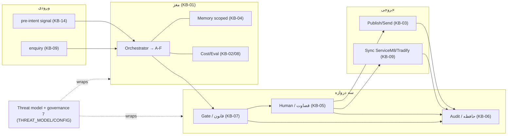

# CONSISTENCY REPORT + Operating Picture

> §۶ پرامپتِ تکمیل. گذرِ ممیزی روی کلِ مجموعه + یک capstone بصریِ خلاقانه که همه‌چیز را یک‌جا نشان می‌دهد.

---

## ۰. Operating Picture — Brushline در یک نگاه

استعارهٔ راهنما: Brushline یک **خطِ تولیدِ اعتماد** است. ورودی = سیگنال/enquiry؛ خروجی = یک کنشِ منتشرشدهٔ مورد‌اعتماد. بینِ این دو، سه دروازه ایستاده‌اند که هیچ‌چیز بدونِ عبور از آن‌ها بیرون نمی‌رود: **Gate (قانون)، Human (قضاوت)، Audit (حافظهٔ تغییرناپذیر)**.

> سه Invariant = سه قفلِ این خط: INV-1 روی G2، INV-2 روی Memory/Store، INV-3 روی کلِ خط (cap + kill + audit).

---

## ۱. ممیزیِ سازگاری (۶ محور)

| محور | نتیجه | یادداشت |
|---|---|---|
| **Naming** | ✅ | همه‌جا Brushline؛ Atelier/placeholder در GLOSSARY منسوخ شد |
| **Invariant coverage** | ✅ | هر KBِ کنش‌دار سه INV را map کرده؛ خلاصه در جدولِ §۲ |
| **ER سازگاری** | ✅ | موجودیت‌های KB-01/03/04/06/09 با KB-00 §۴ یکی‌اند؛ Gate≡Evaluator (بدونِ duplication) |
| **No-code** | ✅ | هیچ فایل کد تولید نشد؛ فقط Markdown + Mermaid |
| **Cross-refs** | ✅ | KB-07↔KB-05↔KB-06 و KB-03↔KB-09 دوطرفه؛ CONFIG تک‌منبع |
| **ROADMAP map** | ⚠️ | همهٔ P-itemها پوشش داده شد؛ **اقدامِ باز:** ROADMAP باید با ✅ به‌روز شود و Capital Works به‌عنوان سگمنتِ فاز ۵+ ثبت شود (تصمیم با Operator) |

---

## ۲. جدولِ پوششِ Invariant (snapshot)

| KB | INV-1 | INV-2 | INV-3 |
|---|---|---|---|
| KB-01 architecture | ✅ approval gate | ✅ data boundary | ✅ gov_* |
| KB-03 publishing | ✅ no auto-post | ✅ no PII leak | ✅ cap+audit |
| KB-04 memory | — | ✅ no PII in memory | ✅ versions↔audit |
| KB-05 queue | ✅ core | ✅ sync preview | ✅ no auto-approve |
| KB-06 audit | ✅ logs approval | ✅ hash نه PII خام | ✅ kill/cap events |
| KB-07 gate | ✅ never publishes | ✅ privacy/sovereignty | ✅ blocks |
| KB-08 eval | ✅ decision=human | — | ✅ anomaly alert |
| KB-09 leads | ✅ first msg approved | ✅ sync boundary | ✅ cap |
| KB-14 ecosystem | ✅ outreach approved | ✅ read-only research | ✅ cap |

---

## ۳. وضعیتِ نهاییِ پروژه

ساخته‌شده در این اجرا: **KB-01, KB-03, KB-04, KB-08, KB-09, KB-14** + **CONFIG, GLOSSARY, THREAT_MODEL** + این گزارش.
از قبل: KB-00, KB-02, KB-05, KB-06, KB-07, MVP spec, KB-10..KB-13, BLUEPRINT, ROADMAP, SETUP.

نتیجه: لایهٔ تئوری **کامل و سازگار** است؛ پروژه آمادهٔ فاز ۰ (scaffold/reuse) در ROADMAP.

---

## ۴. اقداماتِ باز (تصمیم با Operator)
۱. به‌روزرسانیِ ROADMAP با ✅ روی P-itemها و افزودنِ Capital Works به سگمنت‌ها.
۲. پر کردنِ مقادیرِ «verify» در CONFIG: `fx_aud_usd`، Google Places per-request، `spam_penalty_units`.
۳. سه ورودیِ اقتصادِ واقعی (KB-02): `avg_margin_per_job`، `enquiry→quote`، `quote→job`.
۴. تصمیم: آیا multi-tenant threat (فاز ۶) حالا به THREAT_MODEL اضافه شود یا بماند برای فاز محصول‌سازی؟
