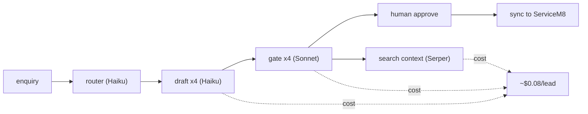
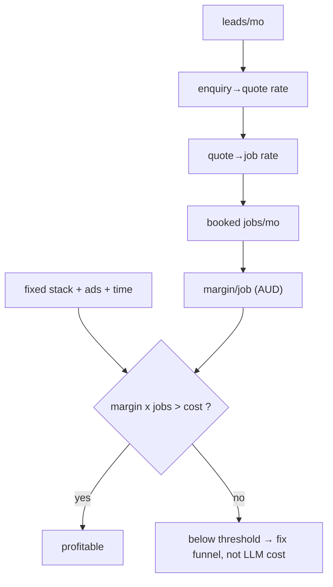
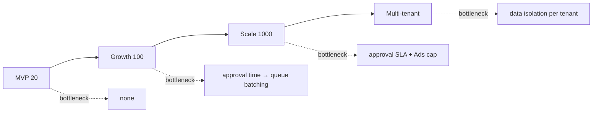

# KB-02 — Financial Model (AUD)

> هدف: مدلِ بهای‌تمام‌شدهٔ Brushline به AUD؛ cost-per-lead و cost-per-booked-job؛ آستانهٔ سودآوری؛ سناریوهای مقیاس MVP→۱۰۰۰ lead/ماه؛ و نقشهٔ pricing/alternative/lock-in برای هر سرویس.
> حالت: decision-support. این سند تصمیم نمی‌گیرد و financial advice نیست؛ ریسک و عدم‌قطعیت را شفاف می‌کند. تصمیم با Operator است.
> همهٔ ارقام USD از منابع روزِ (≈ ژوئن ۲۰۲۶) سرچ‌شده‌اند؛ ارقام AUD با planning rate تبدیل شده‌اند و علامت‌دارند.

---

## ۰. خلاصهٔ سریع

سه یافتهٔ load-bearing:

۱. **هزینهٔ LLM/سرچ، گلوگاه نیست.** هزینهٔ متغیرِ هر lead در حد چند سنت است. گلوگاهِ واقعی = (الف) ظرفیتِ human approval، (ب) خرجِ Google Ads (اختیاری)، (ج) subscription یک job-management.
۲. **هزینهٔ ثابتِ ماهانهٔ Brushline (LLM + سرچ + تصویر) ~ AUD ۱۵–۶۰/ماه** در فاز MVP — جدا از subscription نرم‌افزار trade (~AUD ۲۹–۷۹) و Google Ads.
۳. **متریکِ حاکم = cost-per-booked-job، نه cost-per-lead.** بهینه‌سازی روی lead ارزان می‌تواند گمراه‌کننده باشد (KB-08).

---

## ۱. فرض‌ها و planning rate (صریح)

| فرض | مقدار | وضعیت |
|---|---|---|
| FX planning rate | ۱ USD ≈ ۱٫۵۵ AUD | **config — روز سرچ شود** |
| مدلِ پیش‌فرض (router cheap-first) | Haiku 4.5 برای ~۹۰٪، escalate به Sonnet 4.6 | KB-01 §۲.۲ |
| prompt caching روی KB context | فعال (≈۹۰٪ تخفیف روی input کش‌شده) | از روز اول |
| Batch API برای کارهای غیر-فوری | فعال (۵۰٪ تخفیف) | review/blog/nightly |
| storage فاز MVP | Google Sheets / فایل (≈ رایگان) | KB-01 |

---

## ۲. نرخ‌نامهٔ ورودی (USD، روزِ ~ژوئن ۲۰۲۶)

### ۲.۱ LLM (per million tokens — MTok)

| مدل | Input | Output | Batch (−۵۰٪) | یادداشت |
|---|---|---|---|---|
| Haiku 4.5 | $1.00 | $5.00 | $0.50 / $2.50 | پیش‌فرضِ حجم‌بالا (router, caption, review) |
| Sonnet 4.6 | $3.00 | $15.00 | $1.50 / $7.50 | suburb page, gate، follow-up استراتژیک |
| Opus 4.8 | $5.00 | $25.00 | $2.50 / $12.50 | فقط تصمیم‌های نادرِ سنگین (پیشنهاد: استفاده نشود در MVP) |
| cache hit | ۱۰٪ نرخ input (۹۰٪ تخفیف) | — | — | cache write: ۱٫۲۵× (۵م) / ۲× (۱س) |

نسبت ثابتِ output = ۵× input در هر سه tier (بودجه‌ریزی ساده: input را در ۵ ضرب کن).

### ۲.۲ Search / SERP API (per ۱۰۰۰ query)

| سرویس | نرخ تقریبی | مدل | یادداشت |
|---|---|---|---|
| Serper | ~$0.30–$1.00 / 1K | PAYG + free 2.5K/mo | ارزان‌ترین برای Google SERP خام |
| DataForSEO | ~$0.0006 (async) – $0.002 (live) /query | PAYG، حداقل deposit ~$50 | ارزان‌ترین در حجم، latency async |
| SearchAPI | ~$40/mo شروع، $2–$8 /1K | subscription | میانه |
| SerpApi | ~$25/1K (entry) | subscription، unused expire | گران‌ترین، پوشش engine زیاد |
| Google Places API | **verify — per-request** | PAYG | برای suburb/competitor؛ نرخ دقیق روز چک شود |

> پیش‌فرضِ MVP: Serper یا DataForSEO (async) برای پژوهشِ غیر-فوری. SerpApi فقط اگر پوشش چند-engine لازم شد.

### ۲.۳ تصویر (before/after enhancement)

tier ارزان (نه generative گرانِ فوتورئال). فاز MVP: enhancement/قالب برند روی عکس واقعی. هزینه ناچیز و per-asset؛ علامتِ «config».

---

## ۳. هزینهٔ واحد — per lead و per content unit

تخمین‌ها با token sizing محافظه‌کارانه. اعداد USD؛ AUD با ×۱٫۵۵.

### ۳.۱ واحدهای محتوا

| draft | مدل | input/output tok | هزینه USD (با cache) | AUD |
|---|---|---|---|---|
| suburb landing page | Sonnet | ۳٬۰۰۰ / ۲٬۰۰۰ | ~$0.035 | ~$0.054 |
| social caption | Haiku | ۸۰۰ / ۳۰۰ | ~$0.0023 | ~$0.0036 |
| quote follow-up (یک پیام) | Haiku | ۱٬۰۰۰ / ۳۰۰ | ~$0.0025 | ~$0.0039 |
| review response | Haiku | ۹۰۰ / ۲۵۰ | ~$0.0022 | ~$0.0034 |
| blog outline | Sonnet | ۲٬۰۰۰ / ۱٬۵۰۰ | ~$0.027 | ~$0.042 |
| gate check (per draft) | Sonnet | ۱٬۲۰۰ / ۴۰۰ | ~$0.010 | ~$0.016 |

### ۳.۲ چرخهٔ کاملِ یک lead

enquiry → speed-to-lead draft + ۳ follow-up (روز ۲/۵/۱۰) + gate برای هرکدام + ۱ search context.

| جزء | برآورد USD |
|---|---|
| ۴ پیام (Haiku) + ۴ gate (Sonnet) | ~$0.075 |
| ۱–۲ search (Serper) | ~$0.001 |
| **جمع per lead (LLM+search)** | **~$0.08 USD ≈ AUD ~0.12** |

> یعنی حتی ۱۰۰۰ lead/ماه ≈ AUD ~۱۲۰ هزینهٔ LLM+search. این عدد در برابر Ads/subscription/time کوچک است.



---

## ۴. هزینهٔ ثابتِ ماهانه (stack)

| قلم | پیش‌فرض MVP (AUD/ماه) | یادداشت |
|---|---|---|
| LLM (Brushline drafting) | ~$10–۴۰ | تابع حجم محتوا/lead |
| Search API | ~$0–۱۵ | Serper free tier کافی برای MVP |
| تصویر | ~$0–۱۰ | enhancement سبک |
| storage (Sheets/فایل) | ~$0 | فاز MVP |
| **جمع Brushline core** | **~AUD ۱۵–۶۵** | منطبق با BLUEPRINT |
| job-management (ServiceM8) | $29 / 79 / 149 / 349 (GST incl) | جدا — KB-06 lock-in |
| یا Tradify | ~$48/user (Lite)+ | per-user |
| Google Ads (اختیاری) | متغیر، با spend cap | KB-03 |

> **spend cap از روز اول** (Invariant-3): per-action و per-day cap روی LLM/search/Ads. KB-06 هزینه را به‌عنوان COST_EVENT لاگ می‌کند.

---

## ۵. آستانهٔ سودآوری (decision-support)

ورودی‌های اقتصادِ واقعیِ کار (از KB-13): ارزشِ هر job نقاشیِ residential سیدنی معمولاً صدها تا هزاران AUD؛ hipages «هزینهٔ واقعیِ هر lead $۲۰۰–۳۰۰+».

مدلِ break-even ساده (متغیرها را Operator پر می‌کند):

```
سود ماهانه ≈ (booked_jobs × avg_margin_per_job)
              − (fixed_stack + ads_spend + value_of_operator_time)

cost_per_booked_job = total_monthly_cost / booked_jobs
آستانه: cost_per_booked_job  <  avg_margin_per_job
```



نکتهٔ صادقانه: چون هزینهٔ LLM ناچیز است، **اهرمِ سود = نرخِ conversion (speed-to-lead + review) و margin/job**، نه قیمتِ توکن. بهینه‌سازیِ توکن یک پیش‌بهینه‌سازی (premature) است مگر در حجمِ خیلی بالا. این هم‌راستا با اصلِ «اول واگرایی، بعد همگرایی» در KB-10.

---

## ۶. سناریوهای مقیاس‌پذیری

| سناریو | leads/ماه | LLM+search (AUD) | human approval | گلوگاه |
|---|---|---|---|---|
| MVP | ۲۰ | ~$3 | دستی، چند دقیقه/مورد | هیچ |
| Growth | ۱۰۰ | ~$15 | نیاز به batching صف | زمانِ approval |
| Scale | ۱٬۰۰۰ | ~$120 | نیاز به SLA + اولویت‌بندی صف (KB-05) | approval throughput + Ads budget |
| Multi-tenant (آینده) | n× | linear | per-tenant isolation | حاکمیت داده per-tenant (Invariant-2) |



درسِ مقیاس: وقتی leadها زیاد می‌شوند، چیزی که می‌شکند **انسان** است نه مدل. پس سرمایه‌گذاری روی KB-05 (Approval Queue با اولویت‌بندی/SLA و ویرایش سریع) ROI بالاتری از بهینه‌سازیِ توکن دارد.

---

## ۷. pricing / alternative / vendor lock-in (الزام §۸ پرامپت مادر)

| سرویس | pricing model | alternative | lock-in | کاهش ریسک |
|---|---|---|---|---|
| LLM (Anthropic) | PAYG per-token | OpenAI / Gemini / DeepSeek | متوسط (prompt-format) | abstraction layer روی provider؛ مدل را config کن نه hard-code |
| Search/SERP | PAYG/subscription | Serper↔DataForSEO↔SerpApi | کم | interface مشترکِ `search_x`؛ سوییچ آسان |
| ServiceM8 | per-job، unlimited users، AUD+GST | Tradify (per-user), Fergus, Simpro | **بالا** (داده/فرم/تاریخچهٔ job) | integrate via Zapier/Make؛ Brushline دادهٔ خودش را نگه دارد، نه فقط داخل SM8 |
| Tradify | per-user | ServiceM8, Fergus | بالا | همان |
| تصویر | per-asset | چند provider | کم | — |

> اصلِ معماری: provider را پشتِ یک interface ماژولار بگذار (config-محور، KB-01). vendor lock-inِ خطرناک فقط در job-management است؛ چون آنجا «integrate, don't duplicate» می‌کنیم، Brushline نباید به ساختار دادهٔ یک vendor خاص گره بخورد.

---

## ۸. اتصال به Capital Works (KB-00 §۵) — خطِ درآمدیِ احتمالی

اگر سگمنت strata/Capital Works فعال شود، یک قلمِ محصول جدید اضافه می‌شود:

| قلم | تخمین هزینه | تخمین ارزش |
|---|---|---|
| `draft_capital_works_assessment` (PDF ۲–۳ صفحه) | Sonnet ~۴K/۳K tok ≈ AUD ~$0.08 + assets | ورودی به یک پروژهٔ exterior که اقتصادش از residential بزرگ‌تر است |

این فقط یک نوع draft اضافه روی همان stack است؛ هزینهٔ نهاییِ تولیدِ گزارش ناچیز، ولی ارزشِ lead بالقوه چند برابر residential. **ریسک: هزینهٔ زمانِ بازدید/عکس‌برداری حضوری** (نه LLM) — این را Operator باید در مدل خودش وارد کند.

---

## ۹. قدم بعدی

۱. Operator سه عدد را تثبیت کند: `avg_margin_per_job`، `enquiry→quote rate`، `quote→job rate` → آنگاه break-even واقعی محاسبه می‌شود.
۲. FX rate و Google Places نرخ، روز سرچ و در config ثبت شوند.
۳. spend cap (per-action/per-day) به‌عنوان عددِ AUD در config — قبل از هر auto-execution.
۴. ورودیِ KB-08 (Eval): cost-per-booked-job به‌عنوان متریکِ شمالِ مالی.
