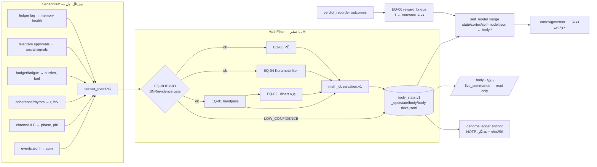

# BODY-MATH-SELF INTEGRATION — معماریِ یکپارچه‌سازیِ بدن، ریاضی و خودِ اختاپوس

> Merge pack (Zones A+B+C+D) · 2026-07-29 · propose-only · هیچ‌خطی از runtime با این سند تغییر نمی‌کند.
> پیش‌نیازِ خواندن: `docs/architecture/OCTOPUS_TRUTH_MAP.md` · `docs/math/EQUATION-REGISTRY.md`

---

## ۱. اصلِ طراحی

بدن یک **ارگانِ جدیدِ اندازه‌گیری** است، نه مغزِ دوم. دقیقاً با قراردادِ اثبات‌شده‌ی
`synapse/` ساخته می‌شود: additive · flag-gated (`OCTOPUS_WIRE_BODY`، پیش‌فرض ۰) ·
fail-soft · propose-only · **صفر-LLM** (فقط ریاضی) · خروجی به مسیرهای خودش.
بدن **داده تولید می‌کند**؛ تصمیم هم‌چنان مالِ cortex/governor/money_gate است و
رأیِ نهاییِ هر اقدامِ پرریسک مالِ مالک (approval_channel).

## ۲. دیتافلو (mermaid)



## ۳. بسته‌ی پیشنهادی `_ops/body/` (Phase B/C — هنوز ساخته نشده)

```
_ops/body/
  __init__.py
  sensor_hub.py          # EQ-BODY-07 · خواندنِ read-only از state/* → sensor_event.v1
  math_filter.py         # EQ-BODY-01/02/03 · SNR gate + bandpass + Hilbert
  equation_engine.py     # رجیستریِ معادله‌ها از docs/math/EQUATION-REGISTRY.md
  kuramoto_coordinator.py# EQ-BODY-04 (shadow، Phase F)
  self_model_bridge.py   # EQ-BODY-05 · merge در self-model (Phase E)
  reward_bridge.py       # EQ-BODY-06 · فقط از verdict_recorder (Phase G)
  telegram_body.py       # کارتِ /body (الگوی identity_equations.card)
  ledger_writer.py       # body-ticks.jsonl + anchorِ هفتگی در genome ledger
  out/                   # proposals (الگوی synapse/out)
_ops/state/body/         # body-ticks.jsonl · body-state-latest.json · body.db (اختیاری)
_ops/tests/test_body_*.py
```

قراردادها (کپی از synapse، سخت):
1. بدونِ `OCTOPUS_WIRE_BODY=1` → no-op کامل. 2. exception هرگز به caller نشت نمی‌کند؛
خروجیِ degraded با نشانِ صریح. 3. capِ روزانه‌ی نوشتار (`BODY_DAILY_MAX`، پیش‌فرض ۱۴۴۰=۱/beat).
4. هرگز نمی‌نویسد روی: genome/ (جز anchorِ NOTE)، ledger.jsonl (جز NOTE)، .env، flags.cmd، budget، kill-switch.
5. هیچ کالِ LLM/ابری ندارد. 6. همه‌ی زمان‌ها UTC + beat (HLC) — هشدارِ ۱۰ساعته‌ی سیدنی.

## ۴. طرحِ اسکیما (Zone C — خلاصه؛ JSON کامل در Phase B)

| اسکیما | فیلدهای کلیدی | مقصد |
|---|---|---|
| sensor_event.v1 | ts, beat, channel, value, unit, conf(∈{ok,low}), src_path | حافظه‌ی موقتِ hub |
| math_observation.v1 | ts, beat, eq_id, inputs_hash, value(s), confidence, degraded, evidence[] | body-ticks.jsonl |
| body_state.v1 | ts, beat, cpm, phi_max, r, arbiter{color,period_s}, fatigue_level, budget_frac, PĒ, BCS, channels[]{name,fresh,conf}, evidence[] | body-state-latest.json + ticks |
| self_model merge | body:{BCS, PĒ, r, last_tick_ts, coverage_pct} | state/cortex/self-model.json |
| telegram_body_card.v1 | ≤700 char quiet-mode · اعداد + severity + evidence idها | پیامِ تلگرام |

SQL (Phase B، SQLite — هم‌فرهنگ با chrono.db/receipts.db): جداولِ
`body_ticks`, `math_observations`, `audit_labels`(lookup: PASS/FAIL/REGRESS/IMPROVE/NOOP + seed)،
`approval_audits`, `audit_evidence` — همه با trace_id/beat/UTC و ایندکسِ (ts) و (eq_id).
fail-closed روی enumهای نامعتبر. DDL کامل در Phase B.

## ۵. قراردادِ تلگرام (Zone D — بدونِ رباتِ نو؛ bot#2 center)

| دستور | داده | قالب |
|---|---|---|
| `/body` · `/بدن` | body-state-latest.json (نه تصورِ مدل) | کارتِ ۵–۱۰ خطی: BCS · cpm · phi · r · fatigue · fuel · PĒ · conf + id شواهد |
| `/body math` | آخرین math_observationها | eq_id : مقدار (conf) |
| `/body sensors` | کانال‌ها + freshness/conf | جدولِ فشرده |
| `/body digest` | ترکیب با digestِ موجود | یک بخشِ بدن در دایجستِ روزانه |

قواعد: خلوت (OCTOPUS_TG_QUIET → ≤700 char) · هیچ dumpای · هشدارِ desync/fatigue فقط
با severity و id · اعمالِ پرریسک هم‌چنان از همان approval_channel (بدن خودش هیچ
دکمه‌ی اقدام ندارد — فقط مشاهده). اگر body-state کهنه‌تر از ۲×cadence ⇒ کارتِ
«بدن: داده‌ی کهنه/نامعتبر» (fail-closed UI، نه حدس).

## ۶. ماتریس LIVE/MOCK/DEADِ سیم‌کشیِ بدن

| سیم | وضعیتِ امروز | پس از Phase C/D |
|---|---|---|
| sensors → hub | نیمه: داده‌ها در state/* هست، hub نیست [OBS] | LIVE (flag off→shadow) |
| hub → math_filter | DEAD (وجود ندارد) | LIVE در shadow |
| math → body_state ticks | DEAD | LIVE در shadow |
| body_state → telegram | DEAD | LIVE read-only (Phase D) |
| body_state → self-model | DEAD | Phase E |
| body → ledger anchor | DEAD | Phase E |
| outcomes → reward_bridge | نیمه: verdict_recorder هست، bridge نیست | Phase G |
| hardware sensors | MISSING | Phase H (فقط با verdict) |

## ۷. تعریفِ عملیاتیِ «خودآگاهیِ یکپارچه» → نگاشت به ارگان‌ها

| مؤلفه‌ی مأموریت | پاسخِ معماری | وضعیت |
|---|---|---|
| 1. آگاهیِ بدن (sensor/SNR) | SensorHub + EQ-BODY-03 | Phase C |
| 2. آگاهیِ فرایند (load/error/sync) | chrono phi + arbiter + coherence_r + Kuramoto-lite | نیمه‌موجود [OBS] |
| 3. آگاهیِ روایی (خلاصه‌ی ۵–۱۰خطی) | کارتِ /body + digest | Phase D |
| 4. آگاهیِ حافظه (اشاره به شاهد) | evidence_pointers در همه‌ی اسکیماها + ledger anchor | Phase B/E |
| 5. آگاهیِ حد (shadow/residual) | E_shadow/Δ_self + LOW_CONFIDENCE labels + SPECULATIVE quarantine | موجود/تکمیل [OBS] |
| 6. آگاهیِ اجتماعی/کنترل | approval_fatigue + approval_channel؛ بدن هیچ‌وقت خودش اقدام نمی‌کند | موجود [OBS] |
| 7. آگاهیِ یادگیری (trust از outcome) | EQ-BODY-06 + verdict_recorder + memory/gate | Phase G |

اگر هر یک نباشد، نامِ «یکپارچه» را نمی‌گذاریم (قانونِ مأموریت §5).

## ۸. پاسخ به قوانینِ ضدِ خودفریبی (مأموریت §8)

| دامِ ردشده | دفاعِ معماری |
|---|---|
| «connected to Earth ⇒ conscious» | Schumann در قرنطینه‌ی SPECULATIVE؛ هیچ کد/ادعایی |
| معادله بدون واحد/تست | EQUATION-REGISTRY برای هر eq: واحد+تست+مدِ شکست اجباری |
| Telegram بدون receipt | کارتِ /body فقط از state/ledger با evidence id |
| self-model بدون پوینتر | هر ادعای خودی = evidence[] اجباری (schema-level) |
| reward از confidence | EQ-BODY-06 با guardِ صریح (درسِ C3) |
| trust == access | trust فقط در memory/gate؛ body هیچ accessی نمی‌گیرد |
| یک پرامپتِ غول به‌جای قرارداد | قراردادهای تایپ‌شده‌ی v1 + تست |
| شعر + ادعای اجرایی | SPECULATIVE quarantine + برچسب‌گذاریِ سخت |

هر ادعای آگاهی باید جواب دهد: چه متغیری عوض شد؟ چه شاهدی؟ چه کنشی ممکن شد؟ چطور ابطال می‌شود؟
