# OCTOPUS reality concept map — draft

Default arbiter envelope for every claim in this document:

```yaml
node_id: octopus-continuity-180
asserted_ip: 192.168.0.180
vantage: cursor-this-host-only
scope: this_host_only
claim_type: observation_unless_marked_inference
evidence: repository HEAD 2a718aaa96235fcf5aa5219d25eba4a9b314eed5 and commands in receipts/
```

The asserted node identity is not independently proven: this Windows host has no adapter named
`eth0`. That is an inference boundary, not evidence that the body or loopback APIs are absent.

## Layer map

| Layer | Status | Real entrypoints/state | Evidence and boundary |
|---|---|---|---|
| Body/runtime | PARTIAL | `_ops/organism.py::main`, `_ops/live_loop.py::LiveLoop` | Source exists and runtime projections under `_ops/state/` change, but the executing process was not identified from this vantage. |
| Sensors | PARTIAL | `_ops/observatory/fetch_guard.py`, `_ops/observatory/observation_v1.py`, `_ops/shadow_homeostasis/observation.py` | Two incompatible observation families exist. The observatory runner is not in this commit. |
| Memory | PARTIAL | `_ops/cognitive/run_store.py`, `_ops/outcomes/decision_receipt.py`, `_ops/shadow_homeostasis/evidence_store.py` | Durable stores and integrity checks exist; no current restore drill was reproduced. |
| World model | PARTIAL | `_ops/shadow_homeostasis/pipeline.py::run_shadow_pipeline`, `world_model.py::build_world_state` | Pure, `executable=False`; 18 isolated tests passed. |
| Cognition | PARTIAL | `_ops/cognition/task_router.py`, `_ops/cortex/cortex.py`, `_ops/cortex/model_router.py` | The narrow cognition, planner and world-model set has no authority-bearing handle and is now protected by a capability-aware AST guard. The broader cortex→provider edge is `SAFE_INFERENCE_BOUNDARY`. |
| Governance | PARTIAL | `_ops/action_bridge/planner.py`, `owner_gate.py`, NBB `kernel/gates.py` | Binding, expiry, replay and fail-closed tests passed; D1/D7 remain owner-only and not released. |
| Action | PARTIAL | `_ops/action_bridge/executor.py::execute`, `_ops/goal_action_bridge.py::run_for_cycle`, `_ops/cortex/code_brain.py` | Action bridge structurally omits A4/A5. `code_brain.py` owns `code_autonomy` calls and is explicitly classified as `APPROVED_EXECUTOR_BOUNDARY`, not provider inference. |
| Observability | PARTIAL | `OCTOPUS/CURRENT-TRUTH.md`, receipts, hash-chained ledgers | Current projections exist; historical `run_observatory.py`/Brier artifacts are absent from HEAD. |
| Recovery | PARTIAL | action-bridge rollback tests; historical `OCTOPUS/Operations/...` receipts | Local rollback is tested; production-like restore was not reproduced here. |

## Actual dataflow and trust boundaries

```mermaid
flowchart LR
  S[allowlisted source or local telemetry] -->|network-read boundary| F[fetch_guard / adapters]
  F --> E[ObservationEnvelope]
  E --> N[observation_v1 or shadow Observation]
  N --> T[trust.validate_observation]
  T --> W[homeostasis + world_state]
  W --> C[task_router / goal-action translation]
  C --> P[action_bridge.planner]
  P --> G[owner_gate / policy]
  G --> X[action_bridge.executor]
  X -->|A0/A1 only| L[local sandbox effect]
  X --> R[receipt + ledger]
  R --> V[independent verifier / replay]
  V --> U[belief or memory update]

  C2[cortex cognition] --> MR[model_router._ask_paid]
  MR -->|provider request + credential handle| EXT[external model provider]
```



Trust boundaries:

1. External content becomes untrusted data at `envelope.py::create_envelope`.
2. `shadow_homeostasis` excludes stale, future, conflicting and unknown observations.
3. Planner output is not authorization; `owner_gate.verify` binds payload, scope, expiry and nonce.
4. Executor success is downgraded when the receipt cannot be persisted.
5. The `cortex -> model_router -> provider` edge is allowed only as inference: its public boundary
   is `ask/complete`, provider adapters import no action executor or owner-signing facility, and
   model output remains data/proposal rather than authorization.
6. `_ops/tests/test_cognition_authority_denylist.py` enforces the boundary and detects direct,
   aliased and dynamic-import attempts to acquire executor, shell, sender, approval or owner-key
   capability. Policy: `_ops/tests/architecture/cognition_authority_policy.yaml`.

An LLM may propose hypotheses, plans or owner-facing text. It is not a truth source, receipt
issuer, policy authority, owner substitute, or final verifier.
