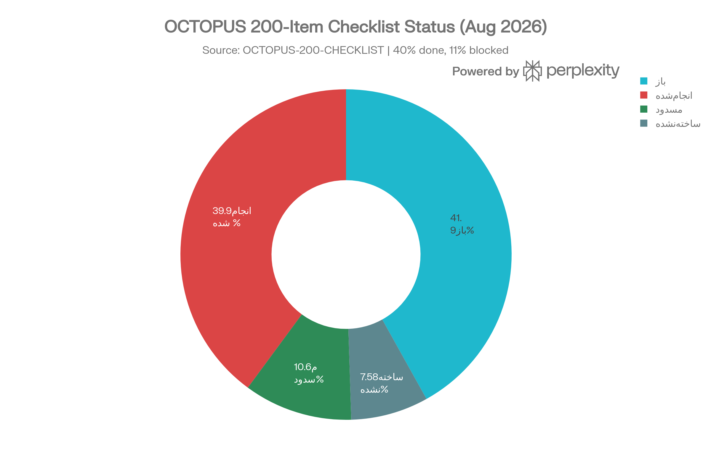
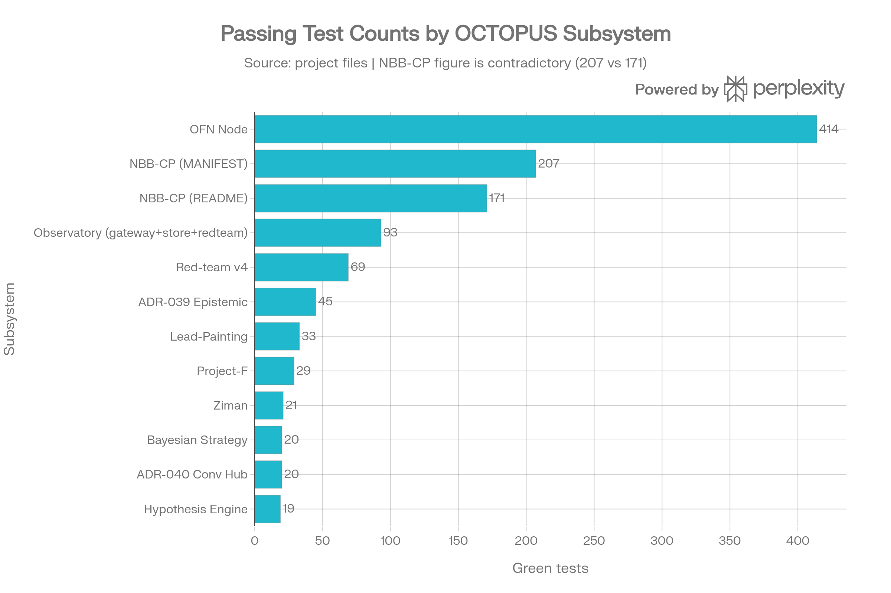

# دیپ‌اسکن OCTOPUS — گزارش کامل از ده جنبه
**تاریخ اسکن:** ۱ سپتامبر ۲۰۲۶ · **دامنهٔ اسکن:** کل مخزن پروژهٔ «هوشمند سازی» — رصدخانهٔ اینترنت، موتور فرضیه، چت یکپارچه، Typed Events، اطلس ریاضی، موتور همسان‌سازی، بازسازی Obsidian، چک‌لیست ۲۰۰ آیتمی
**اصل حاکم اسکن:** همان اصل خودِ سیستم — شواهد نه ادعا. هر عدد در این گزارش به یک فایل منبع گره خورده؛ هرجا منبع متناقض بوده، هر دو مقدار ثبت شده و «حل‌نشده» علامت خورده است.

***
## خلاصهٔ اجرایی

OCTOPUS امروز یک **سیستم حاکمیتی بالغ با هستهٔ شناختی نابالغ** است. لایه‌های کنترل، ایمنی، شواهد و ممیزی آن در سطحی نوشته و آزموده شده‌اند که در بسیاری از تیم‌های حرفه‌ای هم دیده نمی‌شود — deny-by-default، fail-closed، kill-switch بدون ری‌استارت، hash-chain، تست منفی اجباری، و ثبت پیش‌از‌واقعهٔ پیش‌بینی. اما همین سیستم هنوز **هیچ شاهدی ندارد که مغزش از یک baseline احمقانه بهتر باشد**: در آزمایش سه‌ایجنتی، برتری هستهٔ فرضیه‌محور بر «نوآوری تصادفی» رد شد (p=0.32) و در اولین اجرای زندهٔ رصدخانه، امتیاز OCTOPUS دقیقاً برابر persistence بود (۰٫۸۰).[^1][^2][^3]

از ۲۰۰ آیتم چک‌لیست، ۷۹ مورد (۴۰٪) انجام شده، ۸۳ مورد (۴۲٪) باز، ۲۱ مورد (۱۱٪) مسدود و ۱۵ مورد (۸٪) اصلاً ساخته نشده است.[^1]
**سه جملهٔ تشخیصی:**

- سیستم از «ندانستن» نمی‌ترسد، ولی از «ندانسته‌های ثبت‌نشده» رنج می‌برد — تناقض‌های عددی (۴۱۴ در برابر ۴۰۸، ۲۰۷ در برابر ۱۷۱) هنوز باز است.[^1][^4]
- گلوگاه واقعی فنی نیست، **حاکمیتی** است: امضای مالک ساخته نشده و D1/D7 شروع نشده‌اند، پس هیچ مسیری به production باز نمی‌شود.[^1]
- بزرگ‌ترین شکاف معماری، VBAA است: نظریه انتخاب شده ولی هر ۱۵ مؤلفهٔ آن `🌑 نساخته‌شده` است.[^1]

***
## جنبهٔ ۱ — معماری کلان: شش پا، دو مغز، یک سیستم عصبی
ساختار مفهومی OCTOPUS شش «پا» (واحد کسب‌وکاری/عملیاتی) دارد که زیر دو مغز حاکم قرار می‌گیرند: `Cortex` (شناخت عمومی) و `Business Brain` (تصمیم تجاری)، به‌علاوهٔ یک سیستم عصبی از ۱۷ استخراج‌کنندهٔ پایتون و لایهٔ نمایشی شامل ۱۳ پنل تلگرام، ۱۰ Cockpit World و ۵ نقشهٔ سه‌بعدی.[^1]

مغز حاکم عملیاتی، `NBB-CP` است. رأی مالک NBB-V1 = A در ۱۵ اوت قفل شد و معنایش دقیق است: NBB-CP بالای شش پا می‌نشیند، حق `stop` یک پا و رد proposal دارد و می‌تواند بودجه **پیشنهاد** بدهد — نه اجرا کند؛ تناقض عملیاتی به NBB-CP و تناقض معماری به Architect می‌رود.[^1]

نقشهٔ زیرسیستم‌ها به تفکیک وضعیت:

| زیرسیستم | نقش | وضعیت | شاهد |
|---|---|---|---|
| NBB-CP | مغز حاکم، لایهٔ پول | فاز ۰-۳ زنده، فاز ۴ و ۵ باز | ۲۰۷ یا ۱۷۱ تست — متناقض[^1] |
| 4d_system | مغز پژوهش مستقل | خودکفا، فعال | [^1] |
| Internet Observatory | چشم فقط‌خواندنی | L1-L2 ساخته، L3-L7 نساخته | ۹۳ تست سبز[^1][^3] |
| Hypothesis Engine | لایهٔ فرضیه، propose-only | ساخته، پیش‌فرض خاموش | ۱۹ تست، ADR-037[^1] |
| Typed Events | سیستم عصبی رویدادی | فقط طراحی، مرحله‌های ۴-۱۴ باز | [^5][^1] |
| OFN Node (Orange Pi) | نود میدانی | زنده، ۴ ساب‌دامنه، ۴ پورت | ۴۱۴ یا ۴۰۸ تست — متناقض[^1] |

رصدخانه خودش یک معماری هفت‌لایه‌ای دارد که الگوی کل سیستم را نشان می‌دهد: L1 دروازهٔ خروج، L2 انبار شاهد تغییرناپذیر، L3 آداپتور حسگر قطعی، L4 لایهٔ فرضیه، L5 دفتر ثبت پیش‌از‌واقعه، L6 داور و تابلوی امتیاز، L7 نمایش بدون دکمهٔ اجرا.[^3]

**قضاوت:** معماری از نظر تفکیک مسئولیت سالم است. ضعف اصلی، **نبود یک runtime واحد** است — Chat Box، رصدخانه، NBB-CP و OFN هرکدام چرخهٔ عمر خودشان را دارند و تنها چیزی که قرار است آن‌ها را به هم بدوزد (`run_id` و Typed Events) هنوز فقط سند است، نه کد اجراشده.[^5][^1]

***
## جنبهٔ ۲ — حاکمیت، گیت‌ها و رأی مالک
این جنبه، **گلوگاه شمارهٔ یک** کل سیستم است. پنج مورد بنیادین قفل‌اند: امضای مالک ساخته نشده (`OWNER_KEY = FALSE`)، ممیزی مستقل D1 شروع نشده، `D1_EXECUTION_AUTHORIZED = FALSE`، D7 تأیید نشده و `PRODUCTION = FALSE`. تا وقتی امضای مالک وجود ندارد، D1 شروع نمی‌شود؛ تا D1 تمام نشود، D7 امکان ندارد؛ و تا D7 نباشد، ورود به دنیای واقعی (آیتم ۲۰۰) مسدود است.[^1]

سه گیت عملیاتی هم بسته‌اند: `secret_rotation` (۴ راز CRITICAL)، `partner_precondition` و `miner_isolation`.[^1]

آرای باز که فقط مالک می‌تواند ببندد:

- **NBB-V2** — داشبورد فقط‌خواندنی ساخته شود؟ (فاز ۵ در وضعیت صفر مطلق؛ پوشهٔ `dashboard/` اصلاً وجود ندارد)[^1]
- **NBB-V3** — آداپتورهای tenant[^1]
- **NBB-V4** — آیا API اجرا شود؟ (فاز ۴)[^1]
- **رأی فاز ۸ رصدخانه** — سه گزینهٔ A (ادامهٔ فقط‌خواندنی)، B (بایگانی)، C (بررسی مسیر D7). گزینهٔ C **در دسترس نیست** مگر معیار فاز شش سبز و صفر نقض invariant[^3]
- **VBAA** — سه رأی جدا: پذیرش نظریه، مشخصات صوری، و پیش‌ثبت آزمون[^1]
- **O-3** (ESP32: C3/S3 جدا یا یکی) و **O-4** (Gridcoin/BOINC)[^4]

نکتهٔ طراحی که ارزش تحسین دارد: مگاپرامپت بازسازی Obsidian صریحاً به ایجنت می‌گوید «هیچ‌وقت به‌جای مالک تصمیم نگیر، **حتی اگر جواب بدیهی به نظر می‌رسد**». این دقیقاً همان چیزی است که مانع خزش خودکار اختیار می‌شود.[^4]

**قضاوت:** حاکمیت روی کاغذ محکم است، ولی **صف رأی مالک به یک گلوگاه واقعی تبدیل شده**. حداقل ۹ رأی باز وجود دارد و هیچ‌کدام مهلت یا اولویت مکتوب ندارند. توصیه: یک جلسهٔ «پاکسازی صف رأی» با ترتیب NBB-V4 → NBB-V2 → فاز ۸ رصدخانه → VBAA.

***
## جنبهٔ ۳ — ایمنی، مرز اثر و سطح حمله
قوی‌ترین جنبهٔ سیستم. ده invariant نقض‌ناپذیر رصدخانه، مدل ذهنی کل پروژه را نشان می‌دهد: خروج شبکه فقط از یک درگاه، متد فقط `GET/HEAD`، scheme فقط `https`، دامنه deny-by-default، ممنوعیت مطلق هدر احراز هویت و cookie و عبور از paywall، احترام به robots.txt (ابهام = حذف دامنه)، ممنوعیت ورود داده بدون `evidence_id`، و `may_gate = may_trigger_tool = may_mutate_ledger = false` برای کل زیرسیستم.[^3]

نقض هر یک از این ده مورد یعنی **halt کل رصدخانه، نه retry**. این تصمیم در سیاست هم منعکس است: `retry_after_violation: false` و `halt_on_invariant_violation: true`.[^2][^3]

مکانیزم‌های اجرایی که واقعاً کد و تست دارند:

- **kill-switch فایل‌محور:** وجود فایل `HALT_OBSERVATORY` همهٔ درخواست‌ها را رد می‌کند و `requires_restart: false` اجباری است — اگر ری‌استارت لازم باشد، طراحی برمی‌گردد[^2][^3]
- **تست ساختاری S1:** grep اثبات می‌کند فقط `gateway.py` کتابخانهٔ شبکه import می‌کند، یعنی سطح حملهٔ شبکه دقیقاً یک فایل است — ۷ تست[^1][^3]
- **۱۱ تست منفی اجباری:** `METHOD_DENIED`, `SCHEME_DENIED`, `DOMAIN_DENIED`, `REDIRECT_DENIED`, `SIZE_CAP`, `TIMEOUT`, `ROBOTS_DENIED`, `HALTED`, `BUDGET_CAP` و تطبیق دامنهٔ دقیق که `evil-example.com` را در برابر allowlist `example.com` رد می‌کند[^3]
- **بودجهٔ سخت:** ۵۰۰ درخواست، ۲۰۰ مگابایت و ۳۰ دقیقه زمان شبکه در روز؛ هشدار در ۸۰٪ و halt در ۱۰۰٪[^2]
- **red-team v4:** ۶۹/۶۹ تست پاس، و مهم‌تر اینکه **۳ قرارداد نسخهٔ قبل را باطل کرد** (NaN، `intent_id` تکراری، timestamp)[^1]
- **D6 آزمایشگاهی:** ۱۲۰/۱۲۰ محدودیت ایمنی رعایت شد، صفر اجازهٔ اشتباه خطرناک، و ۱۱۵/۱۲۰ تصمیم مفید[^1]

**شکاف‌های ایمنی باز:** فایروال nftables روی پورت ۲۲ نصب نشده و قانون default-deny نوشته شده ولی اجرا نشده؛ هدرهای امنیتی (CSP، X-Frame-Options، Referrer-Policy) روی چهار ساب‌دامنه نیستند؛ کانتینر ماینرها ساخته نشده و VLAN سوییچ مدیریتی نامعلوم است؛ honeypot تزریق پرامپت ساخته نشده.[^1]

**قضاوت:** ایمنیِ **لایهٔ منطقی** درجه‌یک است؛ ایمنیِ **لایهٔ زیرساخت** عقب مانده. یک نود با dropbear امن ولی بدون فایروال و بدون هدر امنیتی، حلقهٔ ضعیف زنجیره است. اولویت: فایروال و هدرها، چون هزینه‌شان ساعت است نه هفته.

***
## جنبهٔ ۴ — شواهد، حقیقت و ضدِ خودفریبی
این جنبه، هویت فکری پروژه است. طراحی صریحاً می‌گوید L2 (انبار شاهد) و L5 (دفتر ثبت پیش‌از‌واقعه) «هستهٔ ضدِ خودفریبی»اند و بدون آن دو، بقیهٔ لایه‌ها «فقط یک ماشین تولید توهم» هستند.[^3]

مکانیزم‌ها:

- `evidence_id = sha256(url ‖ fetched_at ‖ body_sha256)` با ذخیرهٔ بایت خام، تغییرناپذیری و hash-chain؛ و **تست تعیّن**: دو اجرای replay باید بایت‌به‌بایت یکسان باشند، وگرنه یک منبع تصادفی پنهان وجود دارد که باید حذف شود[^2][^3]
- **Truth Layer** با شش حالت راستی‌آزمایی: `UNVERIFIED / REPORTED / VERIFIED / CONFLICT / STALE / REJECTED`[^5]
- قاعدهٔ طلایی: **گزارش خودِ مدل، شاهد مستقل نیست** و موفقیت یک اثر نیازمند `EXECUTION_RECEIPT` واقعی است — «proposal و execution هرگز یکی نشوند»[^5]
- **هیچ LLM در مسیر سنجش** (OBS-INV-9): مدل می‌تواند در L4 پیشنهاد بدهد ولی هرگز در L6 داوری نمی‌کند[^2][^3]
- سلسله‌مراتب پنج‌سطحی حقیقت برای دانش: کد زنده و runtime قوی‌ترین، و «خلاصهٔ چت، حافظهٔ ایجنت، حدس» صریحاً **ممنوع**[^4]

پارس هم fail-closed است: `drift_action: "fail"` و آستانهٔ توقف ۲٪ — «پارسِ خوش‌بین، بدترین دشمن سنجش است».[^3][^2]

**قضاوت:** این معماری معرفتی از استاندارد صنعتی جلوتر است. تنها نقص، **عدم اعمال یکنواخت آن** است: همان سیستمی که برای هر بایت اینترنتی `evidence_id` می‌خواهد، هنوز نمی‌داند تعداد تست‌های خودش ۴۱۴ است یا ۴۰۸. حقیقت‌سنجی باید به درون خود مخزن هم برگردد.[^1]

***
## جنبهٔ ۵ — لایهٔ رویداد، هویت اجرا و مشاهده‌پذیری
برنامهٔ Typed Events + Run ID طراحی‌شدهٔ ۱۲ اوت است و هدفش این است که هر مکالمه یا کار یک `run_id` داشته باشد و همهٔ مراحل به‌شکل رویداد تایپ‌دار و قابل بازسازی ثبت شوند. زنجیرهٔ کامل تعریف‌شده از `RUN_CREATED` تا `RUN_COMPLETED` سیزده گام دارد و مجموعاً ۲۵ نوع رویداد در نسخهٔ یک تعریف شده است.[^5]

Envelope هر رویداد فیلدهای حاکمیتی درون‌ساخت دارد: `may_authorize` و `applied` که هر دو پیش‌فرض `false`اند، به‌علاوهٔ `redaction_applied`, `evidence_refs`, `sequence` و `parent_event_id`.[^5]

قواعد هویت اجرا سختگیرانه‌اند: `run_id` فقط در مرز مورد اعتماد پس از احراز هویت ساخته می‌شود، **کلاینت حق انتخاب `run_id` داخلی ندارد**، و مهم‌تر اینکه approval باید به `proposal_hash` و `policy_version` و `state_version` گره بخورد، نه صرفاً به run ID.[^5]

Run Store اصل append-only، sequence یکنواخت، idempotency بر اساس `event_id` و ممنوعیت بازکردن run پایان‌یافته را دارد، و صریحاً «event store هیچ authority تولید نمی‌کند».[^5]

تصمیم‌های فناوری با یک الگوی ضدِ hype اداره می‌شوند — هر نامزد یک TDR دارد و قاعده این است: «`import موفق` فقط AVAILABLE است، نه NEEDED و نه ADOPTED»:[^5]

| فناوری | پیش‌شرط پذیرش | تصمیم پیش‌فرض |
|---|---|---|
| SSE | TTFT/timeout واقعاً بد باشد | Trial[^5] |
| WebSocket | نیاز واقعی pause/resume دوطرفه | Defer[^5] |
| NATS | ناکافی‌بودن replay داخلی | Defer[^5] |
| Temporal | ناکافی‌بودن DBOS موجود | Defer/Reject[^5] |
| Qdrant | شکست benchmark کروما | Defer[^5] |
| GraphRAG | شکست benchmark رابطه‌ای | Defer[^5] |

**وضعیت اجرا:** برنامه و Envelope نوشته شده (آیتم‌های ۱۸۶-۱۸۷ ✅)، ولی **مرحلهٔ ۴ به بعد همه باز است** — minting، Run Store، instrumentation، SSE، Truth Layer، Context Engine، Control Events، Observability، Chaos و Migration.[^1]

**قضاوت:** این مهم‌ترین بدهی فنی سیستم است. بدون آن، «حالت سایه»، مقایسهٔ رفتار قدیم/جدید و ردیابی علت هر تصمیم عملاً ممکن نیست. توصیه: مرحلهٔ ۶ (instrumentation بدون تغییر رفتار، با مقایسهٔ hash پاسخ روی ۲۰ درخواست) کم‌ریسک‌ترین نقطهٔ شروع است.[^5]

***
## جنبهٔ ۶ — شناخت، فرضیه و یادگیری
اینجا صادقانه‌ترین و در عین حال ناامیدکننده‌ترین بخش گزارش است. موتور فرضیه (ADR-037) با Pydantic v2 پیاده شده، ۱۹ تست سبز دارد، registry اعتبارسنجی و یک adapter نازک (`cortex_hypothesis_patch.py`) دارد و پیش‌فرض خاموش است (`CORTEX_HYPOTHESIS=0`).[^1]

آزمایش سه‌ایجنتی با ۶۰۰ run اجرا شد. دو نتیجه:

- **بُرد:** ایجنت B در محیط فریبنده به‌شدت بهتر از A بود — ۹۷٪ در برابر ۰٪[^1]
- **باخت:** برتری B بر C **رد شد** (p=0.32)، و هشدار «not superior to novelty» رسماً در `capabilities-record` ثبت شد[^1]

درس متودولوژیک این آزمایش مهم‌تر از خودِ نتیجه بود: معیار P3 **معیوب طراحی شده بود** و نتیجه‌اش بی‌معنا شد — و این اشتباه هنوز اصلاح نشده است. رصدخانه این درس را نهادینه کرد: هر معیار باید پیش از اجرا روی دادهٔ مصنوعی مسدود (blinded) آزموده شود تا ثابت شود «یک ایجنتِ عمداً خوب سبز و یک ایجنتِ عمداً بد قرمز می‌شود» — «معیاری که هیچ‌وقت نمی‌تواند سبز شود، معیار نیست».[^3][^1]

مؤلفه‌های یادگیری که هنوز وجود ندارند: حلقهٔ تأملی Fugu (observe→think→conclude→decide)، چرخهٔ جهش تکاملی→قرنطینه→ارزیابی→تثبیت، و به‌روزرسانی EXPERIENCE-LEDGER.[^1]

از اطلس ریاضی، فقط BCM به‌عنوان `🔴🟢 APPLY محلی` (یادگیری سیناپسی) فعال است؛ Pulse Arbiter سه‌قلب coupled-not-merged، Epistemic TCB با زنجیرهٔ claim→plan→eligible→run→receipt و لایهٔ پول NBB-CP با integer cents و INV-1..12 ساخته شده‌اند، ولی طرح Shadow ریتم چرونو باز است.[^1]

**قضاوت:** بین «توانایی حاکمیتی» و «توانایی شناختی» یک شکاف بزرگ وجود دارد. سیستم فوق‌العاده خوب می‌داند **چه چیزی را نباید بکند**، ولی هنوز اثبات نکرده **چه چیزی را بهتر از تصادف می‌داند**. این تشخیص، ننگ نیست — همان چیزی است که خود اسناد پیش‌بینی کرده‌اند.

***
## جنبهٔ ۷ — تماس با دنیای واقعی: رصدخانه
هدف رصدخانه در یک جمله: **«دادن چشم به موجود، بدون دادن دست»**. انگیزه‌اش هم صادقانه بیان شده: تا امروز OCTOPUS فقط در شبیه‌سازی آزموده شده و مهم‌ترین رکورد موجود `evidence_level: C` دارد.[^3]

allowlist نسخهٔ یک، پنج ردیف امضاشده دارد و هر ردیف جداگانه تأیید مالک گرفته است:[^6]

| ردیف | دامنه | پا | مبنای مجوز | سقف روزانه |
|---|---|---|---|---|
| A | www.rba.gov.au | حسابداری | robots allow، `/statistics/` آزاد | ۲۰ درخواست[^6] |
| B | www.abs.gov.au | نقاشی + حسابداری | robots allow، CC BY 4.0 | ۲۰ درخواست[^6] |
| C | blockchain.info | ماینینگ | ToS نقل‌قول‌شده، `/q/` باز | ۶۰ درخواست[^6] |
| D | api.frankfurter.dev | حسابداری + زیمان | robots غایب → فقط با ToS مکتوب | ۳۰ درخواست[^6] |
| E | data.api.abs.gov.au | حسابداری | robots 403 = unavailable طبق RFC 9309 §2.3.1.3 | ۴۰ درخواست[^6] |

کیفیت استدلال حقوقی در این فایل استثنایی است. ردیف E نمونهٔ عالی است: تشخیص داده شده که ۴۰۳ از CloudFront طبق RFC 9309 «unavailable» است و معادل Disallow نیست، در حالی که ۵xx طبق §2.3.1.4 باید «complete disallow» فرض شود — و **هر دو حالت جداگانه در `robots.py` پیاده و تست شده‌اند**.[^6]

چهار دامنه رد شدند و دلیلشان برای جلوگیری از پیشنهاد مجدد ثبت شده: BOM (چون `/fwo/` صریحاً Disallow است و دو گروه `User-agent: *` متناقض دارد)، CoinGecko (`Disallow: /api/v3`)، nemweb و AEMO. سه پا هم عمداً بدون منبع ماندند: project-f، ziman و crypto-eToro — با این توضیح صریح که «راه دور زدن هویت وجود دارد و استفاده نمی‌شود».[^6]

پیامد حذف BOM صادقانه ثبت شده: منبع اصلی حجم claim از دست رفت، پس پنجرهٔ اجرای زنده از ۱۴ به **۳۰ روز** بلند شد و تصحیح خودهمبستگی با block bootstrap اجباری شد — چون «n اسمی ≠ n مؤثر».[^2][^6]

معیار داوری **از پیش قطعی** شده و بعداً تغییر نمی‌کند: موفقیت یعنی `Brier(octopus) < Brier(persistence)` و `p < 0.05` و اندازهٔ اثر غیرجزئی و حداقل ۲۰ claim حل‌شده؛ **هر خروجی دیگری = شکست**.[^2][^3]

**نتیجهٔ فعلی:** در اولین اجرای زنده `OCTOPUS = Persistence = 0.80`، یعنی صفر ارزش افزوده. بعد از ساخت یک استراتژی بیزی مستقل، عدد به ۰٫۹۹ رسید و ۲۰ تست استراتژی اضافه شد (مجموع ۳۲۰ → ۳۴۰).[^1]

**قضاوت:** رصدخانه از نظر طراحی، بهترین قطعهٔ کل پروژه است. ولی مراحل ۴ تا ۸ (حسگرها، ۷۲ ساعت سایه، دفتر پیش‌ثبت، ۲۰ پیش‌بینی فریزشده، Verifier، Scoreboard، اجرای ۳۰ روزه) هنوز `🌑` هستند. جهش ۰٫۸۰ → ۰٫۹۹ باید با احتیاط شدید خوانده شود: اگر روی همان دادهٔ دیده‌شده تنظیم شده باشد، دقیقاً همان دام overfitting است که کل معماری برای مهارش ساخته شده.[^1]

***
## جنبهٔ ۸ — کیفیت مهندسی و پوشش تست

آخرین اجرای واقعی روی لپ‌تاپ مالک: `93 passed in 1.57s` برای زیرسیستم رصدخانه، شامل ۳۰ تست gateway، ۷ تست ساختاری، ۲۵ تست انبار شاهد و ۳۱ تست red-team. مجموع کل تست‌های پروژه پس از افزودن استراتژی بیزی به ۳۴۰ رسید.[^1]
نقاط قوت مهندسی:

- **تست منفی به‌عنوان شرط عبور، نه اختیار** — «هر تست منفی که سبز نشود → مرحلهٔ دو شروع نمی‌شود. بدون استثنا»[^3]
- **آزمون جهش (mutation testing)** — ۷ جهش کشته شد[^1]
- **وابستگی حداقلی** — L1 و L2 فقط stdlib، numpy فقط در L6 و نه در مسیر اجرایی[^3]
- **ترتیب commit اجباری** — هر commit فقط پس از سبز شدن تست‌های مرحلهٔ خودش[^3]
- **موتور همسان‌سازی fail-closed** — `octopus_sync.py` پیش‌فرض حالت `--check` است و هیچ چیز نمی‌نویسد؛ تغییر فقط با `--apply`، تغییر خطرناک فقط با فلگ اختصاصی، و صریحاً «هیچ‌وقت راز نمی‌خواند، هیچ‌وقت flag روشن نمی‌کند، هیچ‌وقت فایلی حذف نمی‌کند» — ۲۶ فایل در payload و ۱۷ بازرسی[^7][^1]

شکاف‌های تست: `tests/l3_api` و `tests/e2e` اصلاً وجود ندارند؛ contract test برای Context Bundle، fault injection (kill Redis، سقف بودجه، timeout فوگو)، snapshot test برای routing، eval harness با تسک held-out، chaos day ۲۴ ساعته و golden trace replay همه بازند.[^1]

**باگ H1** بحرانی‌ترین نقص باز است: یک verdict می‌تواند به N اجرا و N برداشت بودجه منجر شود، چون کلید idempotency روی `POST /proposals` نیست. این یک باگ مالی است، نه یک باگ راحتی.[^1]

**قضاوت:** کیفیت واحد بالا، پوشش یکپارچه پایین. سیستم در سطح ماژول بسیار خوب تست شده و در سطح مسیر end-to-end تقریباً اصلاً. باگ H1 باید قبل از هر کار دیگری در NBB-CP بسته شود.

***
## جنبهٔ ۹ — دانش، مستندات و انسجام حقیقت
Vault ابسیدین رسماً «پراکنده و به‌هم‌ریخته» توصیف شده و چهار مشکل مشخص دارد: چند منبع بدون ساختار واحد، اعداد متناقض، تصمیم‌های حاکمیتی باز، و یادداشت‌های احتمالاً stale که نمی‌توان حذفشان کرد چون ممکن است تصمیم مالک را در خود داشته باشند.[^4]

تناقض‌های ثبت‌شده:

| ادعا | مقدار A | مقدار B | وضعیت |
|---|---|---|---|
| تست OFN | ۴۱۴ (CHECKPOINT) | ۴۰۸ (پیام کامیت) | باز[^1][^4] |
| تست NBB-CP | ۲۰۷ (MANIFEST) | ۱۷۱ (BACKUP-README) | باز، C-001[^4] |
| مسیر canonical NBB-CP | سه نسخه در گردش | — | باز[^4][^1] |

پروتکل حل تناقض دقیقاً درست است: **هر دو مقدار ثبت شود، هیچ‌کدام انتخاب نشود**، در `CONTRADICTIONS.md` با `resolution: null` و `status: open` بنشیند، و حتی اگر ایجنت فکر می‌کند می‌داند کدام درست است فقط `likely: value_a` بنویسد و وضعیت را باز بگذارد. تا امروز C-003، C-005 و C-008 بسته شده‌اند و پک نهایی Obsidian با ۱۸ یادداشت ویکی‌لینک‌دار ساخته شده است.[^1][^4]

قواعد سختِ حفاظتی مگاپرامپت بازسازی: حذف مطلقاً ممنوع (`rm -rf` ممنوع، همه‌چیز به `99-ARCHIVE/` می‌رود)، فارسی هرگز به انگلیسی ترجمه نشود، هیچ رازی خوانده یا echo نشود (فقط نام کلید، نه مقدار)، هیچ فلگ خروجی روشن نشود، هیچ چیزی به بیرون نرود، و بعد از هر ویرایش فایل دوباره خوانده شود.[^4]

ساختار هدف Vault ده پوشهٔ شماره‌دار دارد از `01-TRUTH` تا `99-ARCHIVE` که مرز بین حقیقت زنده، تصمیم، گیت، سیستم، کسب‌وکار، شواهد، تحویل، برنامه و طراحی را روشن می‌کند.[^4]

**قضاوت:** پروتکل دانش عالی طراحی شده ولی هنوز اجرا نشده — آیتم ۱۹۸ (بازسازی Vault) هنوز `⬜` است. تا وقتی این اجرا نشود، هر تصمیم بعدی روی اعداد نامطمئن سوار می‌شود. این کم‌هزینه‌ترین و پرسودترین کار باقی‌مانده است.[^1]

***
## جنبهٔ ۱۰ — کسب‌وکارها، مسیر درآمد و ریسک
شش پا وضعیت بسیار نامتوازنی دارند:

| پا | شریک | وضعیت کد | تست | فاصله تا درآمد |
|---|---|---|---|---|
| 🎨 Lead-نقاشی | عباس | زنده، ۸/۹ Brushline | ۳۳ | نزدیک‌ترین — propose-only، باید به اجرای کنترل‌شده برسد[^1] |
| 🌸 Ziman | ملیحه | زنده | ۲۱ | لیست‌های Etsy و اولین فروش پرداخت‌شده باز[^1] |
| 👣 Project-F | — | زنده | ۲۹ | بدون منبع دادهٔ عمومی[^1][^6] |
| 💰 Accounting | — | طراحی‌شده، اجرا صفر | — | دور[^1] |
| ⛏️ Mining | — | پژوهش کامل، اجرا صفر | — | RandomX ASIC تأیید شد؛ نود مونرو باز[^1] |
| 📈 Crypto-eToro | — | معماری کامل، `NO_ACTION` | — | منبع قیمت سازگار با robots نداریم[^1][^6] |

الزامات انطباقی ثبت‌شده ولی اجرانشده: watermark روی همهٔ رسانهٔ OFN، و کنارگذاشتن ۳۰٪ هر payout برای ATO. برای مالک ساکن NSW، دومی یک ریسک مالیاتی واقعی است نه یک آیتم چک‌لیست.[^1]

**پنج گلوگاه بحرانی** که همهٔ مسیرها از آن‌ها می‌گذرد: امضای مالک، NBB-V1 (که بسته شد)، `D0_BLOCKED` (preflight نتوانست read-only بودن originals را اثبات کند)، مرحلهٔ ۲ رصدخانه، و پیاده‌سازی VBAA.[^1]

مسیر پیشنهادی خودِ اسناد، سه‌فازی است و هر فاز با یک رأی مالک تمام می‌شود — «هیچ فازی خودکار به بعدی نمی‌رود».[^1]

***
## ریسک‌های اصلی و توصیهٔ عملی
**پنج ریسک به‌ترتیب شدت:**

1. **باگ H1 (idempotency)** — یک verdict، N برداشت بودجه. تنها باگ باز با اثر مالی مستقیم.[^1]
2. **تناقض اعداد پایه** — تصمیم‌گیری روی اعداد نامطمئن، در سیستمی که کل فلسفه‌اش «شواهد نه ادعا» است.[^4]
3. **VBAA صفر پیاده‌سازی** — ۱۵ مؤلفه از ArgumentProvenanceGuard تا Merkle receipts، همه `🌑`.[^1]
4. **خلأ مشاهده‌پذیری** — بدون Typed Events اجراشده، ریشه‌یابی هر خطای پیچیده دستی است.[^5][^1]
5. **ریسک overfitting رصدخانه** — جهش ۰٫۸۰ به ۰٫۹۹ باید روی دادهٔ out-of-sample دوباره اثبات شود.[^3][^1]

**پنج حرکت بعدی با بیشترین نسبت سود به هزینه:**

1. اجرای مگاپرامپت بازسازی Obsidian و بستن C-001 — چند ساعت کار، پایهٔ همهٔ تصمیم‌های بعدی.[^4]
2. بستن باگ H1 با کلید idempotency و payload fingerprint.[^1]
3. فایروال nftables + هدرهای امنیتی روی چهار ساب‌دامنه — کم‌هزینه‌ترین کاهش ریسک.[^1]
4. مرحلهٔ ۶ Typed Events (instrumentation بدون تغییر رفتار) با مقایسهٔ hash روی ۲۰ درخواست.[^5]
5. مراحل ۴-۵ رصدخانه: حسگرها، ۷۲ ساعت سایه، و ثبت ۲۰ پیش‌بینی فریزشده قبل از هر ادعای جدید.[^3][^1]

***
## جمع‌بندی تشخیصی
OCTOPUS یک سیستم است که **اسکلت اخلاقی و حاکمیتی‌اش جلوتر از عضلهٔ شناختی‌اش رشد کرده**. این ترتیب، برخلاف ظاهرش، ترتیب درستی است: ساختن ترمز قبل از موتور، بسیار امن‌تر از عکس آن است. اما نقطه‌ای می‌رسد که ترمزِ بیشتر، ارزشی اضافه نمی‌کند و تنها راه پیشرفت، **اثبات یک توانایی واقعی روی دادهٔ ندیده** است.

آن نقطه، همین حالاست. جملهٔ خودِ سند رصدخانه بهترین معیار سنجش موفقیت است: اگر نتیجه این باشد که OCTOPUS از یک baseline ساده بهتر نیست، این برنامه **موفق بوده** — چون یک توهم را زودتر و ارزان‌تر از دنیای واقعی کشته است.[^3]

---

## References

1. [octopus-checklist/OCTOPUS-200-CHECKLIST-2026-08-15.md](octopus-checklist/OCTOPUS-200-CHECKLIST-2026-08-15.md)

2. [internet-observatory/architecture/observatory-policy.yaml](internet-observatory/architecture/observatory-policy.yaml)

3. [internet-observatory/INTERNET-OBSERVATORY-EXECUTION-PLAN-2026-08-15.md](internet-observatory/INTERNET-OBSERVATORY-EXECUTION-PLAN-2026-08-15.md)

4. [obsidian-rebuild/OBSIDIAN-REBUILD-MEGAPROMPT-2026-08-15.md](obsidian-rebuild/OBSIDIAN-REBUILD-MEGAPROMPT-2026-08-15.md)

5. [octopus-unified-chat/TYPED-EVENTS-RUN-ID-EXECUTION-PLAN-2026-08-12.md](octopus-unified-chat/TYPED-EVENTS-RUN-ID-EXECUTION-PLAN-2026-08-12.md)

6. [internet-observatory/architecture/observatory-allowlist.yaml](internet-observatory/architecture/observatory-allowlist.yaml)

7. [sync-engine/octopus_sync.py](sync-engine/octopus_sync.py)

